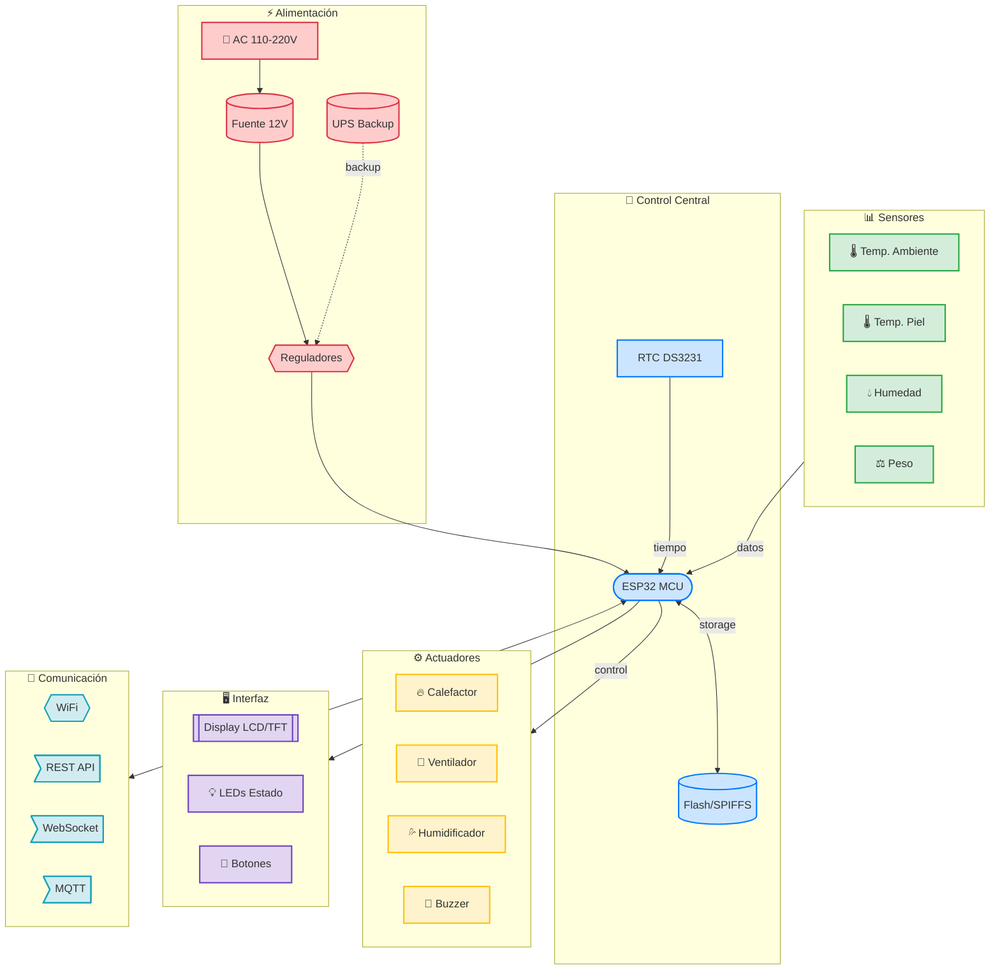
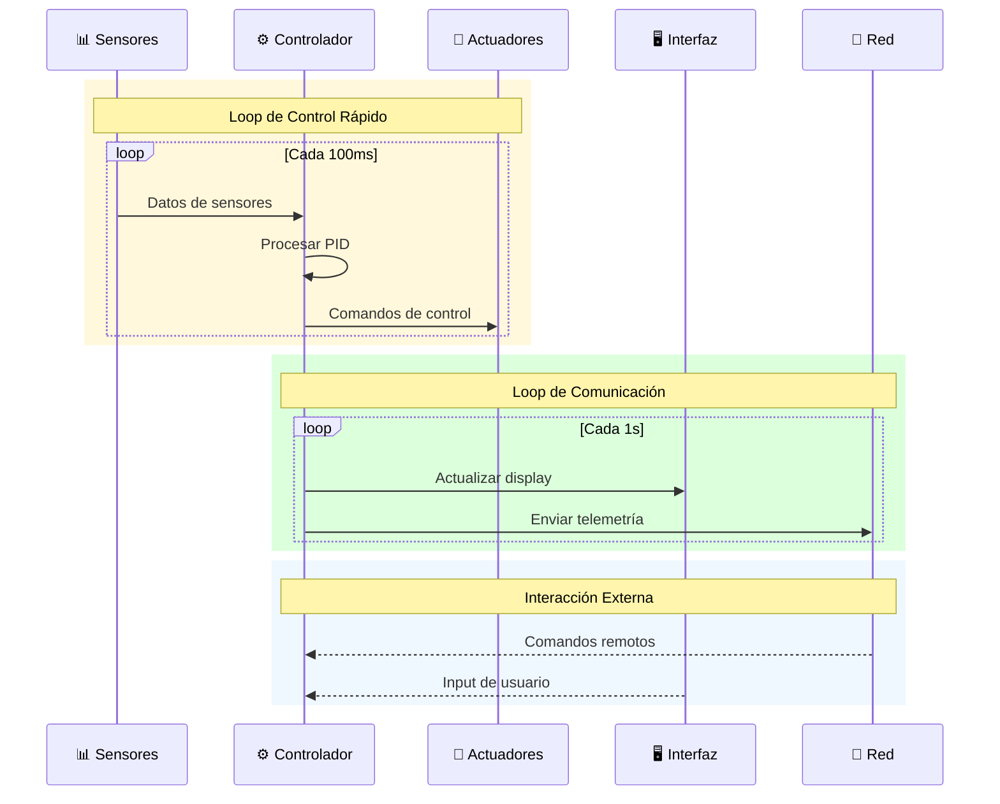
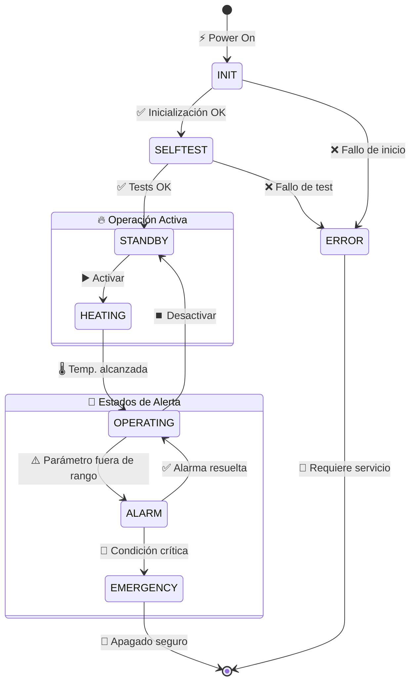

# Arquitectura General del Sistema

## Introducción

IncuNest está diseñado siguiendo principios de **modularidad**, **seguridad** y **mantenibilidad**. Esta sección describe la arquitectura general del sistema, incluyendo hardware y software.

## Diagrama de Bloques del Sistema



## Capas del Sistema

### 1. Capa de Hardware

La capa física incluye:

| Componente | Función | Criticidad |
|------------|---------|------------|
| ESP32 | Procesamiento central | Alta |
| Sensores | Adquisición de datos | Alta |
| Actuadores | Control ambiental | Alta |
| Alimentación | Energía del sistema | Crítica |
| Display | Interfaz local | Media |

### 2. Capa de Firmware

El firmware se organiza en módulos:

```
firmware/
├── src/
│   ├── main.cpp              # Punto de entrada
│   ├── config.h              # Configuración
│   ├── sensors/              # Módulo de sensores
│   │   ├── temperature.cpp
│   │   └── humidity.cpp
│   ├── control/              # Sistema de control
│   │   ├── pid.cpp
│   │   └── safety.cpp
│   ├── actuators/            # Control de actuadores
│   │   ├── heater.cpp
│   │   └── fan.cpp
│   ├── ui/                   # Interfaz de usuario
│   │   ├── display.cpp
│   │   └── buttons.cpp
│   ├── network/              # Comunicaciones
│   │   ├── wifi.cpp
│   │   ├── webserver.cpp
│   │   └── mqtt.cpp
│   └── storage/              # Almacenamiento
│       └── datalogger.cpp
└── lib/                      # Librerías externas
```

### 3. Capa de Aplicación

Interfaces disponibles:

- **Interfaz Local**: Display LCD/TFT + botones físicos
- **Interfaz Web**: Dashboard accesible vía WiFi
- **API REST**: Para integración con sistemas externos
- **MQTT**: Para IoT y monitoreo centralizado

## Flujo de Datos



## Principios de Diseño

### Seguridad por Diseño

1. **Redundancia de sensores**: Múltiples sensores de temperatura
2. **Límites por hardware**: Termostatos físicos de respaldo
3. **Fail-safe**: El sistema falla hacia estado seguro
4. **Watchdog**: Reinicio automático ante bloqueos

### Modularidad

Cada módulo puede:
- Funcionar independientemente
- Ser probado aisladamente
- Ser reemplazado sin afectar otros módulos

### Eficiencia Energética

- Modo sleep cuando es posible
- Control PWM eficiente
- Optimización de ciclos de trabajo

## Estados del Sistema



### Descripción de Estados

| Estado | Descripción | LED |
|--------|-------------|-----|
| INIT | Inicializando sistema | Azul parpadeando |
| SELFTEST | Ejecutando auto-diagnóstico | Azul fijo |
| STANDBY | Listo, esperando activación | Verde parpadeando |
| HEATING | Calentando a temperatura objetivo | Amarillo |
| OPERATING | Operación normal | Verde fijo |
| ALARM | Condición de alarma activa | Rojo parpadeando |
| EMERGENCY | Apagado de emergencia | Rojo fijo |
| ERROR | Error del sistema | Rojo/Azul alternando |

## Comunicaciones

### Protocolos Soportados

| Protocolo | Puerto | Uso |
|-----------|--------|-----|
| HTTP | 80 | Interfaz web |
| WebSocket | 81 | Datos en tiempo real |
| MQTT | 1883 | Telemetría IoT |
| mDNS | 5353 | Descubrimiento local |

### Estructura de Datos

Ejemplo de mensaje de telemetría:

```json
{
  "device_id": "INCUNEST_001",
  "timestamp": "2026-01-15T10:30:00Z",
  "sensors": {
    "temperature_ambient": 36.5,
    "temperature_skin": 36.8,
    "humidity": 65.2
  },
  "actuators": {
    "heater_power": 45,
    "fan_speed": 30,
    "humidifier": true
  },
  "status": {
    "state": "OPERATING",
    "alarms": [],
    "uptime": 3600
  }
}
```

## Próximos Documentos

- [Diseño del Sistema](./system-design) - Detalles técnicos del diseño
- [Comunicaciones](./communication) - Protocolos y APIs en detalle
