# Diseño del Sistema

## Sistema de Control de Temperatura

### Control PID

IncuNest utiliza un controlador **PID** (Proporcional-Integral-Derivativo) para mantener la temperatura estable.

```mermaid
graph LR
    subgraph entrada [📥 Entrada]
        SP([🎯 Setpoint])
        PV([🌡️ Temp Actual])
    end
    
    subgraph pid [⚙️ Controlador PID]
        E((Error))
        P[P - Proporcional]
        I[I - Integral]
        D[D - Derivativo]
        SUM((Σ))
    end
    
    subgraph salida [📤 Salida]
        OUT>Salida PWM]
        HEATER[[🔥 Calefactor]]
        PROCESS[(Proceso Térmico)]
        SENSOR[📊 Sensor]
    end
    
    SP --> E
    PV --> E
    E --> P
    E --> I
    E --> D
    P --> SUM
    I --> SUM
    D --> SUM
    SUM --> OUT
    OUT --> HEATER
    HEATER --> PROCESS
    PROCESS --> SENSOR
    SENSOR --> PV
    
    classDef input fill:#d4edda,stroke:#28a745,stroke-width:2px
    classDef controller fill:#cce5ff,stroke:#007bff,stroke-width:2px
    classDef output fill:#fff3cd,stroke:#ffc107,stroke-width:2px
    
    class SP,PV input
    class E,P,I,D,SUM controller
    class OUT,HEATER,PROCESS,SENSOR output
```



### Ecuación del Controlador

```
u(t) = Kp × e(t) + Ki × ∫e(τ)dτ + Kd × de(t)/dt
```

Donde:
- u(t) = Señal de control (duty cycle del PWM)
- e(t) = Error (setpoint - temperatura actual)
- Kp = Ganancia proporcional
- Ki = Ganancia integral
- Kd = Ganancia derivativa

### Implementación en Código

```cpp
class PIDController {
private:
    float kp, ki, kd;
    float integral = 0;
    float previousError = 0;
    unsigned long lastTime = 0;
    
public:
    PIDController(float p, float i, float d) 
        : kp(p), ki(i), kd(d) {}
    
    float compute(float setpoint, float measured) {
        unsigned long now = millis();
        float dt = (now - lastTime) / 1000.0f;
        
        if (dt <= 0) return 0;
        
        float error = setpoint - measured;
        
        // Término proporcional
        float pTerm = kp * error;
        
        // Término integral con anti-windup
        integral += error * dt;
        integral = constrain(integral, -100, 100);
        float iTerm = ki * integral;
        
        // Término derivativo
        float derivative = (error - previousError) / dt;
        float dTerm = kd * derivative;
        
        previousError = error;
        lastTime = now;
        
        // Salida limitada a 0-100%
        return constrain(pTerm + iTerm + dTerm, 0, 100);
    }
    
    void reset() {
        integral = 0;
        previousError = 0;
    }
};
```

### Sintonización del PID

Parámetros recomendados según el método de Ziegler-Nichols:

| Parámetro | Valor por Defecto | Rango |
|-----------|-------------------|-------|
| $K_p$ | 2.0 | 1.0 - 5.0 |
| $K_i$ | 0.5 | 0.1 - 2.0 |
| $K_d$ | 1.0 | 0.5 - 3.0 |

## Sistema de Adquisición de Datos

### Arquitectura de Sensores

```mermaid
graph TB
    subgraph Sensores [📊 Sensores de Entrada]
        direction LR
        DHT22[DHT22<br/>🌡️ Temp + 💧 Hum]
        SHT31[SHT31<br/>🌡️ Temp + 💧 Hum]
        DS18B20[DS18B20<br/>🌡️ Temp Piel]
    end
    
    subgraph Procesamiento [⚙️ Procesamiento de Señales]
        direction LR
        FILTER{{Filtro Digital}}
        CALIB[(Calibración)]
        VALID{Validación}
    end
    
    subgraph Salida [📤 Salida]
        direction LR
        AVG([Promedio Ponderado])
        ALARM[[🚨 Sistema de Alarmas]]
    end
    
    DHT22 --> FILTER
    SHT31 --> FILTER
    DS18B20 --> FILTER
    
    FILTER --> CALIB
    CALIB --> VALID
    VALID --> AVG
    VALID --> ALARM
    
    classDef sensors fill:#d4edda,stroke:#28a745,stroke-width:2px
    classDef processing fill:#cce5ff,stroke:#007bff,stroke-width:2px
    classDef output fill:#fff3cd,stroke:#ffc107,stroke-width:2px
    
    class DHT22,SHT31,DS18B20 sensors
    class FILTER,CALIB,VALID processing
    class AVG,ALARM output
```



### Filtrado de Señales

Implementamos un **filtro de media móvil exponencial** (EMA):

```cpp
class ExponentialFilter {
private:
    float alpha;
    float filteredValue;
    bool initialized = false;
    
public:
    ExponentialFilter(float smoothingFactor = 0.1f) 
        : alpha(smoothingFactor) {}
    
    float filter(float newValue) {
        if (!initialized) {
            filteredValue = newValue;
            initialized = true;
        } else {
            filteredValue = alpha * newValue + (1 - alpha) * filteredValue;
        }
        return filteredValue;
    }
};
```

### Calibración de Sensores

Cada sensor almacena coeficientes de calibración:

```cpp
struct CalibrationData {
    float offset;      // Desplazamiento
    float gain;        // Ganancia
    uint32_t timestamp; // Fecha de calibración
    bool valid;        // Flag de validez
};

float applyCalibration(float raw, CalibrationData& cal) {
    if (!cal.valid) return raw;
    return (raw * cal.gain) + cal.offset;
}
```

## Sistema de Alarmas

### Niveles de Alarma

```mermaid
graph TB
    subgraph Niveles [🎚️ Niveles de Alarma]
        L1[ℹ️ Nivel 1: INFO]
        L2[⚠️ Nivel 2: WARNING]
        L3[🚨 Nivel 3: ALARM]
        L4[🛑 Nivel 4: CRITICAL]
    end
    
    subgraph Acciones [📢 Acciones de Respuesta]
        A1[🔵 LED Azul]
        A2[🟡 LED Amarillo + Beep]
        A3[🔴 LED Rojo + Alarma Sonora]
        A4[⛔ Apagado + Alarma Continua]
    end
    
    L1 --> A1
    L2 --> A2
    L3 --> A3
    L4 --> A4
    
    classDef info fill:#cce5ff,stroke:#007bff,stroke-width:2px
    classDef warning fill:#fff3cd,stroke:#ffc107,stroke-width:2px
    classDef alarm fill:#f8d7da,stroke:#dc3545,stroke-width:2px
    classDef critical fill:#dc3545,stroke:#721c24,stroke-width:2px,color:#fff
    
    class L1,A1 info
    class L2,A2 warning
    class L3,A3 alarm
    class L4,A4 critical
```



### Condiciones de Alarma

| Condición | Nivel | Umbral |
|-----------|-------|--------|
| Temp. ligeramente baja | INFO | < 35°C |
| Temp. baja | WARNING | < 34°C |
| Temp. alta | WARNING | > 37.5°C |
| Temp. muy alta | ALARM | > 38°C |
| Temp. crítica | CRITICAL | > 39°C |
| Sensor desconectado | ALARM | Timeout |
| Fallo de calefactor | CRITICAL | Sin respuesta |

### Implementación del Sistema de Alarmas

```cpp
enum AlarmLevel {
    ALARM_INFO,
    ALARM_WARNING,
    ALARM_ALARM,
    ALARM_CRITICAL
};

struct Alarm {
    uint8_t id;
    AlarmLevel level;
    const char* message;
    uint32_t timestamp;
    bool acknowledged;
};

class AlarmManager {
private:
    std::vector<Alarm> activeAlarms;
    
public:
    void checkConditions(float temp, float humidity) {
        // Verificar temperatura
        if (temp > 39.0f) {
            raiseAlarm(1, ALARM_CRITICAL, "Temperatura crítica");
        } else if (temp > 38.0f) {
            raiseAlarm(2, ALARM_ALARM, "Temperatura muy alta");
        } else if (temp > 37.5f) {
            raiseAlarm(3, ALARM_WARNING, "Temperatura alta");
        }
        
        if (temp < 34.0f) {
            raiseAlarm(4, ALARM_WARNING, "Temperatura baja");
        }
        
        // Verificar humedad
        if (humidity > 85.0f) {
            raiseAlarm(5, ALARM_WARNING, "Humedad alta");
        } else if (humidity < 40.0f) {
            raiseAlarm(6, ALARM_WARNING, "Humedad baja");
        }
    }
    
    void raiseAlarm(uint8_t id, AlarmLevel level, const char* msg);
    void clearAlarm(uint8_t id);
    void acknowledgeAlarm(uint8_t id);
};
```

## Gestión de Energía

### Estados de Energía

```mermaid
stateDiagram-v2
    [*] --> ACTIVE: ⚡ Power On
    
    state "💚 Activo" as ACTIVE
    state "😴 Bajo Consumo" as LOW_POWER
    state "🚨 Emergencia" as EMERGENCY
    
    ACTIVE --> LOW_POWER: ⏰ Sin actividad (5 min)
    LOW_POWER --> ACTIVE: 👆 Actividad detectada
    ACTIVE --> EMERGENCY: ⚡ Falla de energía
    EMERGENCY --> ACTIVE: ✅ Energía restaurada
```



### Consumo por Componente

| Componente | Activo | Standby |
|------------|--------|---------|
| ESP32 | 240mA | 10mA |
| Calefactor | 8A (máx) | 0A |
| Display TFT | 80mA | 5mA |
| Sensores | 20mA | 5mA |
| Ventilador | 500mA | 0A |

### Sistema UPS

Diseño recomendado para respaldo de energía:

```mermaid
graph TD
    subgraph entrada [🔌 Entrada AC]
        AC[AC 110-220V]
    end
    
    subgraph conversion [⚡ Conversión]
        RECT{{Rectificador}}
        CHARGER[(Cargador)]
        BATTERY[(🔋 Batería)]
        CONV{{Convertidor}}
    end
    
    subgraph salida [📤 Salida]
        DC12[DC 12V]
        SYSTEM([🏥 Sistema IncuNest])
    end
    
    AC --> RECT --> CHARGER
    CHARGER --> BATTERY
    BATTERY --> CONV
    CONV --> DC12
    DC12 --> SYSTEM
    
    classDef input fill:#ffcccc,stroke:#dc3545,stroke-width:2px
    classDef conversion fill:#cce5ff,stroke:#007bff,stroke-width:2px
    classDef output fill:#d4edda,stroke:#28a745,stroke-width:2px
    
    class AC input
    class RECT,CHARGER,BATTERY,CONV conversion
    class DC12,SYSTEM output
```



## Próximos Documentos

- [Comunicaciones](./communication) - Protocolos de red detallados
