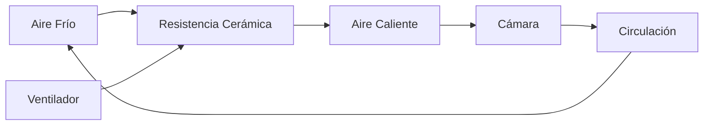
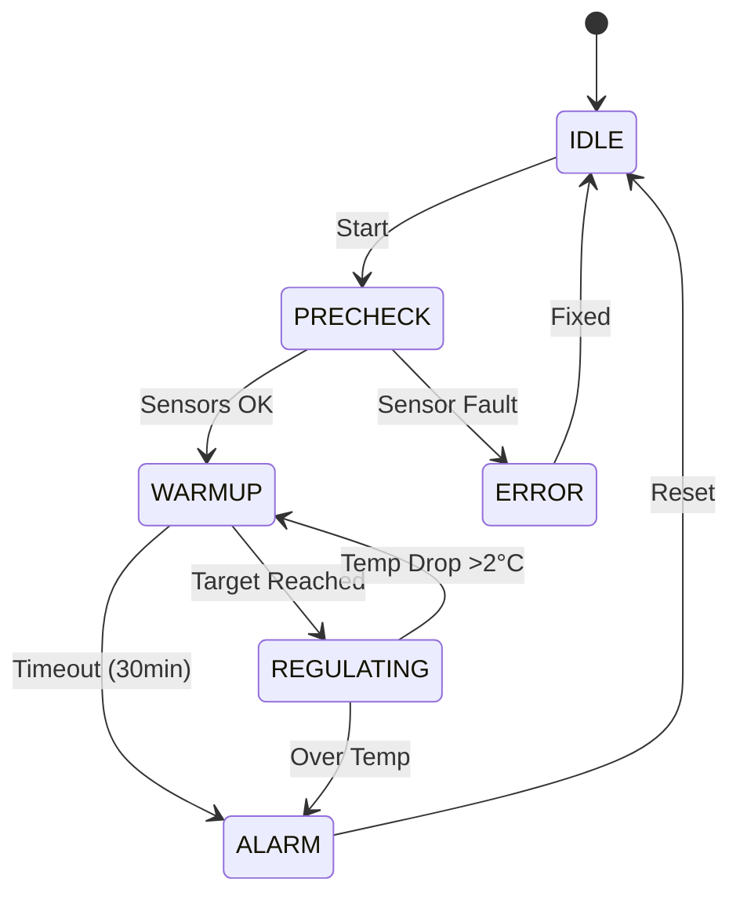

# Sistema de Calefacción

## Principio de Funcionamiento

El sistema de calefacción de IncuNest utiliza **convección forzada**:



## Componentes

### Elemento Calefactor

| Parámetro | Especificación |
|-----------|----------------|
| Tipo | Resistencia cerámica PTC |
| Potencia | 100W |
| Voltaje | 12V DC |
| Temperatura máx | 200°C |
| Dimensiones | 50 x 30 x 10 mm |

### Ventilador de Circulación

| Parámetro | Especificación |
|-----------|----------------|
| Tipo | Axial brushless |
| Tamaño | 80 x 80 x 25 mm |
| Voltaje | 12V DC |
| Flujo | 40 CFM |
| Ruido | menor a 30 dB |

## Diseño del Conducto de Aire

### Vista en Corte

```
          CÁMARA PRINCIPAL
    ┌─────────────────────────────┐
    │                             │
    │    ↑    ↑    ↑    ↑    ↑   │  Aire caliente sube
    │    │    │    │    │    │   │
    │    └────┴────┴────┴────┘   │
    │         DIFUSOR            │
    │                             │
    └─────────────────────────────┘
              │
    ┌─────────┴─────────┐
    │  CONDUCTO CALEF.  │
    │                   │
    │  ┌─────────────┐  │
    │  │  RESISTENCIA │  │
    │  │    100W      │  │
    │  └─────────────┘  │
    │         ▲         │
    │  ┌──────┴──────┐  │
    │  │ VENTILADOR  │  │
    │  │    80mm     │  │
    │  └─────────────┘  │
    │         ▲         │
    └─────────┬─────────┘
              │
        ENTRADA DE AIRE
```

### Dimensiones del Conducto

| Sección | Dimensiones |
|---------|-------------|
| Entrada | 80 x 80 mm |
| Cámara de calefacción | 100 x 100 x 50 mm |
| Difusor | 400 x 30 mm |

## Difusor de Aire

El difusor distribuye el aire caliente uniformemente:

```
┌─────────────────────────────────────────────────┐
│  ○  ○  ○  ○  ○  ○  ○  ○  ○  ○  ○  ○  ○  ○  ○  │
│     ○  ○  ○  ○  ○  ○  ○  ○  ○  ○  ○  ○  ○     │
│  ○  ○  ○  ○  ○  ○  ○  ○  ○  ○  ○  ○  ○  ○  ○  │
└─────────────────────────────────────────────────┘

○ = Agujero de 5mm de diámetro
Patrón: Rejilla alternada
Total: ~45 agujeros
```

## Protección Térmica

### Termostato de Seguridad

Adicional al control electrónico, se incluye un termostato mecánico:

| Parámetro | Valor |
|-----------|-------|
| Tipo | Bimetálico NC |
| Temperatura de corte | 45°C |
| Histéresis | 5°C |
| Corriente máxima | 10A |

### Conexión del Termostato

```
    12V ───[FUSIBLE]───[TERMOSTATO]───[MOSFET]─── RESISTENCIA
              15A          45°C
```

## Balance Térmico

### Cálculo de Potencia Necesaria

```
P necesaria = Q / Δt
```

Donde:
- Q = Energía térmica necesaria
- Δt = Tiempo de calentamiento deseado

Para calentar la cámara de 25°C a 37°C en 10 minutos:

```
P ≈ (m × cp × ΔT) / t ≈ 80W
```

La resistencia de 100W proporciona margen de seguridad.

### Pérdidas Térmicas

| Fuente | Pérdida Estimada |
|--------|------------------|
| Conducción (paredes) | 20W |
| Apertura de puertas | 30W (transitorio) |
| Radiación | 5W |
| **Total en operación** | **~25W** |

## Código de Control

### Control PID del Calefactor

```cpp
class HeatingController {
private:
    PIDController pid;
    float targetTemp = 36.5;
    float currentTemp = 25.0;
    uint8_t heaterPower = 0;
    uint8_t fanSpeed = 0;
    
public:
    HeatingController() : pid(2.0, 0.5, 1.0) {}
    
    void update(float measuredTemp) {
        currentTemp = measuredTemp;
        
        // Calcular potencia del calefactor
        heaterPower = pid.compute(targetTemp, currentTemp);
        
        // Calcular velocidad del ventilador
        // Mínimo 30% cuando el calefactor está activo
        if (heaterPower > 0) {
            fanSpeed = max(30, heaterPower);
        } else {
            fanSpeed = 0;
        }
        
        // Aplicar salidas
        setHeaterPWM(heaterPower);
        setFanPWM(fanSpeed);
    }
    
    void setTarget(float temp) {
        targetTemp = constrain(temp, 25.0, 37.5);
    }
    
    bool isSafe() {
        // Verificar temperatura segura
        return currentTemp < 40.0;
    }
};
```

### Secuencia de Calentamiento



## Mantenimiento

### Inspección Periódica

| Tarea | Frecuencia |
|-------|------------|
| Verificar funcionamiento del ventilador | Semanal |
| Limpiar filtro de entrada | Mensual |
| Verificar conexiones eléctricas | Mensual |
| Calibrar termostato de seguridad | Anual |

### Señales de Desgaste

- Ventilador ruidoso → Reemplazar
- Resistencia con puntos calientes → Reemplazar
- Termostato no corta → Reemplazar inmediatamente

## Lista de Materiales

| Componente | Especificación | Cantidad |
|------------|----------------|----------|
| Resistencia PTC | 100W 12V | 1 |
| Ventilador | 80mm 12V | 1 |
| Termostato | KSD301 45°C NC | 1 |
| Conducto | Aluminio 1mm | 1 set |
| Difusor | PLA/PETG impreso 3D | 1 |
| Aislante | Fibra cerámica | 100x100x10mm |

## Próximas Secciones

- [Sistema de Humidificación](./humidification)
- [Piezas 3D](./3d-parts)
