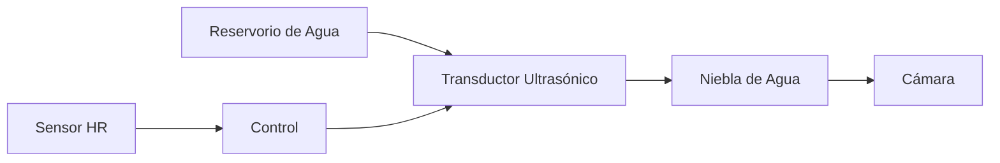

# Sistema de Humidificación

## Principio de Funcionamiento

IncuNest utiliza un **humidificador ultrasónico** para mantener niveles adecuados de humedad relativa (40-80% HR).



## Componentes

### Módulo Ultrasónico

| Parámetro | Especificación |
|-----------|----------------|
| Tipo | Transductor piezoeléctrico |
| Frecuencia | 1.7 MHz |
| Voltaje | 5V DC |
| Consumo | 200mA típico |
| Producción | 20-30 ml/hora |

### Reservorio de Agua

| Parámetro | Especificación |
|-----------|----------------|
| Capacidad | 500 ml |
| Material | Polipropileno (PP) |
| Sensor de nivel | Flotador magnético |
| Llenado | Manual, acceso frontal |

## Diseño del Sistema

### Diagrama de Componentes

```
┌───────────────────────────────────────────┐
│              CÁMARA                       │
│                                           │
│         ↑↑↑  NIEBLA  ↑↑↑                 │
│         │            │                    │
└─────────┼────────────┼────────────────────┘
          │            │
┌─────────┴────────────┴───────┐
│     CONDUCTO DE HUMEDAD      │
│                              │
│  ┌────────────────────────┐  │
│  │   TRANSDUCTOR          │  │
│  │   ULTRASÓNICO          │  │
│  │       (～～)           │  │
│  └────────────────────────┘  │
│                              │
│  ════════════════════════    │ ← Nivel de agua
│  ┌────────────────────────┐  │
│  │     RESERVORIO         │  │
│  │     500 ml             │  │
│  └────────────────────────┘  │
│                              │
│  [SENSOR DE NIVEL]          │
│                              │
└──────────────────────────────┘
```

### Sensor de Nivel de Agua

```
         ┌─────┐
         │     │
         │  S  │ ← Reed switch
         │     │
    ═════╪═════╪════  Nivel normal
         │  ○  │ ← Flotador con imán
         │     │
    ═════╪═════╪════  Nivel bajo → Alarma
         │     │
         └─────┘
```

## Control de Humedad

### Algoritmo On/Off con Histéresis

```cpp
class HumidityController {
private:
    float targetHumidity = 60.0;
    float hysteresis = 5.0;
    bool humidifierOn = false;
    
public:
    void update(float currentHumidity) {
        if (currentHumidity < targetHumidity - hysteresis) {
            humidifierOn = true;
        } else if (currentHumidity > targetHumidity + hysteresis) {
            humidifierOn = false;
        }
        // Mantener estado entre los umbrales (histéresis)
        
        setHumidifier(humidifierOn);
    }
    
    void setTarget(float humidity) {
        targetHumidity = constrain(humidity, 40.0, 80.0);
    }
    
    bool isActive() {
        return humidifierOn;
    }
};
```

### Gráfico de Histéresis

```
Humedad (%)
    80 ┤
       │         ┌──────┐
    65 ┤─────────┤ OFF  ├─────────  Umbral superior (target + 5%)
       │         └──┬───┘
    60 ┤────────────┼────────────  Target
       │         ┌──┴───┐
    55 ┤─────────┤  ON  ├─────────  Umbral inferior (target - 5%)
       │         └──────┘
    40 ┤
       └──────────────────────────► Tiempo
```

## Circuito Electrónico

### Conexión del Humidificador

```
      5V
       │
       │
  ┌────┴────┐
  │ HUMIDIF │
  │  MODULE │
  └────┬────┘
       │
      [Q1]     2N2222 o MOSFET
       │
      GND

  GPIO27 ───[1K]───[Base/Gate Q1]
```

### Conexión del Sensor de Nivel

```
      3.3V
       │
      [10K]
       │
  GPIO39 ──┬── SENSOR_NIVEL
           │
          GND (cuando el flotador está bajo)
```

### Código del Sensor de Nivel

```cpp
#define WATER_LEVEL_PIN 39
#define LOW_WATER_THRESHOLD 1000  // Valor ADC

bool checkWaterLevel() {
    int level = analogRead(WATER_LEVEL_PIN);
    
    if (level < LOW_WATER_THRESHOLD) {
        raiseAlarm(ALARM_LOW_WATER, "Nivel de agua bajo");
        return false;
    }
    return true;
}

void controlHumidifier(bool enable) {
    // Solo activar si hay suficiente agua
    if (enable && checkWaterLevel()) {
        digitalWrite(HUMIDIFIER_PIN, HIGH);
    } else {
        digitalWrite(HUMIDIFIER_PIN, LOW);
    }
}
```

## Seguridad

### Protecciones Implementadas

| Riesgo | Mitigación |
|--------|------------|
| Reservorio vacío | Sensor de nivel + alarma |
| Humedad excesiva | Límite máximo 85% HR |
| Crecimiento bacteriano | Recordatorio de limpieza |
| Desbordamiento | Bandeja de drenaje |

### Alarmas de Humidificación

```cpp
void checkHumidityAlarms(float humidity) {
    if (humidity > 85.0) {
        raiseAlarm(ALARM_HIGH_HUMIDITY, "Humedad muy alta");
        setHumidifier(false);
    }
    
    if (humidity < 30.0 && humidifierActive) {
        raiseAlarm(ALARM_HUMIDIFIER_FAULT, "Humidificador no responde");
    }
    
    if (!checkWaterLevel()) {
        setHumidifier(false);
    }
}
```

## Mantenimiento

### Rutina de Limpieza

**Frecuencia**: Cada 48 horas de uso o al cambiar el agua

1. **Vaciar** el reservorio completamente
2. **Limpiar** con solución de vinagre diluido (1:10)
3. **Enjuagar** con agua destilada
4. **Secar** completamente
5. **Rellenar** con agua destilada fresca

### Recomendaciones de Agua

| Tipo de Agua | Recomendación |
|--------------|---------------|
| Destilada | ✅ Recomendada |
| Hervida | ✅ Aceptable |
| Filtrada (RO) | ✅ Aceptable |
| Grifo | ⚠️ Puede generar depósitos |
| Mineral | ❌ No usar |

### Señales de Mantenimiento

- **Producción de niebla reducida** → Limpiar transductor
- **Depósitos blancos** → Usar agua destilada
- **Olor desagradable** → Limpieza profunda necesaria
- **Sin producción de niebla** → Verificar transductor

## Especificaciones Técnicas

| Parámetro | Valor |
|-----------|-------|
| Rango de control | 40% - 80% HR |
| Precisión | ±5% HR |
| Tiempo de respuesta | 5-10 minutos |
| Producción de niebla | 20-30 ml/hora |
| Capacidad del reservorio | 500 ml |
| Autonomía máxima | ~20 horas |

## Lista de Materiales

| Componente | Especificación | Cantidad |
|------------|----------------|----------|
| Módulo ultrasónico | 5V 1.7MHz | 1 |
| Reservorio | PP 500ml | 1 |
| Sensor de nivel | Reed switch + flotador | 1 |
| Transistor | 2N2222A | 1 |
| Resistencia | 1KΩ 1/4W | 1 |
| Tubo silicona | 10mm diámetro | 0.5m |

## Próximas Secciones

- [Piezas Impresas 3D](./3d-parts)
