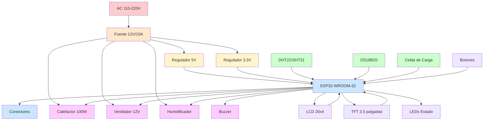

# Hardware - Visión General

## Introducción

El hardware de IncuNest está diseñado con los siguientes principios:

- **Accesibilidad**: Componentes disponibles globalmente
- **Simplicidad**: Fácil de ensamblar y reparar
- **Seguridad**: Múltiples capas de protección
- **Modularidad**: Componentes intercambiables

## Diagrama del Sistema



## Componentes Principales

### 1. Unidad de Control

| Componente | Especificación | Función |
|------------|----------------|---------|
| ESP32-WROOM-32 | 240MHz, 520KB RAM | MCU principal |
| Flash 4MB | W25Q32 | Almacenamiento |
| RTC DS3231 | Precisión ±2ppm | Reloj tiempo real |
| EEPROM 24C32 | 32Kbit | Configuración |

### 2. Sensores

| Sensor | Interfaz | Precisión | Uso |
|--------|----------|-----------|-----|
| SHT31 | I2C | ±0.3°C, ±2%RH | Temp/Hum ambiente |
| DS18B20 | 1-Wire | ±0.5°C | Temp. de piel |
| HX711 + Celda | Serial | 0.1g | Peso (opcional) |

### 3. Actuadores

| Actuador | Especificación | Control |
|----------|----------------|---------|
| Resistencia cerámica | 100W, 12V | PWM via MOSFET |
| Ventilador | 12V, 0.5A | PWM |
| Humidificador | 5V ultrasónico | On/Off |
| Buzzer | 5V, 85dB | PWM/Digital |

### 4. Interfaz de Usuario

| Componente | Especificación | Conexión |
|------------|----------------|----------|
| LCD 20x4 | HD44780 compatible | I2C |
| TFT 3.5" | ILI9488, 480x320 | SPI |
| LEDs | RGB, indicadores | GPIO |
| Botones | 4x táctiles | GPIO |

## Diagrama de Bloques Eléctrico

```
┌─────────────────────────────────────────────────────────────────┐
│                      FUENTE DE ALIMENTACIÓN                      │
├──────────────────┬──────────────────┬──────────────────────────┤
│     12V/10A      │     5V/3A        │       3.3V/1A            │
│    (Actuadores)  │   (Lógica 5V)    │    (ESP32, Sensores)     │
└────────┬─────────┴────────┬─────────┴──────────┬───────────────┘
         │                  │                     │
         ▼                  ▼                     ▼
┌────────────────┐  ┌──────────────┐      ┌──────────────┐
│   CALEFACTOR   │  │    BUZZER    │      │    ESP32     │
│   100W PWM     │  │    ALARMA    │      │   MCU        │
└────────────────┘  └──────────────┘      └──────┬───────┘
         │                                        │
         │              ┌─────────────────────────┼─────────────┐
         │              │                         │             │
         ▼              ▼                         ▼             ▼
┌────────────────┐ ┌────────────┐         ┌────────────┐ ┌────────────┐
│  VENTILADOR    │ │   DISPLAY  │         │  SENSORES  │ │   WiFi     │
│   12V PWM      │ │  LCD/TFT   │         │  I2C/1Wire │ │  Integrado │
└────────────────┘ └────────────┘         └────────────┘ └────────────┘
```

## Especificaciones Eléctricas

### Consumo de Potencia

| Estado | Corriente 12V | Potencia |
|--------|---------------|----------|
| Standby | 0.5A | 6W |
| Calentando (100%) | 10A | 120W |
| Operación normal | 3-5A | 36-60W |
| Solo monitoreo | 0.3A | 3.6W |

### Protecciones

- **Fusible principal**: 15A, 12V
- **Protección contra inversión de polaridad**: Diodo Schottky
- **Reguladores con protección térmica**
- **TVS en líneas de señal**

## Asignación de Pines ESP32

```cpp
// Sensores
#define PIN_DHT22           4    // Sensor temp/hum ambiente
#define PIN_DS18B20         5    // Sensor temp piel
#define PIN_SDA             21   // I2C Data
#define PIN_SCL             22   // I2C Clock
#define PIN_HX711_DT        16   // Celda de carga data
#define PIN_HX711_SCK       17   // Celda de carga clock

// Actuadores
#define PIN_HEATER_PWM      25   // Control calefactor
#define PIN_FAN_PWM         26   // Control ventilador
#define PIN_HUMIDIFIER      27   // Control humidificador
#define PIN_BUZZER          32   // Alarma sonora

// Display TFT (SPI)
#define PIN_TFT_CS          15   // TFT Chip Select
#define PIN_TFT_DC          2    // TFT Data/Command
#define PIN_TFT_RST         4    // TFT Reset
#define PIN_TFT_MOSI        23   // SPI MOSI
#define PIN_TFT_SCLK        18   // SPI Clock

// LEDs de estado
#define PIN_LED_RED         12   // LED Alarma
#define PIN_LED_GREEN       13   // LED OK
#define PIN_LED_BLUE        14   // LED Info

// Botones
#define PIN_BTN_UP          33   // Botón arriba
#define PIN_BTN_DOWN        34   // Botón abajo
#define PIN_BTN_SELECT      35   // Botón selección
#define PIN_BTN_BACK        36   // Botón volver
```

## Estructura Mecánica

### Dimensiones Generales

| Parámetro | Valor |
|-----------|-------|
| Dimensiones externas | 60 x 40 x 50 cm |
| Espacio interno | 50 x 30 x 30 cm |
| Peso (vacío) | ~15 kg |
| Material carcasa | Acrílico 6mm + PLA |

### Componentes Mecánicos

1. **Cámara principal**: Acrílico transparente
2. **Base estructural**: MDF o aluminio
3. **Sistema de calefacción**: Conductos de aire
4. **Aislamiento**: Espuma de poliestireno
5. **Puertas de acceso**: Con sellos herméticos

## Próximas Secciones

- [Componentes Electrónicos](./electronics/main-board) - Detalles del PCB
- [Estructura Mecánica](./mechanical/enclosure) - Diseño físico
- [Ensamblaje](./assembly/bom) - Guía de construcción
