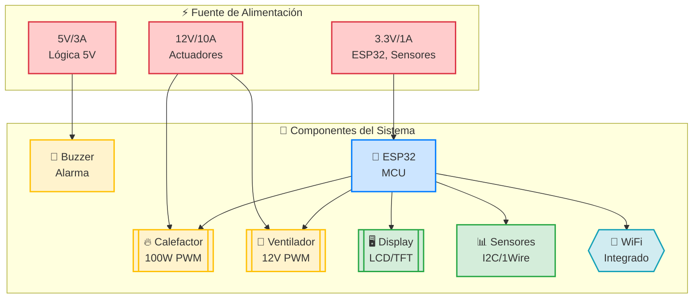

# Hardware - Visión General

## Introducción

El hardware de IncuNest está diseñado con los siguientes principios:

- **Accesibilidad**: Componentes disponibles globalmente
- **Simplicidad**: Fácil de ensamblar y reparar
- **Seguridad**: Múltiples capas de protección
- **Modularidad**: Componentes intercambiables

## Diagrama del Sistema

```mermaid
graph TB
    subgraph power [⚡ Alimentación]
        AC[🔌 AC 110-220V]
        PSU[(Fuente 12V/10A)]
        VREG5{{Regulador 5V}}
        VREG3{{Regulador 3.3V}}
    end
    
    subgraph sensors [📊 Sensores]
        TEMP1[🌡️ DHT22/SHT31]
        TEMP2[🌡️ DS18B20]
        WEIGHT[⚖️ Celda de Carga]
    end
    
    subgraph mcu [🧠 Controlador]
        ESP32([ESP32-WROOM-32])
    end
    
    subgraph actuators [⚙️ Actuadores]
        HEATER[[🔥 Calefactor 100W]]
        FAN[[💨 Ventilador 12V]]
        HUMID[[💦 Humidificador]]
        BUZ[🔔 Buzzer]
    end
    
    subgraph ui [🖥️ Interfaz de Usuario]
        LCD[[LCD 20x4]]
        TFT[[TFT 3.5"]]
        LED[💡 LEDs Estado]
        BTN[🔘 Botones]
    end
    
    AC --> PSU
    PSU --> VREG5
    PSU --> VREG3
    
    VREG5 --> ESP32
    VREG3 --> TEMP1
    VREG3 --> TEMP2
    
    PSU --> HEATER
    PSU --> FAN
    PSU --> HUMID
    
    TEMP1 --> ESP32
    TEMP2 --> ESP32
    WEIGHT --> ESP32
    
    ESP32 --> HEATER
    ESP32 --> FAN
    ESP32 --> HUMID
    ESP32 --> BUZ
    
    ESP32 <--> LCD
    ESP32 <--> TFT
    ESP32 --> LED
    BTN --> ESP32
    
    classDef power fill:#ffcccc,stroke:#dc3545,stroke-width:2px
    classDef sensors fill:#d4edda,stroke:#28a745,stroke-width:2px
    classDef mcu fill:#cce5ff,stroke:#007bff,stroke-width:2px
    classDef actuators fill:#fff3cd,stroke:#ffc107,stroke-width:2px
    classDef ui fill:#e2d5f1,stroke:#6f42c1,stroke-width:2px
    
    class AC,PSU,VREG5,VREG3 power
    class TEMP1,TEMP2,WEIGHT sensors
    class ESP32 mcu
    class HEATER,FAN,HUMID,BUZ actuators
    class LCD,TFT,LED,BTN ui
```

## Componentes Principales

### 1. Unidad de Control

| Componente | Especificación | Función |
|------------|----------------|---------|
| ESP32-WROOM-32 | 240MHz, 520KB RAM | MCU principal |
| Flash 4MB | W25Q32 | Almacenamiento |
| RTC DS3231 | Precisión ±2ppm | Reloj tiempo real |
| EEPROM 24C32 | 32Kbit | Configuración |

### 2. Sensores

| Sensor | Interfaz | Precisión | Uso |
|--------|----------|-----------|-----|
| SHT31 | I2C | ±0.3°C, ±2%RH | Temp/Hum ambiente |
| DS18B20 | 1-Wire | ±0.5°C | Temp. de piel |
| HX711 + Celda | Serial | 0.1g | Peso (opcional) |

### 3. Actuadores

| Actuador | Especificación | Control |
|----------|----------------|---------|
| Resistencia cerámica | 100W, 12V | PWM via MOSFET |
| Ventilador | 12V, 0.5A | PWM |
| Humidificador | 5V ultrasónico | On/Off |
| Buzzer | 5V, 85dB | PWM/Digital |

### 4. Interfaz de Usuario

| Componente | Especificación | Conexión |
|------------|----------------|----------|
| LCD 20x4 | HD44780 compatible | I2C |
| TFT 3.5" | ILI9488, 480x320 | SPI |
| LEDs | RGB, indicadores | GPIO |
| Botones | 4x táctiles | GPIO |

## Diagrama de Bloques Eléctrico


```mermaid
graph TB
    subgraph psu [⚡ Fuente de Alimentación]
        direction LR
        V12[12V/10A<br/>Actuadores]
        V5[5V/3A<br/>Lógica 5V]
        V33[3.3V/1A<br/>ESP32, Sensores]
    end
    
    subgraph components [🔧 Componentes del Sistema]
        CALEFACTOR[[🔥 Calefactor<br/>100W PWM]]
        BUZZER[🔔 Buzzer<br/>Alarma]
        ESP[🧠 ESP32<br/>MCU]
        VENTILADOR[[💨 Ventilador<br/>12V PWM]]
        DISPLAY[[🖥️ Display<br/>LCD/TFT]]
        SENSORES[📊 Sensores<br/>I2C/1Wire]
        WIFI{{📡 WiFi<br/>Integrado}}
    end
    
    V12 --> CALEFACTOR
    V12 --> VENTILADOR
    V5 --> BUZZER
    V33 --> ESP
    
    ESP --> CALEFACTOR
    ESP --> VENTILADOR
    ESP --> DISPLAY
    ESP --> SENSORES
    ESP --> WIFI
    
    classDef power fill:#ffcccc,stroke:#dc3545,stroke-width:2px
    classDef actuator fill:#fff3cd,stroke:#ffc107,stroke-width:2px
    classDef core fill:#cce5ff,stroke:#007bff,stroke-width:2px
    classDef sensor fill:#d4edda,stroke:#28a745,stroke-width:2px
    classDef comm fill:#d1ecf1,stroke:#17a2b8,stroke-width:2px
    
    class V12,V5,V33 power
    class CALEFACTOR,VENTILADOR,BUZZER actuator
    class ESP core
    class DISPLAY,SENSORES sensor
    class WIFI comm
```

## Especificaciones Eléctricas

### Consumo de Potencia

| Estado | Corriente 12V | Potencia |
|--------|---------------|----------|
| Standby | 0.5A | 6W |
| Calentando (100%) | 10A | 120W |
| Operación normal | 3-5A | 36-60W |
| Solo monitoreo | 0.3A | 3.6W |

### Protecciones

- **Fusible principal**: 15A, 12V
- **Protección contra inversión de polaridad**: Diodo Schottky
- **Reguladores con protección térmica**
- **TVS en líneas de señal**

## Asignación de Pines ESP32

```cpp
// Sensores
#define PIN_DHT22           4    // Sensor temp/hum ambiente
#define PIN_DS18B20         5    // Sensor temp piel
#define PIN_SDA             21   // I2C Data
#define PIN_SCL             22   // I2C Clock
#define PIN_HX711_DT        16   // Celda de carga data
#define PIN_HX711_SCK       17   // Celda de carga clock

// Actuadores
#define PIN_HEATER_PWM      25   // Control calefactor
#define PIN_FAN_PWM         26   // Control ventilador
#define PIN_HUMIDIFIER      27   // Control humidificador
#define PIN_BUZZER          32   // Alarma sonora

// Display TFT (SPI)
#define PIN_TFT_CS          15   // TFT Chip Select
#define PIN_TFT_DC          2    // TFT Data/Command
#define PIN_TFT_RST         4    // TFT Reset
#define PIN_TFT_MOSI        23   // SPI MOSI
#define PIN_TFT_SCLK        18   // SPI Clock

// LEDs de estado
#define PIN_LED_RED         12   // LED Alarma
#define PIN_LED_GREEN       13   // LED OK
#define PIN_LED_BLUE        14   // LED Info

// Botones
#define PIN_BTN_UP          33   // Botón arriba
#define PIN_BTN_DOWN        34   // Botón abajo
#define PIN_BTN_SELECT      35   // Botón selección
#define PIN_BTN_BACK        36   // Botón volver
```

## Estructura Mecánica

### Dimensiones Generales

| Parámetro | Valor |
|-----------|-------|
| Dimensiones externas | 60 x 40 x 50 cm |
| Espacio interno | 50 x 30 x 30 cm |
| Peso (vacío) | ~15 kg |
| Material carcasa | Acrílico 6mm + PLA |

### Componentes Mecánicos

1. **Cámara principal**: Acrílico transparente
2. **Base estructural**: MDF o aluminio
3. **Sistema de calefacción**: Conductos de aire
4. **Aislamiento**: Espuma de poliestireno
5. **Puertas de acceso**: Con sellos herméticos

## Próximas Secciones

- [Componentes Electrónicos](./electronics/main-board) - Detalles del PCB
- [Estructura Mecánica](./mechanical/enclosure) - Diseño físico
- [Ensamblaje](./assembly/bom) - Guía de construcción
