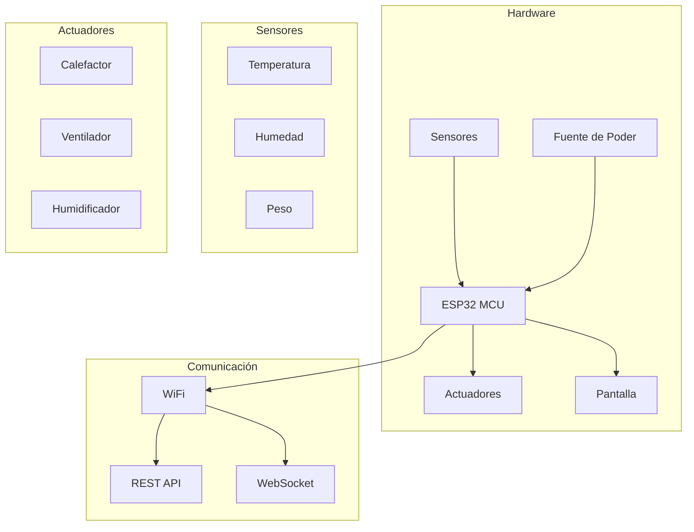

# Introducción a IncuNest

  

    <h1 className="hero__title">🏥 IncuNest</h1>
    
Incubadora Neonatal de Código Abierto

  

## ¿Qué es IncuNest?

**IncuNest** es un proyecto de hardware y software de código abierto que tiene como objetivo proporcionar una **incubadora neonatal accesible y de bajo costo** para entornos con recursos limitados. El proyecto está diseñado para cumplir con los estándares de seguridad médica mientras mantiene la facilidad de fabricación y mantenimiento.

:::tip Misión del Proyecto
Reducir la mortalidad neonatal proporcionando tecnología médica de calidad a comunidades que más la necesitan.
:::

## Características Principales

### 🌡️ Control de Temperatura
- Control preciso de temperatura mediante PID
- Rango de operación: 25°C - 37°C
- Precisión: ±0.1°C
- Múltiples sensores de temperatura redundantes

### 💧 Control de Humedad
- Humidificación activa del ambiente
- Rango de humedad: 40% - 80% HR
- Sistema de reservorio de agua integrado

### 📊 Monitorización en Tiempo Real
- Pantalla LCD/TFT integrada
- Interfaz web accesible vía WiFi
- Registro de datos históricos
- Alertas y alarmas configurables

### 🔒 Seguridad
- Múltiples niveles de alarma
- Protección contra sobrecalentamiento
- Batería de respaldo para emergencias
- Diseño a prueba de fallos

## Arquitectura del Sistema

## Especificaciones Técnicas

| Parámetro | Especificación |
|-----------|----------------|
| **Microcontrolador** | ESP32-WROOM-32 |
| **Rango de Temperatura** | 25°C - 37°C |
| **Precisión de Temperatura** | ±0.1°C |
| **Rango de Humedad** | 40% - 80% HR |
| **Alimentación** | 12V DC / 110-220V AC |
| **Consumo Máximo** | 150W |
| **Conectividad** | WiFi 802.11 b/g/n |
| **Pantalla** | LCD 20x4 / TFT 3.5" |

## Licencia

IncuNest está licenciado bajo **MIT**, lo que significa que:

- ✅ Puedes usar, modificar y distribuir el proyecto, incluso con fines comerciales
- ✅ Debes incluir el aviso de copyright y la licencia MIT en copias o trabajos derivados
- ⚠️ No se ofrece garantía; úsalo bajo tu propio riesgo

:::warning Aviso de Seguridad
Este proyecto es para fines educativos y de investigación. Cualquier uso clínico debe cumplir con las regulaciones médicas locales y requerir certificación apropiada.
:::

## Próximos Pasos

  

    

      

        <h3>🚀 Guía de Inicio Rápido</h3>
      

      

        
Aprende a configurar tu primera IncuNest

      

      

        <a className="button button--primary button--block" href="./getting-started">Comenzar</a>
      

    

  

  

    

      

        <h3>🔧 Hardware</h3>
      

      

        
Explora los componentes y ensamblaje

      

      

        <a className="button button--secondary button--block" href="./hardware/overview">Ver Hardware</a>
      

    

  

## Contribuir

IncuNest es un proyecto comunitario y agradecemos todas las contribuciones. Consulta nuestra [guía de contribución](./contributing) para más información.

---

  <strong>Medical Open World</strong> - Tecnología médica accesible para todos

