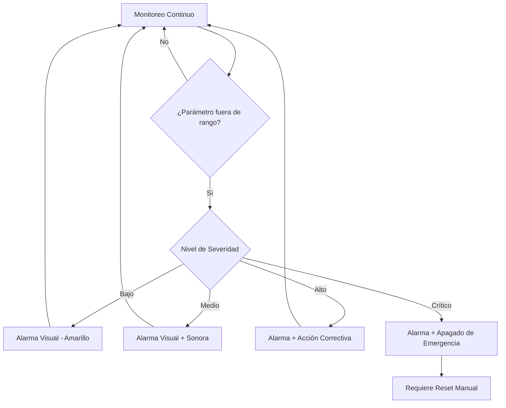

# ⚠️ Aviso de Seguridad

:::danger Advertencia Importante
Lea completamente este aviso antes de construir, ensamblar o utilizar IncuNest.
:::

## Descargo de Responsabilidad

IncuNest es un proyecto de **código abierto con fines educativos y de investigación**. El equipo de desarrollo y los contribuidores:

1. **NO garantizan** la idoneidad del dispositivo para uso clínico
2. **NO se hacen responsables** de daños o lesiones resultantes del uso
3. **NO certifican** el cumplimiento de normativas médicas específicas

## Requisitos para Uso Clínico

Si planea utilizar IncuNest en un entorno clínico, **DEBE**:

### Certificaciones Requeridas

| Región | Certificación Requerida |
|--------|------------------------|
| Unión Europea | Marcado CE (MDR 2017/745) |
| Estados Unidos | FDA 510(k) Clearance |
| América Latina | ANVISA, COFEPRIS, INVIMA, etc. |
| Internacional | ISO 13485, IEC 60601-1 |

### Pasos Obligatorios

1. **Evaluación de Riesgos**: Realizar análisis completo según ISO 14971
2. **Validación Clínica**: Pruebas en entorno controlado con supervisión médica
3. **Certificación**: Obtener aprobación de la autoridad regulatoria local
4. **Trazabilidad**: Implementar sistema de seguimiento de dispositivos
5. **Capacitación**: Entrenar al personal médico en el uso correcto

## Riesgos Conocidos

### Riesgos Térmicos

| Riesgo | Mitigación |
|--------|------------|
| Sobrecalentamiento | Múltiples sensores + alarma a 38°C |
| Falla del calefactor | Control redundante + corte térmico |
| Temperatura insuficiente | Alarma de baja temperatura |

### Riesgos Eléctricos

| Riesgo | Mitigación |
|--------|------------|
| Descarga eléctrica | Aislamiento galvánico + fusibles |
| Cortocircuito | Protección de circuito |
| Falla de alimentación | Sistema UPS recomendado |

### Riesgos de Humedad

| Riesgo | Mitigación |
|--------|------------|
| Humedad excesiva | Control automático + drenaje |
| Condensación | Ventilación adecuada |
| Crecimiento bacteriano | Limpieza periódica |

## Sistema de Alarmas

IncuNest implementa un sistema de alarmas de múltiples niveles:



### Niveles de Alarma

| Nivel | Condición | Acción |
|-------|-----------|--------|
| **INFO** | Desviación menor | Indicador LED azul |
| **WARNING** | Desviación moderada | LED amarillo + beep |
| **ALARM** | Parámetro fuera de límites | LED rojo + alarma sonora |
| **CRITICAL** | Riesgo para el paciente | Apagado seguro + alarma continua |

## Límites de Operación Seguros

### Temperatura

```
┌──────────────────────────────────────────────────────┐
│ ZONA DE PELIGRO (FRÍO)  │ ZONA SEGURA │ ZONA PELIGRO │
│        < 25°C           │  25°C - 37°C │    > 38°C    │
│      ⚠️ ALARMA          │      ✅      │  🛑 CRÍTICO  │
└──────────────────────────────────────────────────────┘
```

### Humedad Relativa

```
┌──────────────────────────────────────────────────────┐
│ BAJO  │     ZONA SEGURA      │        ALTO          │
│ < 40% │      40% - 80%       │        > 85%         │
│  ⚠️   │         ✅           │         ⚠️           │
└──────────────────────────────────────────────────────┘
```

## Mantenimiento de Seguridad

### Inspecciones Diarias

- [ ] Verificar lecturas de temperatura y humedad
- [ ] Comprobar funcionamiento de alarmas
- [ ] Inspeccionar cables y conexiones
- [ ] Verificar nivel de agua del humidificador

### Inspecciones Semanales

- [ ] Limpiar sensores de temperatura
- [ ] Verificar calibración de sensores
- [ ] Comprobar conexiones eléctricas
- [ ] Revisar registros de alarmas

### Inspecciones Mensuales

- [ ] Calibración completa de sensores
- [ ] Limpieza profunda de la cámara
- [ ] Verificar integridad del aislamiento
- [ ] Actualizar firmware si hay versiones disponibles

## Contacto de Emergencia

En caso de mal funcionamiento durante el uso:

1. **Retire inmediatamente al paciente** a un ambiente seguro alternativo
2. **Desconecte el dispositivo** de la fuente de alimentación
3. **Documente el incidente** con todos los detalles
4. **Reporte el problema** en [GitHub Issues](https://github.com/medicalopenworld/IncuNest/issues)

## Declaración de Conformidad

Este proyecto **NO** incluye declaración de conformidad con normativas médicas. Cada implementador es responsable de:

- Obtener certificaciones necesarias
- Realizar validación clínica
- Cumplir regulaciones locales
- Mantener documentación de calidad

---

:::info Nota Legal
Al utilizar este proyecto, acepta que lo hace bajo su propia responsabilidad y que ha leído y comprendido completamente este aviso de seguridad.
:::
