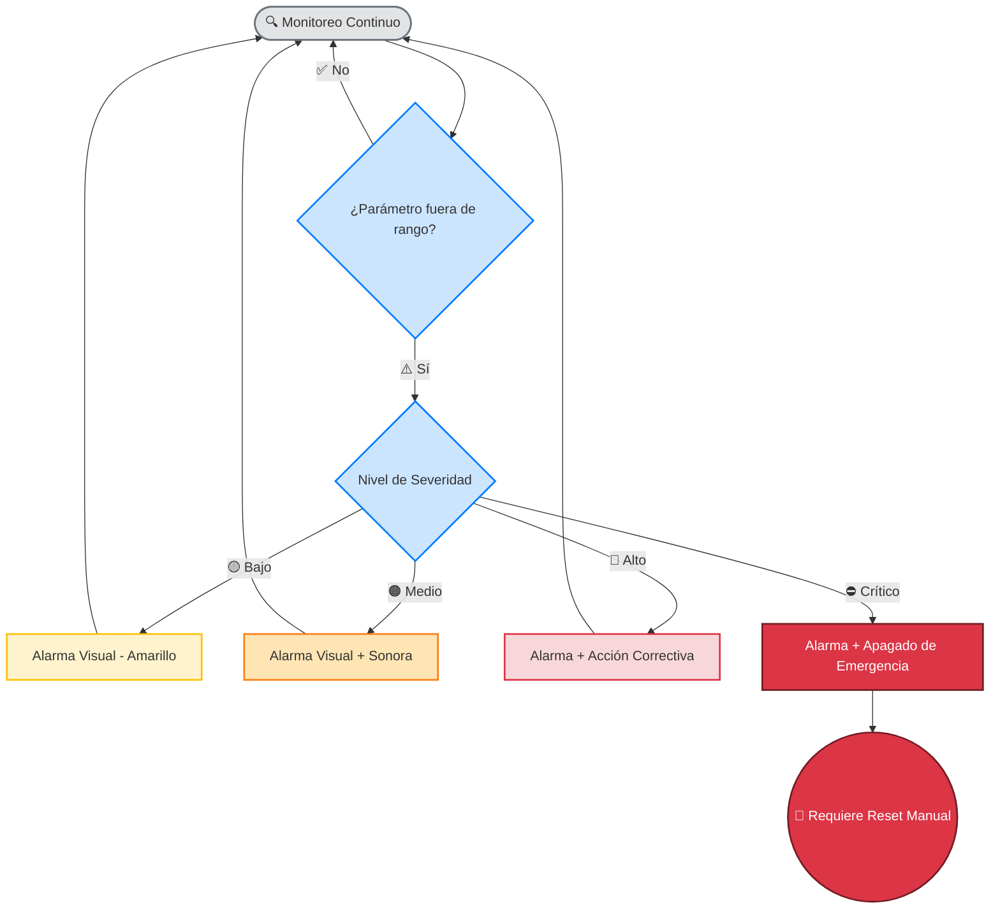
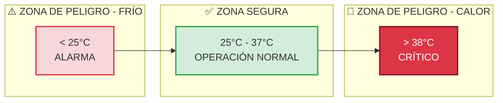
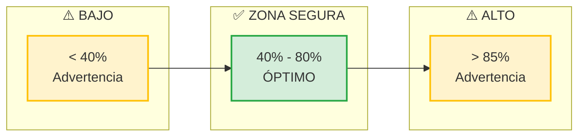

# ⚠️ Aviso de Seguridad

:::danger Advertencia Importante
Lea completamente este aviso antes de construir, ensamblar o utilizar IncuNest.
:::

## Descargo de Responsabilidad

IncuNest es un proyecto de **código abierto con fines educativos y de investigación**. El equipo de desarrollo y los contribuidores:

1. **NO garantizan** la idoneidad del dispositivo para uso clínico
2. **NO se hacen responsables** de daños o lesiones resultantes del uso
3. **NO certifican** el cumplimiento de normativas médicas específicas

## Requisitos para Uso Clínico

Si planea utilizar IncuNest en un entorno clínico, **DEBE**:

### Certificaciones Requeridas

| Región | Certificación Requerida |
|--------|------------------------|
| Unión Europea | Marcado CE (MDR 2017/745) |
| Estados Unidos | FDA 510(k) Clearance |
| América Latina | ANVISA, COFEPRIS, INVIMA, etc. |
| Internacional | ISO 13485, IEC 60601-1 |

### Pasos Obligatorios

1. **Evaluación de Riesgos**: Realizar análisis completo según ISO 14971
2. **Validación Clínica**: Pruebas en entorno controlado con supervisión médica
3. **Certificación**: Obtener aprobación de la autoridad regulatoria local
4. **Trazabilidad**: Implementar sistema de seguimiento de dispositivos
5. **Capacitación**: Entrenar al personal médico en el uso correcto

## Riesgos Conocidos

### Riesgos Térmicos

| Riesgo | Mitigación |
|--------|------------|
| Sobrecalentamiento | Múltiples sensores + alarma a 38°C |
| Falla del calefactor | Control redundante + corte térmico |
| Temperatura insuficiente | Alarma de baja temperatura |

### Riesgos Eléctricos

| Riesgo | Mitigación |
|--------|------------|
| Descarga eléctrica | Aislamiento galvánico + fusibles |
| Cortocircuito | Protección de circuito |
| Falla de alimentación | Sistema UPS recomendado |

### Riesgos de Humedad

| Riesgo | Mitigación |
|--------|------------|
| Humedad excesiva | Control automático + drenaje |
| Condensación | Ventilación adecuada |
| Crecimiento bacteriano | Limpieza periódica |

## Sistema de Alarmas

IncuNest implementa un sistema de alarmas de múltiples niveles:

```mermaid
graph TD
    A([🔍 Monitoreo Continuo]) --> B{¿Parámetro fuera de rango?}
    B -->|✅ No| A
    B -->|⚠️ Sí| C{Nivel de Severidad}
    
    C -->|🟡 Bajo| D[Alarma Visual - Amarillo]
    C -->|🟠 Medio| E[Alarma Visual + Sonora]
    C -->|🔴 Alto| F[Alarma + Acción Correctiva]
    C -->|⛔ Crítico| G[Alarma + Apagado de Emergencia]
    
    D --> A
    E --> A
    F --> A
    G --> H((🔧 Requiere Reset Manual))
    
    classDef monitor fill:#e2e3e5,stroke:#6c757d,stroke-width:2px
    classDef decision fill:#cce5ff,stroke:#007bff,stroke-width:2px
    classDef low fill:#fff3cd,stroke:#ffc107,stroke-width:2px
    classDef medium fill:#ffe5b4,stroke:#fd7e14,stroke-width:2px
    classDef high fill:#f8d7da,stroke:#dc3545,stroke-width:2px
    classDef critical fill:#dc3545,stroke:#721c24,stroke-width:2px,color:#fff
    
    class A monitor
    class B,C decision
    class D low
    class E medium
    class F high
    class G,H critical
```

### Niveles de Alarma

| Nivel | Condición | Acción |
|-------|-----------|--------|
| **INFO** | Desviación menor | Indicador LED azul |
| **WARNING** | Desviación moderada | LED amarillo + beep |
| **ALARM** | Parámetro fuera de límites | LED rojo + alarma sonora |
| **CRITICAL** | Riesgo para el paciente | Apagado seguro + alarma continua |

## Límites de Operación Seguros

### Temperatura

```mermaid
graph LR
    subgraph danger1 [⚠️ ZONA DE PELIGRO - FRÍO]
        A["< 25°C<br/>ALARMA"]
    end
    
    subgraph safe [✅ ZONA SEGURA]
        B["25°C - 37°C<br/>OPERACIÓN NORMAL"]
    end
    
    subgraph danger2 [🛑 ZONA DE PELIGRO - CALOR]
        C["> 38°C<br/>CRÍTICO"]
    end
    
    A --> B --> C
    
    classDef danger fill:#f8d7da,stroke:#dc3545,stroke-width:2px
    classDef safe fill:#d4edda,stroke:#28a745,stroke-width:2px
    classDef critical fill:#dc3545,stroke:#721c24,stroke-width:2px,color:#fff
    
    class A danger
    class B safe
    class C critical
```

### Humedad Relativa

```mermaid
graph LR
    subgraph low [⚠️ BAJO]
        A["< 40%<br/>Advertencia"]
    end
    
    subgraph optimal [✅ ZONA SEGURA]
        B["40% - 80%<br/>ÓPTIMO"]
    end
    
    subgraph high [⚠️ ALTO]
        C["> 85%<br/>Advertencia"]
    end
    
    A --> B --> C
    
    classDef warning fill:#fff3cd,stroke:#ffc107,stroke-width:2px
    classDef safe fill:#d4edda,stroke:#28a745,stroke-width:2px
    
    class A,C warning
    class B safe
```

## Mantenimiento de Seguridad

### Inspecciones Diarias

- [ ] Verificar lecturas de temperatura y humedad
- [ ] Comprobar funcionamiento de alarmas
- [ ] Inspeccionar cables y conexiones
- [ ] Verificar nivel de agua del humidificador

### Inspecciones Semanales

- [ ] Limpiar sensores de temperatura
- [ ] Verificar calibración de sensores
- [ ] Comprobar conexiones eléctricas
- [ ] Revisar registros de alarmas

### Inspecciones Mensuales

- [ ] Calibración completa de sensores
- [ ] Limpieza profunda de la cámara
- [ ] Verificar integridad del aislamiento
- [ ] Actualizar firmware si hay versiones disponibles

## Contacto de Emergencia

En caso de mal funcionamiento durante el uso:

1. **Retire inmediatamente al paciente** a un ambiente seguro alternativo
2. **Desconecte el dispositivo** de la fuente de alimentación
3. **Documente el incidente** con todos los detalles
4. **Reporte el problema** en [GitHub Issues](https://github.com/medicalopenworld/IncuNest/issues)

## Declaración de Conformidad

Este proyecto **NO** incluye declaración de conformidad con normativas médicas. Cada implementador es responsable de:

- Obtener certificaciones necesarias
- Realizar validación clínica
- Cumplir regulaciones locales
- Mantener documentación de calidad

---

:::info Nota Legal
Al utilizar este proyecto, acepta que lo hace bajo su propia responsabilidad y que ha leído y comprendido completamente este aviso de seguridad.
:::
