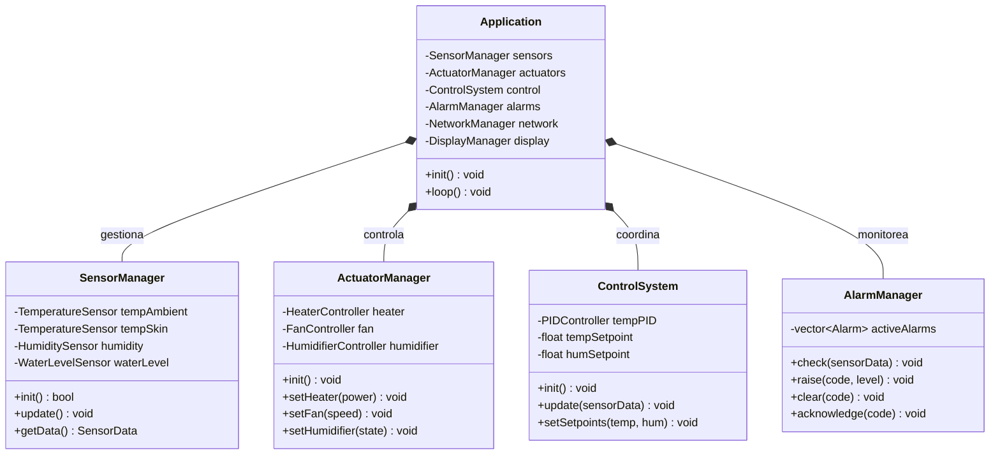

# Arquitectura del Firmware

## Visión General

El firmware de IncuNest sigue una arquitectura modular basada en capas, facilitando el mantenimiento, testing y extensibilidad.

## Diagrama de Clases



## Máquina de Estados Principal

```mermaid
stateDiagram-v2
    [*] --> BOOT: ⚡ Power On
    
    state "🔄 Inicialización" as init_group {
        BOOT --> INIT: ✅ Hardware OK
        BOOT --> ERROR: ❌ Hardware Fault
        INIT --> SELFTEST: 📦 Modules Loaded
        SELFTEST --> STANDBY: ✅ Tests Pass
        SELFTEST --> ERROR: ❌ Tests Fail
    }
    
    state "🔥 Operación" as operation_group {
        STANDBY --> PREHEATING: ▶️ User Start
        PREHEATING --> OPERATING: 🌡️ Temp Reached
        PREHEATING --> ALARM: ⏰ Timeout
        OPERATING --> STANDBY: ⏹️ User Stop
        OPERATING --> ALARM: ⚠️ Out of Range
        OPERATING --> PREHEATING: 📉 Temp Drop >2°C
    }
    
    state "🚨 Alertas" as alert_group {
        ALARM --> OPERATING: ✅ Resolved
        ALARM --> EMERGENCY: 🛑 Critical
        EMERGENCY --> STANDBY: 🔄 Manual Reset
    }
    
    ERROR --> [*]: 🔧 Service Required
```



### Descripción de Estados

| Estado | Descripción | Transiciones |
|--------|-------------|--------------|
| BOOT | Inicio del sistema | → INIT, ERROR |
| INIT | Inicialización de módulos | → SELFTEST |
| SELFTEST | Auto-diagnóstico | → STANDBY, ERROR |
| STANDBY | Esperando activación | → PREHEATING |
| PREHEATING | Calentando a setpoint | → OPERATING, ALARM |
| OPERATING | Operación normal | → STANDBY, ALARM |
| ALARM | Condición de alarma | → OPERATING, EMERGENCY |
| EMERGENCY | Apagado de emergencia | → STANDBY |
| ERROR | Error crítico | → (requiere servicio) |

## Loop Principal

```cpp
void loop() {
    static uint32_t lastSensorUpdate = 0;
    static uint32_t lastControlUpdate = 0;
    static uint32_t lastDisplayUpdate = 0;
    static uint32_t lastNetworkUpdate = 0;
    
    uint32_t now = millis();
    
    // Actualización de sensores (100ms)
    if (now - lastSensorUpdate >= SENSOR_UPDATE_INTERVAL) {
        sensorManager.update();
        lastSensorUpdate = now;
    }
    
    // Control PID (100ms)
    if (now - lastControlUpdate >= CONTROL_UPDATE_INTERVAL) {
        controlSystem.update(sensorManager.getData());
        alarmManager.check(sensorManager.getData());
        lastControlUpdate = now;
    }
    
    // Display (1000ms)
    if (now - lastDisplayUpdate >= DISPLAY_UPDATE_INTERVAL) {
        displayManager.update(sensorManager.getData(), controlSystem.getState());
        lastDisplayUpdate = now;
    }
    
    // Network (100ms)
    if (now - lastNetworkUpdate >= NETWORK_UPDATE_INTERVAL) {
        networkManager.update();
        lastNetworkUpdate = now;
    }
    
    // Procesar eventos de botones
    buttonHandler.update();
    
    // Watchdog
    esp_task_wdt_reset();
}
```

## Módulo de Sensores

### Clase Base de Sensor

```cpp
class Sensor {
public:
    virtual void init() = 0;
    virtual bool read() = 0;
    virtual float getValue() = 0;
    virtual bool isValid() = 0;
    virtual String getName() = 0;
    
protected:
    float value;
    bool valid;
    uint32_t lastReadTime;
    
    float applyCalibration(float raw) {
        return (raw * calibrationGain) + calibrationOffset;
    }
    
    float calibrationOffset = 0.0f;
    float calibrationGain = 1.0f;
};
```

### Implementación de Sensor de Temperatura

```cpp
class SHT31Sensor : public Sensor {
private:
    Adafruit_SHT31 sht;
    ExponentialFilter filter;
    
public:
    void init() override {
        if (!sht.begin(0x44)) {
            valid = false;
            Serial.println("Error: SHT31 no encontrado");
        } else {
            valid = true;
        }
    }
    
    bool read() override {
        if (!valid) return false;
        
        float raw = sht.readTemperature();
        if (isnan(raw)) {
            valid = false;
            return false;
        }
        
        value = applyCalibration(raw);
        value = filter.apply(value);
        lastReadTime = millis();
        valid = true;
        return true;
    }
    
    float getValue() override { return value; }
    bool isValid() override { return valid; }
    String getName() override { return "SHT31"; }
};
```

## Módulo de Control

### Controlador PID

```cpp
class PIDController {
private:
    float kp, ki, kd;
    float setpoint;
    float integral;
    float previousError;
    uint32_t lastTime;
    
    // Anti-windup
    float integralMin, integralMax;
    float outputMin, outputMax;
    
public:
    PIDController(float p, float i, float d) 
        : kp(p), ki(i), kd(d), 
          integral(0), previousError(0),
          integralMin(-100), integralMax(100),
          outputMin(0), outputMax(100) {}
    
    void setSetpoint(float sp) { setpoint = sp; }
    
    void setTunings(float p, float i, float d) {
        kp = p; ki = i; kd = d;
    }
    
    void setOutputLimits(float min, float max) {
        outputMin = min;
        outputMax = max;
    }
    
    float compute(float input) {
        uint32_t now = millis();
        float dt = (now - lastTime) / 1000.0f;
        
        if (dt <= 0) return 0;
        
        float error = setpoint - input;
        
        // Proporcional
        float pTerm = kp * error;
        
        // Integral con anti-windup
        integral += error * dt;
        integral = constrain(integral, integralMin, integralMax);
        float iTerm = ki * integral;
        
        // Derivativo (sobre PV para evitar derivative kick)
        float derivative = (error - previousError) / dt;
        float dTerm = kd * derivative;
        
        previousError = error;
        lastTime = now;
        
        float output = pTerm + iTerm + dTerm;
        return constrain(output, outputMin, outputMax);
    }
    
    void reset() {
        integral = 0;
        previousError = 0;
    }
};
```

## Módulo de Alarmas

### Estructura de Alarma

```cpp
enum class AlarmCode : uint8_t {
    NONE = 0,
    TEMP_HIGH,
    TEMP_LOW,
    TEMP_CRITICAL,
    HUMIDITY_HIGH,
    HUMIDITY_LOW,
    SENSOR_FAULT,
    HEATER_FAULT,
    WATER_LOW,
    SYSTEM_ERROR
};

enum class AlarmLevel : uint8_t {
    INFO = 0,
    WARNING,
    ALARM,
    CRITICAL
};

struct Alarm {
    AlarmCode code;
    AlarmLevel level;
    String message;
    uint32_t timestamp;
    bool acknowledged;
};
```

### Gestor de Alarmas

```cpp
class AlarmManager {
private:
    std::vector<Alarm> activeAlarms;
    BuzzerController* buzzer;
    LEDController* leds;
    
public:
    void check(const SensorData& data) {
        // Verificar temperatura
        if (data.ambientTemp > TEMP_CRITICAL) {
            raise(AlarmCode::TEMP_CRITICAL, AlarmLevel::CRITICAL,
                  "Temperatura crítica");
        } else if (data.ambientTemp > TEMP_MAX) {
            raise(AlarmCode::TEMP_HIGH, AlarmLevel::ALARM,
                  "Temperatura alta");
        } else {
            clear(AlarmCode::TEMP_HIGH);
            clear(AlarmCode::TEMP_CRITICAL);
        }
        
        if (data.ambientTemp < TEMP_MIN) {
            raise(AlarmCode::TEMP_LOW, AlarmLevel::WARNING,
                  "Temperatura baja");
        } else {
            clear(AlarmCode::TEMP_LOW);
        }
        
        // Verificar sensores
        if (!data.sensorsValid) {
            raise(AlarmCode::SENSOR_FAULT, AlarmLevel::ALARM,
                  "Fallo de sensor");
        }
        
        // Actualizar indicadores
        updateIndicators();
    }
    
    void raise(AlarmCode code, AlarmLevel level, const String& msg) {
        // Verificar si ya existe
        for (auto& alarm : activeAlarms) {
            if (alarm.code == code) return;
        }
        
        Alarm newAlarm = {code, level, msg, millis(), false};
        activeAlarms.push_back(newAlarm);
        
        // Notificar
        triggerNotification(level);
    }
    
    void clear(AlarmCode code) {
        activeAlarms.erase(
            std::remove_if(activeAlarms.begin(), activeAlarms.end(),
                [code](const Alarm& a) { return a.code == code; }),
            activeAlarms.end()
        );
    }
    
private:
    void updateIndicators() {
        AlarmLevel maxLevel = AlarmLevel::INFO;
        for (const auto& alarm : activeAlarms) {
            if (alarm.level > maxLevel) maxLevel = alarm.level;
        }
        
        switch (maxLevel) {
            case AlarmLevel::INFO:
                leds->set(LED_BLUE);
                break;
            case AlarmLevel::WARNING:
                leds->set(LED_YELLOW);
                buzzer->beep(1000, 100);
                break;
            case AlarmLevel::ALARM:
                leds->blink(LED_RED, 250);
                buzzer->alarm();
                break;
            case AlarmLevel::CRITICAL:
                leds->set(LED_RED);
                buzzer->continuous();
                break;
        }
    }
};
```

## Próximas Secciones

- [Setup del Entorno](./setup)
- [Módulos del Firmware](./modules)
- [Sistema de Control](./control-system)
