# Sistema de Control

## Teoría de Control PID

El sistema de control de IncuNest utiliza un controlador PID (Proporcional-Integral-Derivativo) para regular la temperatura de manera precisa y estable.

### Ecuación PID

La salida del controlador se calcula como:

```
u(t) = Kp × e(t) + Ki × ∫e(τ)dτ + Kd × de(t)/dt
```

Donde:
- u(t) = Salida del controlador (potencia del calefactor)
- e(t) = Error = Setpoint - Temperatura actual
- Kp = Ganancia proporcional
- Ki = Ganancia integral
- Kd = Ganancia derivativa

### Forma Discreta

En implementación digital:

```
u[n] = Kp × e[n] + Ki × Ts × Σe[k] + Kd × (e[n] - e[n-1]) / Ts
```

## Implementación

### Clase PIDController

```cpp
class PIDController {
private:
    float Kp, Ki, Kd;
    float setpoint;
    float integral;
    float lastError;
    float outputMin, outputMax;
    unsigned long lastTime;
    float sampleTime;  // en segundos
    
    // Anti-windup
    float integralMax;
    bool antiWindupEnabled;

public:
    PIDController(float kp, float ki, float kd) 
        : Kp(kp), Ki(ki), Kd(kd), 
          integral(0), lastError(0),
          outputMin(0), outputMax(100),
          sampleTime(1.0),
          antiWindupEnabled(true) {
        lastTime = millis();
        integralMax = outputMax / Ki;  // Límite anti-windup
    }
    
    void setTunings(float kp, float ki, float kd) {
        Kp = kp;
        Ki = ki;
        Kd = kd;
        integralMax = outputMax / (Ki > 0 ? Ki : 1);
    }
    
    void setSetpoint(float sp) {
        setpoint = sp;
    }
    
    void setOutputLimits(float min, float max) {
        outputMin = min;
        outputMax = max;
        integralMax = outputMax / (Ki > 0 ? Ki : 1);
    }
    
    void setSampleTime(float seconds) {
        sampleTime = seconds;
    }
    
    float compute(float input) {
        unsigned long now = millis();
        float dt = (now - lastTime) / 1000.0;  // Convertir a segundos
        
        // Verificar tiempo de muestreo
        if (dt < sampleTime) {
            return lastOutput;  // No actualizar aún
        }
        
        // Calcular error
        float error = setpoint - input;
        
        // Término Proporcional
        float P = Kp * error;
        
        // Término Integral con anti-windup
        integral += error * dt;
        
        if (antiWindupEnabled) {
            // Clamping anti-windup
            integral = constrain(integral, -integralMax, integralMax);
        }
        
        float I = Ki * integral;
        
        // Término Derivativo (derivada del error)
        float derivative = (error - lastError) / dt;
        float D = Kd * derivative;
        
        // Calcular salida
        float output = P + I + D;
        
        // Limitar salida
        output = constrain(output, outputMin, outputMax);
        
        // Guardar para próxima iteración
        lastError = error;
        lastTime = now;
        lastOutput = output;
        
        return output;
    }
    
    void reset() {
        integral = 0;
        lastError = 0;
        lastTime = millis();
    }
    
    // Getters para diagnóstico
    float getP() { return Kp * lastError; }
    float getI() { return Ki * integral; }
    float getD() { return Kd * (lastError - prevError) / sampleTime; }
    
private:
    float lastOutput;
    float prevError;
};
```

## Control de Temperatura

### TemperatureController

```cpp
class TemperatureController {
private:
    PIDController pid;
    HeaterDriver* heater;
    SensorManager* sensors;
    
    float setpoint;
    ControlMode mode;
    float manualPower;
    
    // Estado
    bool isRunning;
    float currentTemp;
    float currentPower;
    
    // Seguridad
    float tempMax = 38.5;
    float tempMin = 20.0;
    bool overTempProtection;

public:
    enum ControlMode {
        AUTO,
        MANUAL
    };

    TemperatureController(HeaterDriver* heater, SensorManager* sensors)
        : pid(2.0, 0.5, 1.0), heater(heater), sensors(sensors),
          mode(AUTO), isRunning(false), overTempProtection(false) {
        pid.setOutputLimits(0, 100);
        pid.setSampleTime(1.0);  // 1 segundo
    }
    
    void setSetpoint(float temp) {
        // Validar rango
        if (temp < 25.0 || temp > 37.5) {
            return;  // Fuera de rango permitido
        }
        setpoint = temp;
        pid.setSetpoint(temp);
    }
    
    void setMode(ControlMode m) {
        mode = m;
        if (mode == AUTO) {
            pid.reset();
        }
    }
    
    void setManualPower(float power) {
        manualPower = constrain(power, 0, 100);
    }
    
    void start() {
        isRunning = true;
        pid.reset();
    }
    
    void stop() {
        isRunning = false;
        heater->setPower(0);
        currentPower = 0;
    }
    
    void update() {
        if (!isRunning) return;
        
        // Leer temperatura
        currentTemp = sensors->getAmbientTemperature();
        
        // Verificar protección de sobre-temperatura
        if (currentTemp >= tempMax) {
            overTempProtection = true;
            heater->setPower(0);
            currentPower = 0;
            return;
        }
        
        // Resetear protección si temperatura baja
        if (overTempProtection && currentTemp < (tempMax - 1.0)) {
            overTempProtection = false;
        }
        
        if (overTempProtection) return;
        
        // Calcular potencia según modo
        if (mode == AUTO) {
            currentPower = pid.compute(currentTemp);
        } else {
            currentPower = manualPower;
        }
        
        // Aplicar al calefactor
        heater->setPower(currentPower);
    }
    
    // Getters
    float getCurrentTemperature() { return currentTemp; }
    float getCurrentPower() { return currentPower; }
    float getSetpoint() { return setpoint; }
    bool isOverTempProtection() { return overTempProtection; }
    
    // Configuración PID
    void setPIDTunings(float kp, float ki, float kd) {
        pid.setTunings(kp, ki, kd);
    }
};
```

## Sintonización PID

### Método de Ziegler-Nichols

```cpp
class PIDAutotuner {
private:
    float outputStep = 20.0;  // Escalón de salida
    float noiseBand = 0.5;    // Banda de ruido
    int lookbackSec = 10;     // Ventana de análisis
    
    enum State { OFF, HEATING, COOLING };
    State state = OFF;
    
    std::vector<float> peaks;
    std::vector<float> valleys;
    std::vector<unsigned long> peakTimes;
    
public:
    struct TuningResult {
        float Kp, Ki, Kd;
        float Ku;  // Ganancia última
        float Tu;  // Período último
        bool success;
    };
    
    TuningResult run(float input, float setpoint) {
        static unsigned long startTime = millis();
        static float lastInput = input;
        static State lastState = OFF;
        
        // Detectar picos y valles
        if (state == HEATING && input < lastInput) {
            // Encontrado pico
            peaks.push_back(lastInput);
            peakTimes.push_back(millis());
            state = COOLING;
        } else if (state == COOLING && input > lastInput) {
            // Encontrado valle
            valleys.push_back(lastInput);
            state = HEATING;
        }
        
        // Verificar si tenemos suficientes oscilaciones
        if (peaks.size() >= 3 && valleys.size() >= 3) {
            return calculateTunings();
        }
        
        lastInput = input;
        
        // Devolver resultado pendiente
        return {0, 0, 0, 0, 0, false};
    }
    
    float getOutput(float input, float setpoint) {
        if (input > setpoint + noiseBand) {
            state = COOLING;
            return 0;
        } else if (input < setpoint - noiseBand) {
            state = HEATING;
            return outputStep;
        }
        return (state == HEATING) ? outputStep : 0;
    }
    
private:
    TuningResult calculateTunings() {
        // Calcular amplitud promedio
        float avgPeak = 0, avgValley = 0;
        for (auto p : peaks) avgPeak += p;
        for (auto v : valleys) avgValley += v;
        avgPeak /= peaks.size();
        avgValley /= valleys.size();
        
        float amplitude = (avgPeak - avgValley) / 2.0;
        
        // Calcular período promedio
        float avgPeriod = 0;
        for (int i = 1; i < peakTimes.size(); i++) {
            avgPeriod += (peakTimes[i] - peakTimes[i-1]);
        }
        avgPeriod /= (peakTimes.size() - 1);
        avgPeriod /= 1000.0;  // Convertir a segundos
        
        // Ganancia última
        float Ku = (4.0 * outputStep) / (M_PI * amplitude);
        float Tu = avgPeriod;
        
        // Calcular parámetros Ziegler-Nichols
        TuningResult result;
        result.Ku = Ku;
        result.Tu = Tu;
        result.Kp = 0.6 * Ku;
        result.Ki = 2.0 * result.Kp / Tu;
        result.Kd = result.Kp * Tu / 8.0;
        result.success = true;
        
        return result;
    }
};
```

## Control de Humedad

El control de humedad usa un enfoque más simple (ON/OFF con histéresis):

```cpp
class HumidityController {
private:
    HumidifierDriver* humidifier;
    SensorManager* sensors;
    
    float setpoint = 60.0;
    float hysteresis = 5.0;
    bool isActive = false;
    float currentHumidity;

public:
    HumidityController(HumidifierDriver* hum, SensorManager* sens)
        : humidifier(hum), sensors(sens) {}
    
    void setSetpoint(float sp) {
        setpoint = constrain(sp, 40.0, 80.0);
    }
    
    void setHysteresis(float hyst) {
        hysteresis = constrain(hyst, 2.0, 10.0);
    }
    
    void update() {
        currentHumidity = sensors->getHumidity();
        
        if (currentHumidity < (setpoint - hysteresis / 2)) {
            // Humedad baja - encender
            humidifier->on();
            isActive = true;
        } else if (currentHumidity > (setpoint + hysteresis / 2)) {
            // Humedad alta - apagar
            humidifier->off();
            isActive = false;
        }
        // Dentro de la banda - mantener estado actual
    }
    
    float getCurrentHumidity() { return currentHumidity; }
    float getSetpoint() { return setpoint; }
    bool isHumidifierActive() { return isActive; }
};
```

## Control del Ventilador

```cpp
class FanController {
private:
    FanDriver* fan;
    TemperatureController* tempController;
    
    int baseSpeed = 30;      // Velocidad mínima
    int maxSpeed = 100;
    int currentSpeed;
    ControlMode mode = AUTO;

public:
    enum ControlMode { AUTO, MANUAL };
    
    void update() {
        if (mode == MANUAL) return;
        
        // Velocidad proporcional a la potencia del calefactor
        float heaterPower = tempController->getCurrentPower();
        
        // Mapear potencia a velocidad de ventilador
        // Más calor = más ventilador para distribuir
        currentSpeed = map(heaterPower, 0, 100, baseSpeed, maxSpeed);
        
        fan->setSpeed(currentSpeed);
    }
    
    void setManualSpeed(int speed) {
        currentSpeed = constrain(speed, 0, 100);
        if (mode == MANUAL) {
            fan->setSpeed(currentSpeed);
        }
    }
    
    void setMode(ControlMode m) {
        mode = m;
    }
};
```

## Diagrama de Control

```mermaid
graph TD
    subgraph entrada [📥 Entrada]
        SP([🎯 Setpoint])
        TEMP([🌡️ Sensor Temp])
    end
    
    subgraph controlador [⚙️ Controlador PID]
        SUM((Σ))
        PID{PID}
        P_TERM[P - Proporcional]
        I_TERM[I - Integral]
        D_TERM[D - Derivativo]
    end
    
    subgraph salida [📤 Salida]
        HEATER[[🔥 Calefactor PTC]]
        CHAMBER[(Cámara)]
    end
    
    subgraph seguridad [🛡️ Seguridad]
        LIMIT{> 38°C?}
        SHUTDOWN[⛔ Apagar Calefactor]
    end
    
    SP --> SUM
    TEMP --> SUM
    SUM -->|Error| PID
    
    PID --> P_TERM
    PID --> I_TERM
    PID --> D_TERM
    
    PID -->|Potencia| HEATER
    HEATER -->|Calor| CHAMBER
    CHAMBER --> TEMP
    
    TEMP --> LIMIT
    LIMIT -->|✅ No| PID
    LIMIT -->|⚠️ Sí| SHUTDOWN
    
    classDef input fill:#d4edda,stroke:#28a745,stroke-width:2px
    classDef controller fill:#cce5ff,stroke:#007bff,stroke-width:2px
    classDef output fill:#fff3cd,stroke:#ffc107,stroke-width:2px
    classDef safety fill:#f8d7da,stroke:#dc3545,stroke-width:2px
    
    class SP,TEMP input
    class SUM,PID,P_TERM,I_TERM,D_TERM controller
    class HEATER,CHAMBER output
    class LIMIT,SHUTDOWN safety
```



## Próximas Secciones

- [Arquitectura del Firmware](./architecture)
- [Integración de Sensores](./sensors-integration)
