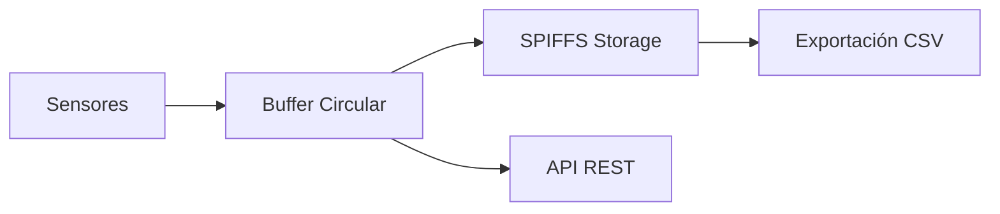

# Registro de Datos

## Arquitectura del Sistema de Logging



## Buffer Circular

```cpp
template<typename T, size_t SIZE>
class CircularBuffer {
private:
    T buffer_[SIZE];
    size_t head_;
    size_t tail_;
    size_t count_;

public:
    CircularBuffer() : head_(0), tail_(0), count_(0) {}
    
    bool push(const T& item) {
        buffer_[head_] = item;
        head_ = (head_ + 1) % SIZE;
        
        if (count_ < SIZE) {
            count_++;
        } else {
            tail_ = (tail_ + 1) % SIZE;  // Sobrescribir más antiguo
        }
        return true;
    }
    
    bool pop(T& item) {
        if (isEmpty()) return false;
        
        item = buffer_[tail_];
        tail_ = (tail_ + 1) % SIZE;
        count_--;
        return true;
    }
    
    T& operator[](size_t index) {
        return buffer_[(tail_ + index) % SIZE];
    }
    
    size_t size() const { return count_; }
    bool isEmpty() const { return count_ == 0; }
    bool isFull() const { return count_ == SIZE; }
    void clear() { head_ = tail_ = count_ = 0; }
    
    // Iterador simple
    class Iterator {
        CircularBuffer& buf_;
        size_t pos_;
    public:
        Iterator(CircularBuffer& buf, size_t pos) : buf_(buf), pos_(pos) {}
        T& operator*() { return buf_[pos_]; }
        Iterator& operator++() { pos_++; return *this; }
        bool operator!=(const Iterator& other) { return pos_ != other.pos_; }
    };
    
    Iterator begin() { return Iterator(*this, 0); }
    Iterator end() { return Iterator(*this, count_); }
};
```

## Estructura de Datos

```cpp
struct LogEntry {
    uint32_t timestamp;       // Unix timestamp
    float temperature;        // Temperatura ambiente °C
    float skinTemperature;    // Temperatura piel °C
    float humidity;           // Humedad %
    uint8_t heaterPower;      // Potencia calefactor %
    uint8_t fanSpeed;         // Velocidad ventilador %
    bool humidifierActive;    // Estado humidificador
    uint8_t alarmFlags;       // Flags de alarmas activas
    
    // Serialización
    String toCSV() const {
        char buffer[128];
        snprintf(buffer, sizeof(buffer), 
                 "%u,%.2f,%.2f,%.1f,%u,%u,%d,%u",
                 timestamp, temperature, skinTemperature, humidity,
                 heaterPower, fanSpeed, humidifierActive, alarmFlags);
        return String(buffer);
    }
    
    String toJSON() const {
        char buffer[256];
        snprintf(buffer, sizeof(buffer),
                 "{\"ts\":%u,\"temp\":%.2f,\"skinTemp\":%.2f,"
                 "\"hum\":%.1f,\"heater\":%u,\"fan\":%u,"
                 "\"humidifier\":%s,\"alarms\":%u}",
                 timestamp, temperature, skinTemperature, humidity,
                 heaterPower, fanSpeed, 
                 humidifierActive ? "true" : "false", alarmFlags);
        return String(buffer);
    }
};
```

## Data Logger

```cpp
#include <SPIFFS.h>
#include <time.h>

class DataLogger {
private:
    CircularBuffer<LogEntry, 1000> buffer_;  // ~30KB en RAM
    
    unsigned long lastLogTime_;
    unsigned long logInterval_;  // milisegundos
    
    String currentLogFile_;
    uint32_t entriesInFile_;
    static constexpr uint32_t MAX_ENTRIES_PER_FILE = 1440;  // 24h @ 1min
    
    SensorManager* sensors_;
    ControlManager* control_;

public:
    DataLogger(SensorManager* sensors, ControlManager* control)
        : sensors_(sensors), control_(control),
          lastLogTime_(0), logInterval_(60000),  // 1 minuto
          entriesInFile_(0) {}
    
    bool begin() {
        if (!SPIFFS.begin(true)) {
            Serial.println("SPIFFS mount failed");
            return false;
        }
        
        // Crear directorio de logs si no existe
        if (!SPIFFS.exists("/logs")) {
            // SPIFFS no tiene directorios reales, solo nombres de archivo
        }
        
        createNewLogFile();
        return true;
    }
    
    void update() {
        unsigned long now = millis();
        if (now - lastLogTime_ < logInterval_) {
            return;
        }
        lastLogTime_ = now;
        
        // Crear entrada
        LogEntry entry;
        entry.timestamp = getEpochTime();
        entry.temperature = sensors_->getAmbientTemperature();
        entry.skinTemperature = sensors_->getSkinTemperature();
        entry.humidity = sensors_->getHumidity();
        entry.heaterPower = control_->getHeaterPower();
        entry.fanSpeed = control_->getFanSpeed();
        entry.humidifierActive = control_->isHumidifierActive();
        entry.alarmFlags = 0;  // TODO: obtener de AlarmManager
        
        // Guardar en buffer
        buffer_.push(entry);
        
        // Guardar en archivo
        appendToFile(entry);
    }
    
    // Obtener historial
    std::vector<LogEntry> getHistory(uint32_t startTime, uint32_t endTime) {
        std::vector<LogEntry> result;
        
        for (auto& entry : buffer_) {
            if (entry.timestamp >= startTime && entry.timestamp <= endTime) {
                result.push_back(entry);
            }
        }
        
        return result;
    }
    
    // Obtener últimas N entradas
    std::vector<LogEntry> getLastEntries(size_t count) {
        std::vector<LogEntry> result;
        size_t start = buffer_.size() > count ? buffer_.size() - count : 0;
        
        for (size_t i = start; i < buffer_.size(); i++) {
            result.push_back(buffer_[i]);
        }
        
        return result;
    }
    
    // Exportar a CSV
    String exportToCSV(uint32_t startTime = 0, uint32_t endTime = UINT32_MAX) {
        String csv = "timestamp,temperature,skin_temp,humidity,heater,fan,humidifier,alarms\n";
        
        for (auto& entry : buffer_) {
            if (entry.timestamp >= startTime && entry.timestamp <= endTime) {
                csv += entry.toCSV() + "\n";
            }
        }
        
        return csv;
    }
    
    // Obtener lista de archivos de log
    std::vector<String> getLogFiles() {
        std::vector<String> files;
        
        File root = SPIFFS.open("/");
        File file = root.openNextFile();
        
        while (file) {
            String name = file.name();
            if (name.startsWith("/log_")) {
                files.push_back(name);
            }
            file = root.openNextFile();
        }
        
        return files;
    }
    
    // Estadísticas de almacenamiento
    void getStorageInfo(size_t& total, size_t& used) {
        total = SPIFFS.totalBytes();
        used = SPIFFS.usedBytes();
    }
    
    // Configuración
    void setLogInterval(unsigned long intervalMs) {
        logInterval_ = intervalMs;
    }

private:
    void createNewLogFile() {
        time_t now = time(nullptr);
        struct tm* timeinfo = localtime(&now);
        
        char filename[32];
        strftime(filename, sizeof(filename), "/log_%Y%m%d.csv", timeinfo);
        currentLogFile_ = filename;
        
        // Si el archivo no existe, crear con cabecera
        if (!SPIFFS.exists(currentLogFile_)) {
            File file = SPIFFS.open(currentLogFile_, "w");
            if (file) {
                file.println("timestamp,temperature,skin_temp,humidity,heater,fan,humidifier,alarms");
                file.close();
            }
        }
        
        entriesInFile_ = 0;
    }
    
    void appendToFile(const LogEntry& entry) {
        // Verificar si necesitamos nuevo archivo
        if (entriesInFile_ >= MAX_ENTRIES_PER_FILE) {
            createNewLogFile();
        }
        
        // Verificar espacio disponible
        if (SPIFFS.usedBytes() > SPIFFS.totalBytes() * 0.9) {
            // Eliminar archivo más antiguo
            deleteOldestLog();
        }
        
        File file = SPIFFS.open(currentLogFile_, "a");
        if (file) {
            file.println(entry.toCSV());
            file.close();
            entriesInFile_++;
        }
    }
    
    void deleteOldestLog() {
        auto files = getLogFiles();
        if (files.size() > 1) {
            // Ordenar y eliminar el más antiguo
            std::sort(files.begin(), files.end());
            SPIFFS.remove(files[0]);
            Serial.printf("Deleted old log: %s\n", files[0].c_str());
        }
    }
    
    uint32_t getEpochTime() {
        time_t now;
        time(&now);
        return (uint32_t)now;
    }
};
```

## API de Acceso a Datos

```cpp
void setupDataLoggerAPI(AsyncWebServer& server, DataLogger& logger) {
    // Obtener últimos datos
    server.on("/api/data/latest", HTTP_GET, [&logger](AsyncWebServerRequest* request) {
        int count = 60;  // Default: última hora
        if (request->hasParam("count")) {
            count = request->getParam("count")->value().toInt();
        }
        
        auto entries = logger.getLastEntries(count);
        
        String json = "[";
        for (size_t i = 0; i < entries.size(); i++) {
            if (i > 0) json += ",";
            json += entries[i].toJSON();
        }
        json += "]";
        
        request->send(200, "application/json", json);
    });
    
    // Obtener rango de datos
    server.on("/api/data/range", HTTP_GET, [&logger](AsyncWebServerRequest* request) {
        uint32_t start = 0, end = UINT32_MAX;
        
        if (request->hasParam("start")) {
            start = request->getParam("start")->value().toInt();
        }
        if (request->hasParam("end")) {
            end = request->getParam("end")->value().toInt();
        }
        
        auto entries = logger.getHistory(start, end);
        
        String json = "[";
        for (size_t i = 0; i < entries.size(); i++) {
            if (i > 0) json += ",";
            json += entries[i].toJSON();
        }
        json += "]";
        
        request->send(200, "application/json", json);
    });
    
    // Exportar CSV
    server.on("/api/data/export", HTTP_GET, [&logger](AsyncWebServerRequest* request) {
        String csv = logger.exportToCSV();
        
        AsyncWebServerResponse* response = request->beginResponse(200, "text/csv", csv);
        response->addHeader("Content-Disposition", "attachment; filename=incunest_data.csv");
        request->send(response);
    });
    
    // Información de almacenamiento
    server.on("/api/data/storage", HTTP_GET, [&logger](AsyncWebServerRequest* request) {
        size_t total, used;
        logger.getStorageInfo(total, used);
        
        String json = "{";
        json += "\"total\":" + String(total) + ",";
        json += "\"used\":" + String(used) + ",";
        json += "\"free\":" + String(total - used) + ",";
        json += "\"percent\":" + String((float)used / total * 100, 1);
        json += "}";
        
        request->send(200, "application/json", json);
    });
}
```

## Sincronización de Tiempo (NTP)

```cpp
#include <time.h>

void setupNTP() {
    configTime(-6 * 3600, 0, "pool.ntp.org", "time.nist.gov");
    
    Serial.print("Syncing time");
    while (time(nullptr) < 100000) {
        Serial.print(".");
        delay(500);
    }
    Serial.println(" done!");
    
    time_t now = time(nullptr);
    Serial.println(ctime(&now));
}
```

## Próximas Secciones

- [API REST](../api/rest-api)
- [Configuración del Entorno](./setup)
