# General System Architecture

## Introduction

IncuNest is designed following principles of **modularity**, **security** and **maintainability**. This section describes the general architecture of the system, including hardware and software.

## System Block Diagram


## System Layers

### 1. Hardware Layer

The physical layer includes:

| Component | Function | Criticality |
|------------|---------|------------|
| ESP32 | Central processing | High |
| Sensors | Data acquisition | High |
| Actuators | Environmental control | High |
| Food | System power | Review |
| Display | Local interface | Medium |

### 2. Firmware Layer

The firmware is organized into modules:

```
firmware/
├── src/
│   ├── main.cpp              # Punto de entrada
│   ├── config.h              # Configuración
│   ├── sensors/              # Módulo de sensores
│   │   ├── temperature.cpp
│   │   └── humidity.cpp
│   ├── control/              # Sistema de control
│   │   ├── pid.cpp
│   │   └── safety.cpp
│   ├── actuators/            # Control de actuadores
│   │   ├── heater.cpp
│   │   └── fan.cpp
│   ├── ui/                   # Interfaz de usuario
│   │   ├── display.cpp
│   │   └── buttons.cpp
│   ├── network/              # Comunicaciones
│   │   ├── wifi.cpp
│   │   ├── webserver.cpp
│   │   └── mqtt.cpp
│   └── storage/              # Almacenamiento
│       └── datalogger.cpp
└── lib/                      # Librerías externas
```

### 3. Application Layer

Available interfaces:

- **Local Interface**: LCD/TFT display + physical buttons
- **Web Interface**: Dashboard accessible via WiFi
- **REST API**: For integration with external systems
- **MQTT**: For IoT and centralized monitoring

## Data Flow

```mermaid
sequenceDiagram
    participant S as Sensores
    participant C as Controlador
    participant A as Actuadores
    participant UI as Interfaz
    participant N as Red
    
    loop Cada 100ms
        S->>C: Datos de sensores
        C->>C: Procesar PID
        C->>A: Comandos de control
    end
    
    loop Cada 1s
        C->>UI: Actualizar display
        C->>N: Enviar telemetría
    end
    
    N-->>C: Comandos remotos
    UI-->>C: Input de usuario
```



## Design Principles

### Security by Design

1. **Sensor redundancy**: Multiple temperature sensors
2. **Hardware Limits**: Backup Physical Thermostats
3. **Fail-safe**: The system fails to a safe state
4. **Watchdog**: Automatic restart in case of crashes

### Modularity

Each module can:
- Function independently
- Be tested in isolation
- Be replaced without affecting other modules

### Energy Efficiency

- Sleep mode when possible
- Efficient PWM control
- Optimization of work cycles

## System States

```mermaid
stateDiagram-v2
    [*] --> INIT: Power On
    INIT --> SELFTEST: Inicialización OK
    INIT --> ERROR: Fallo de inicio
    
    SELFTEST --> STANDBY: Tests OK
    SELFTEST --> ERROR: Fallo de test
    
    STANDBY --> HEATING: Activar
    HEATING --> OPERATING: Temp. alcanzada
    
    OPERATING --> STANDBY: Desactivar
    OPERATING --> ALARM: Parámetro fuera de rango
    
    ALARM --> OPERATING: Alarma resuelta
    ALARM --> EMERGENCY: Condición crítica
    
    EMERGENCY --> [*]: Apagado seguro
    ERROR --> [*]: Requiere servicio
```



### Description of States

| Status | Description | LED |
|--------|-------------|-----|
| INIT | Initializing system | Blue flashing |
| SELFTEST | Running self-diagnosis | Solid blue |
| STANDBY | Ready, waiting for activation | Green flashing |
| HEATING | Heating to target temperature | Yellow |
| OPERATING | Normal operation | Solid green |
| ALARM | Active alarm condition | Red flashing |
| EMERGENCY | Emergency shutdown | Solid red |
| ERROR | System error | Red/Blue alternating |

## Communications

### Supported Protocols

| Protocol | Port | Usage |
|-----------|--------|-----|
| HTTP | 80 | Web interface |
| WebSocket | 81 | Real-time data |
| MQTT | 1883 | IoT Telemetry |
| mDNS | 5353 | Local discovery |

### Data Structure

Telemetry message example:

```json
{
  "device_id": "INCUNEST_001",
  "timestamp": "2026-01-15T10:30:00Z",
  "sensors": {
    "temperature_ambient": 36.5,
    "temperature_skin": 36.8,
    "humidity": 65.2
  },
  "actuators": {
    "heater_power": 45,
    "fan_speed": 30,
    "humidifier": true
  },
  "status": {
    "state": "OPERATING",
    "alarms": [],
    "uptime": 3600
  }
}
```

## Upcoming Documents

- [System Design](./system-design) - Technical details of the design
- [Communications](./communication) - Protocols and APIs in detail
