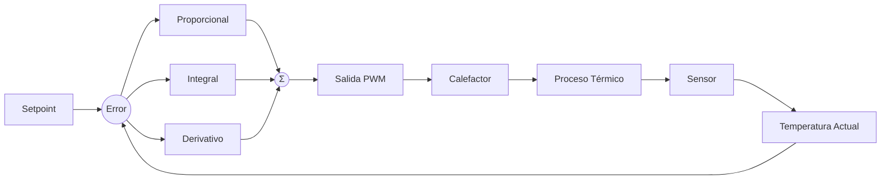
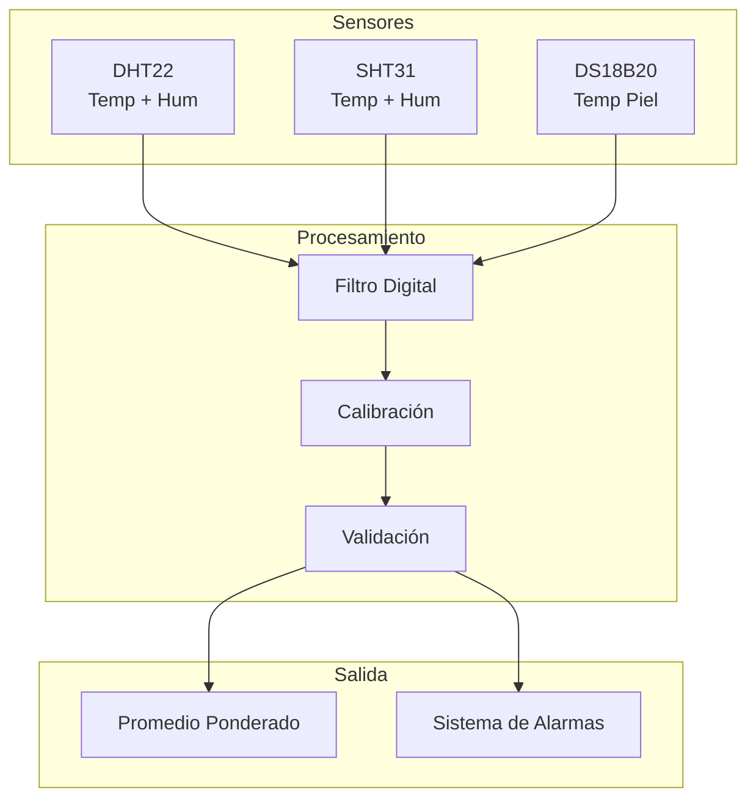
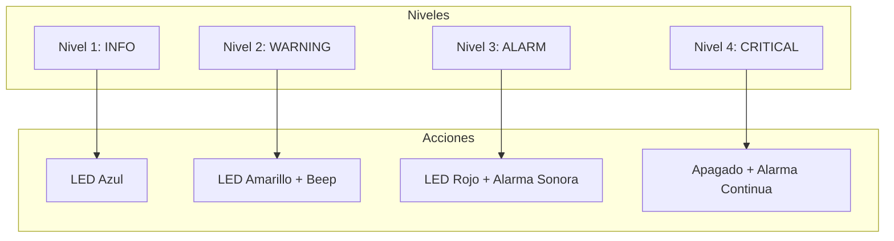
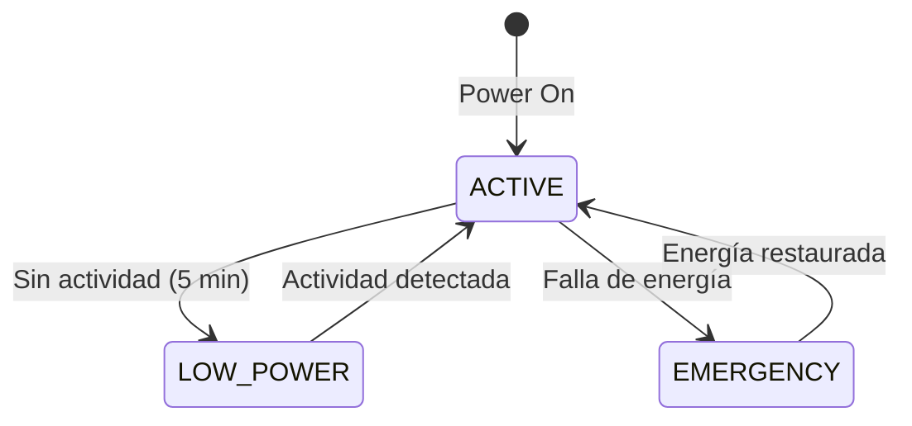

# System Design

## Temperature Control System

### PID control

IncuNest uses a **PID** (Proportional-Integral-Derivative) controller to keep the temperature stable.



### Controller Equation

```
u(t) = Kp × e(t) + Ki × ∫e(τ)dτ + Kd × de(t)/dt
```

Where:
- u(t) = Control signal (PWM duty cycle)
- e(t) = Error (setpoint - current temperature)
- Kp = Proportional gain
- Ki = Integral gain
- Kd = Derivative gain

### Implementation in Code

```cpp
class PIDController {
private:
    float kp, ki, kd;
    float integral = 0;
    float previousError = 0;
    unsigned long lastTime = 0;
    
public:
    PIDController(float p, float i, float d) 
        : kp(p), ki(i), kd(d) {}
    
    float compute(float setpoint, float measured) {
        unsigned long now = millis();
        float dt = (now - lastTime) / 1000.0f;
        
        if (dt <= 0) return 0;
        
        float error = setpoint - measured;
        
        // Término proporcional
        float pTerm = kp * error;
        
        // Término integral con anti-windup
        integral += error * dt;
        integral = constrain(integral, -100, 100);
        float iTerm = ki * integral;
        
        // Término derivativo
        float derivative = (error - previousError) / dt;
        float dTerm = kd * derivative;
        
        previousError = error;
        lastTime = now;
        
        // Salida limitada a 0-100%
        return constrain(pTerm + iTerm + dTerm, 0, 100);
    }
    
    void reset() {
        integral = 0;
        previousError = 0;
    }
};
```

### PID tuning

Recommended parameters according to the Ziegler-Nichols method:

| Parameter | Default Value | Range |
|-----------|--------|-------|
| $K_p$ | 2.0 | 1.0 - 5.0 |
| $K_i$ | 0.5 | 0.1 - 2.0 |
| $K_d$ | 1.0 | 0.5 - 3.0 |

## Data Acquisition System

### Sensor Architecture



### Signal Filtering

We implement an **exponential moving average** (EMA) filter:

```cpp
class ExponentialFilter {
private:
    float alpha;
    float filteredValue;
    bool initialized = false;
    
public:
    ExponentialFilter(float smoothingFactor = 0.1f) 
        : alpha(smoothingFactor) {}
    
    float filter(float newValue) {
        if (!initialized) {
            filteredValue = newValue;
            initialized = true;
        } else {
            filteredValue = alpha * newValue + (1 - alpha) * filteredValue;
        }
        return filteredValue;
    }
};
```

### Sensor Calibration

Each sensor stores calibration coefficients:

```cpp
struct CalibrationData {
    float offset;      // Desplazamiento
    float gain;        // Ganancia
    uint32_t timestamp; // Fecha de calibración
    bool valid;        // Flag de validez
};

float applyCalibration(float raw, CalibrationData& cal) {
    if (!cal.valid) return raw;
    return (raw * cal.gain) + cal.offset;
}
```

## Alarm System

### Alarm Levels



### Alarm Conditions

| Condition | Level | Threshold |
|--------|-------|--------|
| Temp. slightly low | INFO | < 35°C |
| Temp. low | WARNING | < 34°C |
| Temp. high | WARNING | > 37.5°C |
| Temp. very high | ALARM | > 38°C |
| Temp. criticism | CRITICAL | > 39°C |
| Sensor disconnected | ALARM | Timeout |
| Heater failure | CRITICAL | No response |

### Implementation of the Alarm System

```cpp
enum AlarmLevel {
    ALARM_INFO,
    ALARM_WARNING,
    ALARM_ALARM,
    ALARM_CRITICAL
};

struct Alarm {
    uint8_t id;
    AlarmLevel level;
    const char* message;
    uint32_t timestamp;
    bool acknowledged;
};

class AlarmManager {
private:
    std::vector<Alarm> activeAlarms;
    
public:
    void checkConditions(float temp, float humidity) {
        // Verificar temperatura
        if (temp > 39.0f) {
            raiseAlarm(1, ALARM_CRITICAL, "Temperatura crítica");
        } else if (temp > 38.0f) {
            raiseAlarm(2, ALARM_ALARM, "Temperatura muy alta");
        } else if (temp > 37.5f) {
            raiseAlarm(3, ALARM_WARNING, "Temperatura alta");
        }
        
        if (temp < 34.0f) {
            raiseAlarm(4, ALARM_WARNING, "Temperatura baja");
        }
        
        // Verificar humedad
        if (humidity > 85.0f) {
            raiseAlarm(5, ALARM_WARNING, "Humedad alta");
        } else if (humidity < 40.0f) {
            raiseAlarm(6, ALARM_WARNING, "Humedad baja");
        }
    }
    
    void raiseAlarm(uint8_t id, AlarmLevel level, const char* msg);
    void clearAlarm(uint8_t id);
    void acknowledgeAlarm(uint8_t id);
};
```

## Energy Management

### Energy States



### Consumption by Component

| Component | Active | Standby |
|---------|--------|---------|
| ESP32 | 240mA | 10mA |
| Heater | 8A (max) | 0A |
| TFT Display | 80mA | 5mA |
| Sensors | 20mA | 5mA |
| Fan | 500mA | 0A |

### UPS System

Recommended layout for power backup:

```
┌─────────────────────────────────────────────┐
│                                             │
│    AC ──► Rectificador ──► Cargador         │
│                              │              │
│                              ▼              │
│                          Batería            │
│                              │              │
│                              ▼              │
│    DC 12V ◄── Convertidor ◄──┘              │
│       │                                     │
│       ▼                                     │
│    Sistema IncuNest                         │
│                                             │
└─────────────────────────────────────────────┘
```

## Upcoming Documents

- [Communications](./communication) - Detailed network protocols
