# Contribution Guide

Thank you for your interest in contributing to IncuNest! This project is possible thanks to contributors like you.

## Code of Conduct

By participating in this project, you agree to maintain a respectful and collaborative environment. We hope that all contributors:

- Be respectful of different points of view
- Accept constructive criticism
- Focus on what is best for the community
- Show empathy towards other members

## Ways to Contribute

### 🐛 Report Bugs

If you find a bug:

1. Verify that it has not been reported before in [Issues](https://github.com/medicalopenworld/IncuNest/issues)
2. Create a new issue using the bug template
3. Includes:
- Clear description of the problem
- Steps to reproduce it
- Expected vs actual behavior
- Firmware/hardware version
- Relevant logs

### 💡 Suggest Improvements

To propose new features:

1. Open an issue with the label `enhancement`
2. Clearly describe the functionality
3. Explain the use case
4. If possible, propose an implementation

### 📝 Improve Documentation

Documentation can always improve:

- Correct typos
- Clarify confusing instructions
- Add examples
- Translate to other languages

### 💻 Contribute Code

#### Configure the Environment

```bash
# Clonar el repositorio
git clone https://github.com/medicalopenworld/IncuNest.git
cd IncuNest

# Crear rama para tu contribución
git checkout -b feature/mi-nueva-funcionalidad
```

#### Code Standards

**For C++ (Firmware):**

```cpp
// Usar nombres descriptivos en inglés
float calculateTemperature(int rawValue);

// Documentar funciones públicas
/**
 * @brief Calcula la temperatura a partir del valor raw del sensor
 * @param rawValue Valor ADC del sensor
 * @return Temperatura en grados Celsius
 */
float calculateTemperature(int rawValue) {
    // Implementación...
}

// Constantes en UPPER_CASE
const float MAX_TEMPERATURE = 38.0f;

// Variables en camelCase
float currentTemperature;
```

**For documentation:**

- Use standard Markdown
- Include code examples where relevant
- Add diagrams for complex concepts
- Maintain a technical but accessible tone

#### Pull Request Process

1. **Fork** the repository
2. **Create** a branch from `main`
3. **Make** your changes
4. **Test** thoroughly
5. **Commit** with clear messages
6. **Push** to your fork
7. **Open** a Pull Request

#### Commits Format

We use semantic commits:

```
tipo(alcance): descripción breve

[cuerpo opcional]

[pie opcional]
```

Valid types:
- `feat`: New functionality
- `fix`: Bug fix
- `docs`: Changes in documentation
- `style`: Format (no logic change)
- `refactor`: Code refactoring
- `test`: Add or modify tests
- `chore`: Maintenance tasks

Examples:

```
feat(sensors): agregar soporte para sensor SHT31

fix(control): corregir oscilación en control PID

docs(readme): actualizar instrucciones de instalación
```

### 🔧 Hardware Contributions

For hardware contributions:

1. **Schematics**: Use KiCad (preferred) or compatible format
2. **PCB**: Include Gerber files
3. **3D**: Prefer STEP or STL formats
4. **BOM**: Use CSV format with references to suppliers

## Review Process

All contributions go through review:

```mermaid
graph LR
    A([🚀 PR Created]) --> B[🔄 CI/CD Tests]
    B --> C{Tests Pass?}
    C -->|❌ No| D[🔧 Fix]
    D --> B
    C -->|✅ Yes| E[👀 Code Review]
    E --> F{Approved?}
    F -->|❌ No| G[📝 Request Changes]
    G --> D
    F -->|✅ Yes| H((✓ Merge))
    
    classDef start fill:#d4edda,stroke:#28a745,stroke-width:2px
    classDef process fill:#fff3cd,stroke:#ffc107,stroke-width:2px
    classDef decision fill:#cce5ff,stroke:#007bff,stroke-width:2px
    classDef action fill:#f8d7da,stroke:#dc3545,stroke-width:2px
    classDef success fill:#28a745,stroke:#155724,stroke-width:2px,color:#fff
    
    class A start
    class B,E process
    class C,F decision
    class D,G action
    class H success
```



### Review Criteria

- [ ] The code follows the project standards
- [ ] The tests pass
- [ ] Documentation is up to date
- [ ] No merge conflicts
- [ ] The commits are clear and semantic

## Versioned

We continue [Semantic Versioning](https://semver.org/):

- **MAJOR**: Incompatible changes
- **MINOR**: New supported functionality
- **PATCH**: Bug fixes

## Recognition

All contributors are acknowledged in:

- README of the project
- CONTRIBUTORS.md file
- Release notes

## Contact

- **Issues**: For bugs and suggestions
- **Discussions**: For general questions
- **Email**: medicalopenworld@proton.me

---

We look forward to your contribution! 🎉
