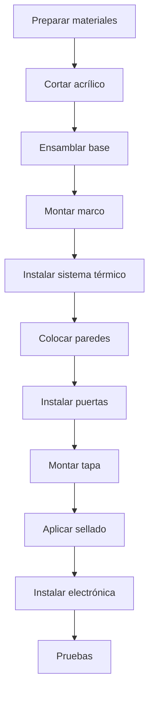

# Mechanical Assembly

## Process Overview



## Step 1: Preparation of Materials

### Checklist

- [ ] All acrylic pieces cut
- [ ] 3D printed parts
- [ ] Cut aluminum profiles
- [ ] Complete screws
- [ ] Available tools

### Tools Needed

| Tool | Usage |
|-------------|-----|
| Drill | Drilling |
| Drill bits 3mm, 4mm | Mounting holes |
| Phillips Screwdriver | Screws |
| 3mm hexagonal wrench | Nuts |
| Jigsaw | Acrylic settings |
| Lima | Finishes |
| Level | Leveling |
| Flexometer | Measurements |
| Silicone gun | Sealed |

## Step 2: Cutting the Acrylic

### Cutting Templates

**Sheet 1: Transparent Acrylic 6mm (600x400mm)**

```
┌──────────────────────────────────────────────────────┐
│                                                      │
│   ┌─────────────────────┐  ┌─────────────────────┐  │
│   │                     │  │                     │  │
│   │   PARED FRONTAL     │  │   PARED TRASERA     │  │
│   │     500 x 350       │  │     500 x 350       │  │
│   │                     │  │                     │  │
│   └─────────────────────┘  └─────────────────────┘  │
│                                                      │
└──────────────────────────────────────────────────────┘
```

**Sheet 2: Transparent Acrylic 6mm (600x400mm)**

```
┌──────────────────────────────────────────────────────┐
│                                                      │
│  ┌───────────┐  ┌───────────┐  ┌──────────────────┐ │
│  │ PARED     │  │  PARED    │  │                  │ │
│  │ LATERAL   │  │  LATERAL  │  │   TAPA SUPERIOR  │ │
│  │ 300 x 350 │  │  300 x 350│  │     500 x 300    │ │
│  │           │  │           │  │                  │ │
│  │     ○     │  │     ○     │  │                  │ │
│  │   (puerta)│  │  (puerta) │  │                  │ │
│  │           │  │           │  │                  │ │
│  └───────────┘  └───────────┘  └──────────────────┘ │
│                                                      │
└──────────────────────────────────────────────────────┘
```

### Cutting Technique

1. Mark with a fine indelible marker
2. For straight cuts: use a metal ruler as a guide
3. For curved cuts (doors): use a jigsaw
4. Medium speed, without forcing
5. Sand edges with 400 sandpaper

## Step 3: Base Assembly

### Base Structure

```
          600mm
    ┌────────────────────┐
    │  ○              ○  │
    │                    │
    │    PLACA BASE      │    400mm
    │      MDF 15mm      │
    │                    │
    │  ○              ○  │
    └────────────────────┘
    
    ○ = Agujeros M4 para patas/niveladores
```

### Procedure

1. Cut MDF to 600x400mm
2. Mark position of holes (20mm from edges)
3. Drill with a 4mm drill bit
4. Sand surface
5. Apply wood sealer (optional)
6. Install leveling feet

## Step 4: Frame Assembly

### Aluminum Structure

```
         VISTA FRONTAL
    ┌────────────────────┐
    │╔══════════════════╗│
    │║                  ║│
    │║   CÁMARA        ║│
    │║                  ║│
    │╚══════════════════╝│
    │    [CALEFACCIÓN]   │
    │    [ELECTRÓNICA]   │
    └────────────────────┘
    
    ═ = Perfil aluminio 20x20mm
```

### Procedure

1. **Cut profiles**:
- 4x 500mm (horizontal)
- 4x 350mm (vertical)
- 4x 300mm (depth)

2. **Assemble bottom frame**:
- Join profiles with squares
- Screw to MDF base

3. **Lift verticals**:
- Fix posts in corners
- Check level

4. **Complete top frame**:
- Connect top horizontals
- Check squareness in all corners

## Step 5: Heating System

### Location

```
         VISTA LATERAL
    ┌───────────────────┐
    │   ╔═══════════╗   │
    │   ║  CÁMARA   ║   │
    │   ╚═════╤═════╝   │
    │    DIFUSOR│       │
    │   ┌──────┴──────┐ │
    │   │  CONDUCTO   │ │
    │   │ ┌─────────┐ │ │
    │   │ │RESISTENC│ │ │◄── 100mm desde base
    │   │ └─────────┘ │ │
    │   │ [VENTILADOR]│ │◄── 50mm desde base
    │   └─────────────┘ │
    └───────────────────┘
```

### Procedure

1. **Assemble duct**:
- Manufacture 100x100x150mm aluminum box
- Or print in PETG

2. **Install fan**:
- Position at the base of the duct
- Orientation: air up
- Fix with M3 screws

3. **Build resistance**:
- Place on ceramic support
- Connect high gauge wires (18AWG)
- Check thermal insulation

4. **Install safety thermostat**:
- Fix near resistance
- Wire in series with power

5. **Place diffuser**:
- Assemble 3D printed piece
- Align with camera

## Step 6: Wall Installation

### Sequence

1. **Back wall first**
2. **Side walls**
3. **Front wall at the end**

### Fixation Technique

```
    ACRÍLICO ─────┬───── PERFIL
                  │
              ┌───┴───┐
              │ TIRA  │
              │SELLADO│
              └───────┘
```

1. Apply adhesive weather stripping to the profile
2. Position acrylic
3. Fix with clips or screws
4. Check alignment before tightening

## Step 7: Access Doors

### Door Preparation

```
    PARED LATERAL
    ┌─────────────┐
    │             │
    │   ┌─────┐   │
    │   │     │   │
    │   │  ○  │   │ ← Corte circular 150mm
    │   │     │   │
    │   └─────┘   │
    │             │
    └─────────────┘
```

### Iris System (Optional)

For more sophisticated access, use iris system:

- Buy used camera iris
- Or print mechanism in 3D

### Simple System

- Circular acrylic door
- Plastic hinge
- Magnetic closure

## Step 8: Top Cover

### Hinges Assembly

```
    ┌─────────────────────────────────┐
    │ ○                           ○   │
    │ │                           │   │
    │ └────── BISAGRAS ───────────┘   │
    │                                 │
    │          TAPA                   │
    │                                 │
    └─────────────────────────────────┘
```

1. Mark position of hinges (100mm from edges)
2. Drill acrylic with a 3mm drill bit
3. Screw hinges to the lid
4. Fix to rear frame
5. Check full opening (180°)

### Closing System

- Neodymium magnets (10mm diameter)
- 4 magnets: 2 on the cover, 2 on the front frame
- Holding force: ~2kg total

## Step 9: Sealing

### Silicone Application

1. Clean all joints with alcohol
2. Apply masking tape 3mm from the edge
3. Apply silicone with a gun
4. Smooth with a wet spatula
5. Remove tape before it dries
6. Let cure 24 hours

### Critical Areas

- [ ] Wall-base joints
- [ ] Joints between walls
- [ ] Door perimeter
- [ ] Cable passage

## Step 10: Final Verification

### Checklist

- [ ] Stable and level structure
- [ ] Lid opens and closes correctly
- [ ] Doors work well
- [ ] No visible spaces
- [ ] Fan rotates freely
- [ ] Unobstructed air duct

### Tightness Test

1. Close all openings
2. Place lit incense inside
3. Observe if there is smoke escaping
4. Seal any leaks detected

## Upcoming Sections

- [Wired](./wiring)
- [Tests](./testing)
