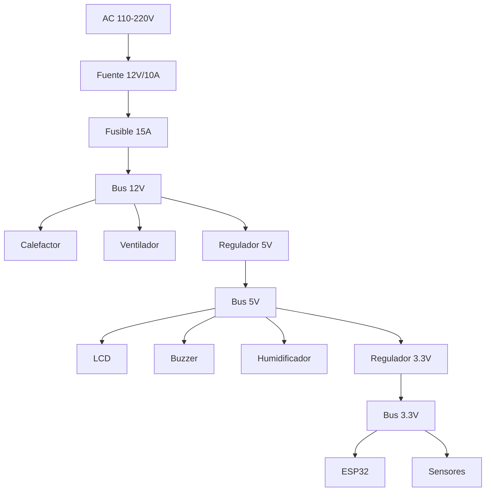
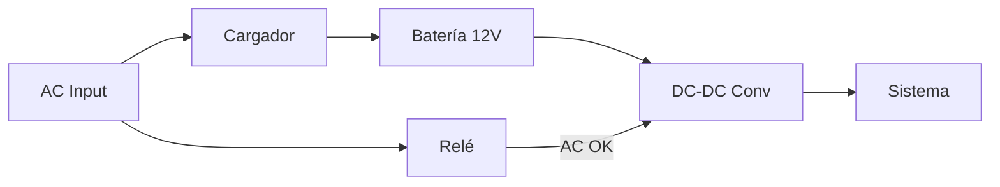

# Power Supply

## System Requirements

| Parameter | Value |
|-----------|-------|
| AC input | 110-220V, 50/60Hz |
| Main DC Output | 12V, 10A |
| Total Power | 120W |
| Logical Voltages | 5V, 3.3V |

## Power System Diagram



## Main Power Supply

### Recommended Specifications

| Parameter | Minimum | Recommended |
|-----------|--------|-------------|
| Output voltage | 12V ±5% | 12V ±2% |
| Current | 10A | 12A |
| Load regulation | 5% | 2% |
| Ripple | 200mV | 100mV |
| Efficiency | 80% | 85%+ |
| Certifications | - | CE, UL, FCC |

### Recommended Sources

| Model | Power | Price Approx. |
|--------|----------|---------------|
| Mean Well LRS-150-12 | 150W | $25 USD |
| Mean Well RS-150-12 | 150W | $30 USD |
| Generic 12V/10A supply | 120W | $15 USD |

### Input Circuit

```
                    ┌─────────────────────────────────────┐
                    │                                     │
    AC L ───────────┤ L        FUENTE 12V/10A        +12V├───► 12V_OUT
                    │              150W                   │
    AC N ───────────┤ N                              GND ├───► GND
                    │                                     │
    AC PE ──────────┤ PE (Tierra)                        │
                    │                                     │
                    └─────────────────────────────────────┘
```

## Voltage Regulators

### 5V regulator

**Component**: AMS1117-5.0 or LM7805

```
           12V_IN
              │
          ┌───┴───┐
    C1    │       │    C2
   100µF  │ REG5V │   100µF
    ═══   │       │    ═══
     │    │       │     │
     │    │  OUT  │     │
     │    └───┬───┘     │
     │        │         │
     └────────┼─────────┘
              │
              ▼
            5V_OUT
```

| Parameter | Value |
|-----------|-------|
| Entry | 7-12V |
| Output | 5V |
| Max current | 1.5A |
| Dropout | 1.3V |

### Regulator 3.3V

**Component**: AMS1117-3.3

```
           5V_IN
              │
          ┌───┴───┐
    C3    │       │    C4
   100µF  │REG3.3V│   100µF
    ═══   │       │    ═══
     │    │       │     │
     │    │  OUT  │     │
     │    └───┬───┘     │
     │        │         │
     └────────┼─────────┘
              │
              ▼
           3.3V_OUT
```

## Protections

### Main Fuse

```
    12V_IN ───[F1 15A]─── 12V_PROTECTED
```

- **Type**: 5x20mm glass fuse
- **Value**: 15A
- **Voltage**: 250V

### Polarity Reversal Protection

```
    12V_IN ───|◄──[D1]───── 12V_PROTECTED
              SS34
```

- **Component**: SS34 Schottky Diode
- **Current**: 3A
- **Drop**: 0.5V

### TVS for Transient Protection

```
    SIGNAL ─────┬───── PROTECTED_SIGNAL
                │
               ─┴─
              │TVS│
               ─┬─
                │
               GND
```

## UPS System (Optional)

For critical applications, a backup system is recommended.

###Basic Design with Battery



### UPS Specifications

| Parameter | Value |
|-----------|-------|
| Battery | 12V 7Ah SLA |
| Autonomy | ~30 minutes |
| Switching time | less than 10ms |
| Charger | 13.8V, 1A |

### Simplified Circuit

```
                    ┌──────────────┐
    AC ─────────────┤   CARGADOR   ├─────┬──────► 12V_OUT
                    │   12V/1A     │     │
                    └──────────────┘     │
                                         │
                    ┌──────────────┐     │
                    │   BATERÍA    ├─────┘
                    │  12V 7Ah     │
                    └──────────────┘
```

## Feeding Monitoring

### Voltage Divider Circuit

To measure battery/source voltage:

```
    12V_IN ───[R1 10K]───┬───[R2 3.3K]─── GND
                         │
                         └───► ADC_PIN (ESP32)
```

Maximum voltage on ADC: V_ADC = 12V × (3.3K / (10K + 3.3K)) = 2.98V

### Monitoring Code

```cpp
#define VOLTAGE_PIN 39  // ADC1_CH3
#define VOLTAGE_DIVIDER_RATIO 4.03  // (10K + 3.3K) / 3.3K

float readSupplyVoltage() {
    int rawADC = analogRead(VOLTAGE_PIN);
    float voltage = (rawADC / 4095.0) * 3.3 * VOLTAGE_DIVIDER_RATIO;
    return voltage;
}

void checkPowerStatus() {
    float voltage = readSupplyVoltage();
    
    if (voltage < 11.0) {
        raiseAlarm(ALARM_LOW_VOLTAGE, "Voltaje bajo");
    } else if (voltage > 13.0) {
        raiseAlarm(ALARM_HIGH_VOLTAGE, "Voltaje alto");
    }
}
```

## Consumption per Subsystem

| Subsystem | Voltage | Typical Current | Maximum Current |
|---------|---------|------------------|----|
| ESP32 | 3.3V | 80mA | 500mA (WiFi TX) |
| Sensors | 3.3V | 10mA | 20mA |
| LCD | 5V | 50mA | 100mA |
| TFT | 3.3V | 100mA | 150mA |
| Buzzer | 5V | 30mA | 50mA |
| Heater | 12V | 0-8A | 8.3A |
| Fan | 12V | 200mA | 500mA |
| Humidifier | 5V | 150mA | 200mA |

## Design Considerations

### Heat Dissipation

Linear regulators dissipate heat:

```
P_disipada = (V_in - V_out) × I_out
```

For the 5V regulator with 1A load:
```
P = (12V - 5V) × 1A = 7W
```

**Solution**: Use a heat sink or switching regulator.

### Decoupling

- 100µF capacitor in each regulator
- 100nF capacitor near each IC
- 10µF capacitor near the ESP32

## Component List

| Ref | Component | Value | Quantity |
|-----|------------|-------|----------|
| PSU | Switching font | 12V 10A | 1 |
| U1 | Regulator | AMS1117-5.0 | 1 |
| U2 | Regulator | AMS1117-3.3 | 1 |
| F1 | Fuse | 15A 5x20mm | 1 |
| D1 | Schottky diode | SS34 | 1 |
| C1-C4 | Capacitor | 100µF 25V | 4 |
| C5-C10 | Capacitor | 100nF 50V | 6 |

## Upcoming Sections

- [PCB Assembly](../assembly/pcb-assembly)
