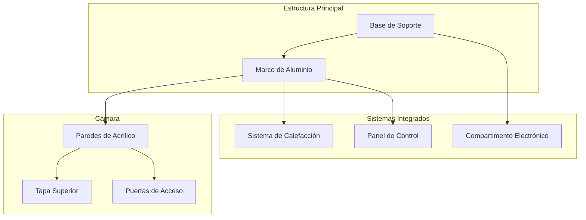

# Shell and Structure

## Overview

The IncuNest structure is designed to:

- Efficient **thermal insulation**
- **Visibility** of the patient
- **Easy access** for medical staff
- **Ease of cleaning** and disinfection
- **Local manufacturing** with accessible materials

## General Dimensions

```
            ┌─────────────────────────────────────────┐
            │                                         │
            │              600mm                      │
            │◄───────────────────────────────────────►│
        ▲   ┌─────────────────────────────────────────┐
        │   │                                         │
        │   │                                         │
  500mm │   │          CÁMARA PRINCIPAL              │
        │   │                                         │
        │   │                                         │
        ▼   └─────────────────────────────────────────┘
            
            PROFUNDIDAD: 400mm
```

| Parameter | External | Internal |
|--------|---------|---------|
| Width | 600mm | 500mm |
| High | 500mm | 350mm |
| Depth | 400mm | 300mm |

## Materials

### Main Chamber

| Materials | Thickness | Usage |
|----------|---------|-----|
| Clear acrylic | 6mm | Side walls and roof |
| Opaque acrylic | 6mm | Base and back panel |
| Medical silicone | - | Seals and gaskets |

### Base and Structure

| Materials | Alternatives | Usage |
|----------|--------------|-----|
| MDF | Plywood | Structural base |
| Aluminum | Stainless steel | Support frame |
| PLA/PETG | ABS | 3D printed parts |

## Modular Design



## Design Views

### Front View

```
┌─────────────────────────────────────────────────────────┐
│  ┌─────────────────────────────────────────────────┐    │
│  │                                                 │    │
│  │                                                 │    │
│  │            CÁMARA PRINCIPAL                     │    │
│  │              (Acrílico)                         │    │
│  │                                                 │    │
│  │                                                 │    │
│  └─────────────────────────────────────────────────┘    │
│  ┌─────────────────────────────────────────────────┐    │
│  │  [DISPLAY]     [TEMP]   [HUM]    [ALARMA]       │    │
│  │                                                 │    │
│  │     ● ● ●     36.5°C   65%      [SILENCIAR]     │    │
│  │     R G B                                       │    │
│  └─────────────────────────────────────────────────┘    │
│                        BASE                             │
└─────────────────────────────────────────────────────────┘
```

### Side View

```
┌───────────────────────────┐
│    ╔═══════════════╗      │
│    ║               ║      │
│    ║    CÁMARA     ║◄──── Tapa abatible
│    ║               ║      │
│    ╚═══════════════╝      │
│  ┌───────────────────┐    │
│  │ SISTEMA CALEFAC.  │◄─── Compartimento calefacción
│  └───────────────────┘    │
│  ┌───────────────────┐    │
│  │   ELECTRÓNICA     │◄─── Panel de control
│  └───────────────────┘    │
│          BASE             │
└───────────────────────────┘
```

## Access System

### Side Doors

The side doors allow access to the patient without completely opening the chamber:

```
┌───────────────────────────────────────┐
│                                       │
│   ┌───────┐           ┌───────┐      │
│   │       │           │       │      │
│   │ PUERTA│           │PUERTA │      │
│   │  IZQ  │           │  DER  │      │
│   │       │           │       │      │
│   └───────┘           └───────┘      │
│                                       │
└───────────────────────────────────────┘

Dimensiones de puerta: 150mm x 200mm
```

### Top Cover

- **Opening**: 180° backwards
- **Hinges**: Stainless steel with shock absorber
- **Closure**: Neodymium magnets
- **Seal**: Perimeter silicone

## Thermal Insulation

### Insulation Layers

```
EXTERIOR          AISLANTE          INTERIOR
    │                │                  │
    ▼                ▼                  ▼
┌───────┐        ┌───────┐        ┌───────┐
│Acrílico│        │Espuma │        │Acrílico│
│  6mm  │        │ 10mm  │        │  3mm  │
└───────┘        └───────┘        └───────┘
```

| Layer | Materials | Thickness | R-Value |
|------|----------|---------|---------|
| External | Acrylic | 6mm | 0.17 |
| Insulator | Expanded polystyrene | 10mm | 2.5 |
| Internal | Acrylic | 3mm | 0.08 |

## Acrylic Cutting List

### Main Camera (6mm transparent)

| Piece | Quantity | Dimensions |
|-------|----------|-------------|
| Front wall | 1 | 500x350mm |
| Back wall | 1 | 500x350mm |
| Side wall | 2 | 300x350mm |
| Top cover | 1 | 500x300mm |
| Indoor base | 1 | 500x300mm |

### Pieces with Special Cuts

| Piece | Court |
|-------|-------|
| Side walls | 150mm circular hole for doors |
| Back wall | 50x10mm slot for cables |
| Top cover | Hinges |

## Assembly

### Assembly Sequence

1. **Prepare structural base**
2. **Assemble aluminum frame**
3. **Install heating system**
4. **Set side walls**
5. **Install access doors**
6. **Place front and rear wall**
7. **Assemble top cover**
8. **Apply silicone seals**
9. **Install electronics**
10. **Tests** for airtightness

### Necessary Hardware

| Type | Size | Quantity | Usage |
|------|--------|----------|-----|
| Self-tapping screw | M4 x 20mm | 40 | Structure |
| Machine screw | M3 x 10mm | 20 | Electronics |
| Nut | M4 | 40 | Fixation |
| Washer | M4 | 80 | Load distribution |

## CAD files

Design files are available at:

```
hardware/
├── mechanical/
│   ├── cad/
│   │   ├── enclosure.step
│   │   ├── enclosure.f3d (Fusion 360)
│   │   └── drawings/
│   │       ├── assembly.pdf
│   │       └── parts_list.pdf
│   └── dxf/
│       ├── front_panel.dxf
│       ├── side_panel.dxf
│       └── base.dxf
```

## Upcoming Sections

- [Heating System](./heating-system)
- [Humidification System](./humidification)
- [3D Printed Parts](./3d-parts)
