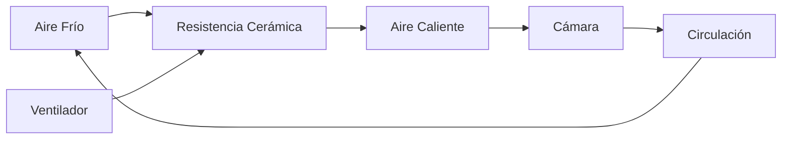
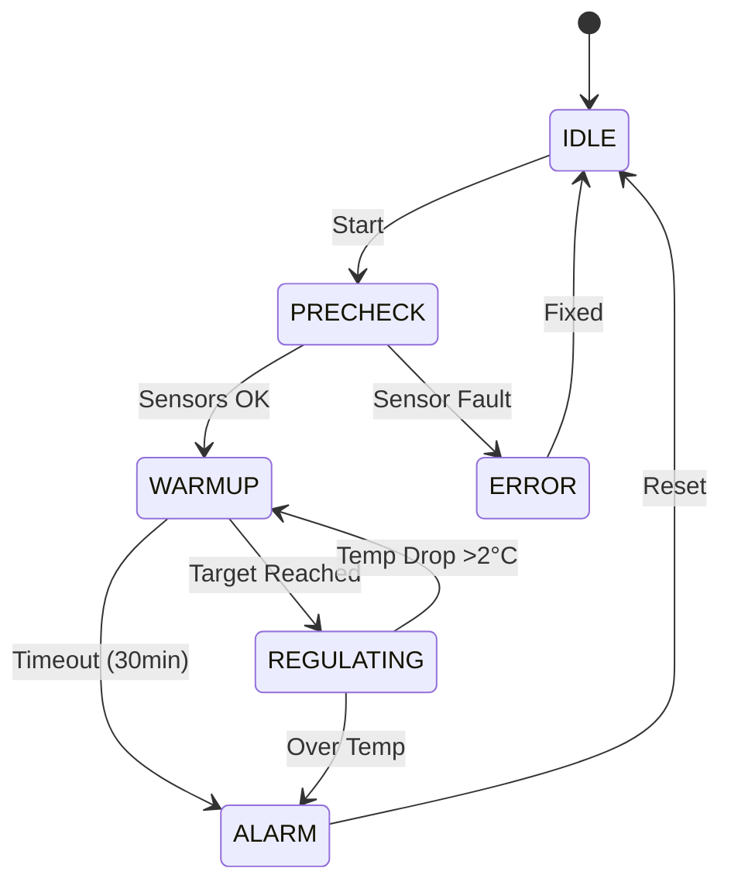

# Heating System

## Working Principle

The IncuNest heating system uses **forced convection**:



## Components

### Heating Element

| Parameter | Specification |
|-----------|----------------|
| Type | PTC ceramic resistance |
| Power | 100W |
| Voltage | 12V DC |
| Max temperature | 200°C |
| Dimensions | 50x30x10mm |

### Circulation Fan

| Parameter | Specification |
|-----------|----------------|
| Type | Axial brushless |
| Size | 80x80x25mm |
| Voltage | 12V DC |
| Flow | 40CFM |
| Noise | less than 30 dB |

## Air Duct Design

### Cutaway View

```
          CÁMARA PRINCIPAL
    ┌─────────────────────────────┐
    │                             │
    │    ↑    ↑    ↑    ↑    ↑   │  Aire caliente sube
    │    │    │    │    │    │   │
    │    └────┴────┴────┴────┘   │
    │         DIFUSOR            │
    │                             │
    └─────────────────────────────┘
              │
    ┌─────────┴─────────┐
    │  CONDUCTO CALEF.  │
    │                   │
    │  ┌─────────────┐  │
    │  │  RESISTENCIA │  │
    │  │    100W      │  │
    │  └─────────────┘  │
    │         ▲         │
    │  ┌──────┴──────┐  │
    │  │ VENTILADOR  │  │
    │  │    80mm     │  │
    │  └─────────────┘  │
    │         ▲         │
    └─────────┬─────────┘
              │
        ENTRADA DE AIRE
```

### Duct Dimensions

| Section | Dimensions |
|---------|-------------|
| Entry | 80x80mm |
| Heating chamber | 100x100x50mm |
| Diffuser | 400 x 30mm |

## Air Diffuser

The diffuser distributes hot air evenly:

```
┌─────────────────────────────────────────────────┐
│  ○  ○  ○  ○  ○  ○  ○  ○  ○  ○  ○  ○  ○  ○  ○  │
│     ○  ○  ○  ○  ○  ○  ○  ○  ○  ○  ○  ○  ○     │
│  ○  ○  ○  ○  ○  ○  ○  ○  ○  ○  ○  ○  ○  ○  ○  │
└─────────────────────────────────────────────────┘

○ = Agujero de 5mm de diámetro
Patrón: Rejilla alternada
Total: ~45 agujeros
```

## Thermal Protection

### Safety Thermostat

In addition to the electronic control, a mechanical thermostat is included:

| Parameter | Value |
|-----------|-------|
| Type | Bimetallic NC |
| Cutting temperature | 45°C |
| Hysteresis | 5°C |
| Maximum current | 10A |

### Thermostat Connection

```
    12V ───[FUSIBLE]───[TERMOSTATO]───[MOSFET]─── RESISTENCIA
              15A          45°C
```

## Thermal Balance

### Calculation of Required Power

```
P necesaria = Q / Δt
```

Where:
- Q = Thermal energy required
- Δt = Desired heating time

To heat the chamber from 25°C to 37°C in 10 minutes:

```
P ≈ (m × cp × ΔT) / t ≈ 80W
```

The 100W resistance provides a safety margin.

### Thermal Losses

| Source | Estimated Loss |
|--------|--------|
| Driving (walls) | 20W |
| Door opening | 30W (transient) |
| Radiation | 5W |
| **Total in operation** | **~25W** |

## Control Code

### Heater PID Control

```cpp
class HeatingController {
private:
    PIDController pid;
    float targetTemp = 36.5;
    float currentTemp = 25.0;
    uint8_t heaterPower = 0;
    uint8_t fanSpeed = 0;
    
public:
    HeatingController() : pid(2.0, 0.5, 1.0) {}
    
    void update(float measuredTemp) {
        currentTemp = measuredTemp;
        
        // Calcular potencia del calefactor
        heaterPower = pid.compute(targetTemp, currentTemp);
        
        // Calcular velocidad del ventilador
        // Mínimo 30% cuando el calefactor está activo
        if (heaterPower > 0) {
            fanSpeed = max(30, heaterPower);
        } else {
            fanSpeed = 0;
        }
        
        // Aplicar salidas
        setHeaterPWM(heaterPower);
        setFanPWM(fanSpeed);
    }
    
    void setTarget(float temp) {
        targetTemp = constrain(temp, 25.0, 37.5);
    }
    
    bool isSafe() {
        // Verificar temperatura segura
        return currentTemp < 40.0;
    }
};
```

### Warm-up Sequence



## Maintenance

### Periodic Inspection

| Task | Frequency |
|-------|------------|
| Check fan operation | Weekly |
| Clean inlet filter | Monthly |
| Check electrical connections | Monthly |
| Calibrate safety thermostat | Annual |

### Signs of Wear

- Noisy fan → Replace
- Resistance with hot spots → Replace
- Thermostat does not cut → Replace immediately

## Materials List

| Component | Specification | Quantity |
|---------|----------------|----------|
| PTC resistance | 100W 12V | 1 |
| Fan | 80mm 12V | 1 |
| Thermostat | KSD301 45°C NC | 1 |
| Duct | Aluminum 1mm | 1 set |
| Diffuser | 3D printed PLA/PETG | 1 |
| Insulator | Ceramic fiber | 100x100x10mm |

## Upcoming Sections

- [Humidification System](./humidification)
- [3D Parts](./3d-parts)
