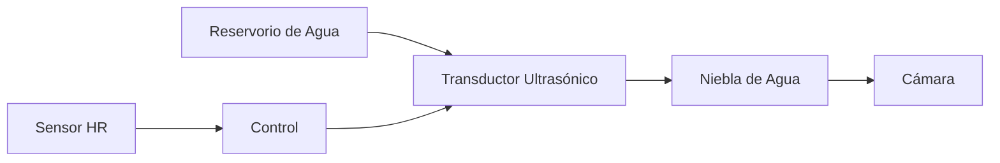

# Humidification System

## Working Principle

IncuNest uses an **ultrasonic humidifier** to maintain proper relative humidity levels (40-80% RH).



## Components

### Ultrasonic Module

| Parameter | Specification |
|-----------|----------------|
| Type | Piezoelectric transducer |
| Frequency | 1.7MHz |
| Voltage | 5V DC |
| Consumption | 200mA typical |
| Production | 20-30 ml/hour |

### Water Reservoir

| Parameter | Specification |
|-----------|----------------|
| Capacity | 500ml |
| Materials | Polypropylene (PP) |
| Level sensor | Magnetic float |
| Filling | Manual, front access |

## System Design

### Component Diagram

```
┌───────────────────────────────────────────┐
│              CÁMARA                       │
│                                           │
│         ↑↑↑  NIEBLA  ↑↑↑                 │
│         │            │                    │
└─────────┼────────────┼────────────────────┘
          │            │
┌─────────┴────────────┴───────┐
│     CONDUCTO DE HUMEDAD      │
│                              │
│  ┌────────────────────────┐  │
│  │   TRANSDUCTOR          │  │
│  │   ULTRASÓNICO          │  │
│  │       (～～)           │  │
│  └────────────────────────┘  │
│                              │
│  ════════════════════════    │ ← Nivel de agua
│  ┌────────────────────────┐  │
│  │     RESERVORIO         │  │
│  │     500 ml             │  │
│  └────────────────────────┘  │
│                              │
│  [SENSOR DE NIVEL]          │
│                              │
└──────────────────────────────┘
```

### Water Level Sensor

```
         ┌─────┐
         │     │
         │  S  │ ← Reed switch
         │     │
    ═════╪═════╪════  Nivel normal
         │  ○  │ ← Flotador con imán
         │     │
    ═════╪═════╪════  Nivel bajo → Alarma
         │     │
         └─────┘
```

## Humidity Control

### On/Off Algorithm with Hysteresis

```cpp
class HumidityController {
private:
    float targetHumidity = 60.0;
    float hysteresis = 5.0;
    bool humidifierOn = false;
    
public:
    void update(float currentHumidity) {
        if (currentHumidity < targetHumidity - hysteresis) {
            humidifierOn = true;
        } else if (currentHumidity > targetHumidity + hysteresis) {
            humidifierOn = false;
        }
        // Mantener estado entre los umbrales (histéresis)
        
        setHumidifier(humidifierOn);
    }
    
    void setTarget(float humidity) {
        targetHumidity = constrain(humidity, 40.0, 80.0);
    }
    
    bool isActive() {
        return humidifierOn;
    }
};
```

### Hysteresis Chart

```
Humedad (%)
    80 ┤
       │         ┌──────┐
    65 ┤─────────┤ OFF  ├─────────  Umbral superior (target + 5%)
       │         └──┬───┘
    60 ┤────────────┼────────────  Target
       │         ┌──┴───┐
    55 ┤─────────┤  ON  ├─────────  Umbral inferior (target - 5%)
       │         └──────┘
    40 ┤
       └──────────────────────────► Tiempo
```

## Electronic Circuit

### Humidifier Connection

```
      5V
       │
       │
  ┌────┴────┐
  │ HUMIDIF │
  │  MODULE │
  └────┬────┘
       │
      [Q1]     2N2222 o MOSFET
       │
      GND

  GPIO27 ───[1K]───[Base/Gate Q1]
```

### Level Sensor Connection

```
      3.3V
       │
      [10K]
       │
  GPIO39 ──┬── SENSOR_NIVEL
           │
          GND (cuando el flotador está bajo)
```

### Level Sensor Code

```cpp
#define WATER_LEVEL_PIN 39
#define LOW_WATER_THRESHOLD 1000  // Valor ADC

bool checkWaterLevel() {
    int level = analogRead(WATER_LEVEL_PIN);
    
    if (level < LOW_WATER_THRESHOLD) {
        raiseAlarm(ALARM_LOW_WATER, "Nivel de agua bajo");
        return false;
    }
    return true;
}

void controlHumidifier(bool enable) {
    // Solo activar si hay suficiente agua
    if (enable && checkWaterLevel()) {
        digitalWrite(HUMIDIFIER_PIN, HIGH);
    } else {
        digitalWrite(HUMIDIFIER_PIN, LOW);
    }
}
```

## Security

### Protections Implemented

| Risk | Mitigation |
|--------|------------|
| Empty reservoir | Level sensor + alarm |
| Excessive humidity | Maximum limit 85% RH |
| Bacterial growth | Cleaning reminder |
| Overflow | Drain tray |

### Humidification Alarms

```cpp
void checkHumidityAlarms(float humidity) {
    if (humidity > 85.0) {
        raiseAlarm(ALARM_HIGH_HUMIDITY, "Humedad muy alta");
        setHumidifier(false);
    }
    
    if (humidity < 30.0 && humidifierActive) {
        raiseAlarm(ALARM_HUMIDIFIER_FAULT, "Humidificador no responde");
    }
    
    if (!checkWaterLevel()) {
        setHumidifier(false);
    }
}
```

## Maintenance

### Cleaning Routine

**Frequency**: Every 48 hours of use or when changing the water

1. **Empty** the reservoir completely
2. **Clean** with diluted vinegar solution (1:10)
3. **Rinse** with distilled water
4. **Dry** completely
5. **Refill** with fresh distilled water

### Water Recommendations

| Water Type | Recommendation |
|--------------|--------------|
| Distilled | ✅ Recommended |
| Boiled | ✅ Acceptable |
| Filtered (RO) | ✅ Acceptable |
| Tap | ⚠️ Can generate deposits |
| Mineral | ❌ Do not use |

### Maintenance Signs

- **Reduced fog production** → Clean transducer
- **White deposits** → Use distilled water
- **Unpleasant smell** → Deep cleaning required
- **No fog production** → Check transducer

## Technical Specifications

| Parameter | Value |
|-----------|-------|
| Control range | 40% - 80% RH |
| Precision | ±5% RH |
| Response time | 5-10 minutes |
| Fog production | 20-30 ml/hour |
| Reservoir capacity | 500ml |
| Maximum autonomy | ~20 hours |

## Materials List

| Component | Specification | Quantity |
|---------|----------------|----------|
| Ultrasonic module | 5V 1.7MHz | 1 |
| Reservoir | PP 500ml | 1 |
| Level sensor | Reed switch + float | 1 |
| Transistor | 2N2222A | 1 |
| Resistance | 1KΩ 1/4W | 1 |
| Silicone tube | 10mm diameter | 0.5m |

## Upcoming Sections

- [3D Printed Parts](./3d-parts)
