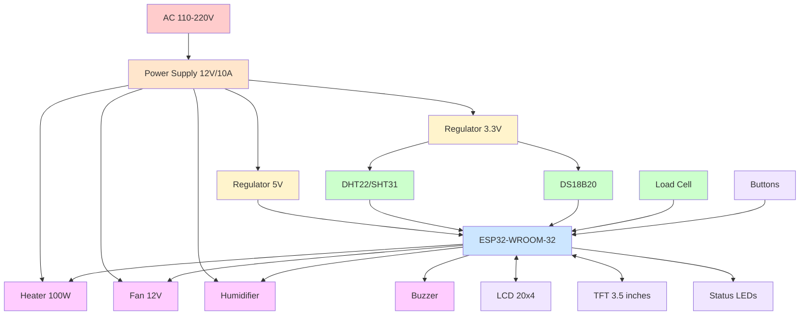

# Hardware - Overview

## Introduction

IncuNest hardware is designed with the following principles:

- **Accessibility**: Components available globally
- **Simplicity**: Easy to assemble and repair
- **Security**: Multiple layers of protection
- **Modularity**: Interchangeable components

## System Diagram



## Main Components

### 1. Control Unit

| Component | Specification | Function |
|---------|----------------|---------|
| ESP32-WROOM-32 | 240MHz, 520KB RAM | Main MCU |
| Flash 4MB | W25Q32 | Storage |
| RTC DS3231 | Accuracy ±2ppm | Real time clock |
| EEPROM 24C32 | 32Kbit | Settings |

### 2. Sensors

| Sensor | Interface | Precision | Usage |
|--------|----------|-----------|-----|
| SHT31 | I2C | ±0.3°C, ±2%RH | Ambient Temp/Hum |
| DS18B20 | 1-Wire | ±0.5°C | Temp. leather |
| HX711 + Cell | Serial | 0.1g | Weight (optional) |

### 3. Actuators

| Actuator | Specification | Control |
|----------|----------------|---------|
| Ceramic resistance | 100W, 12V | PWM via MOSFET |
| Fan | 12V, 0.5A | PWM |
| Humidifier | 5V ultrasonic | On/Off |
| Buzzer | 5V, 85dB | PWM/Digital |

### 4. User Interface

| Component | Specification | Connection |
|---------|----------------|----------|
| LCD 20x4 | HD44780 compatible | I2C |
| TFT 3.5" | ILI9488, 480x320 | SPI |
| LEDs | RGB, indicators | GPIO |
| Buttons | 4x touch | GPIO |

## Electrical Block Diagram

```
┌─────────────────────────────────────────────────────────────────┐
│                      FUENTE DE ALIMENTACIÓN                      │
├──────────────────┬──────────────────┬──────────────────────────┤
│     12V/10A      │     5V/3A        │       3.3V/1A            │
│    (Actuadores)  │   (Lógica 5V)    │    (ESP32, Sensores)     │
└────────┬─────────┴────────┬─────────┴──────────┬───────────────┘
         │                  │                     │
         ▼                  ▼                     ▼
┌────────────────┐  ┌──────────────┐      ┌──────────────┐
│   CALEFACTOR   │  │    BUZZER    │      │    ESP32     │
│   100W PWM     │  │    ALARMA    │      │   MCU        │
└────────────────┘  └──────────────┘      └──────┬───────┘
         │                                        │
         │              ┌─────────────────────────┼─────────────┐
         │              │                         │             │
         ▼              ▼                         ▼             ▼
┌────────────────┐ ┌────────────┐         ┌────────────┐ ┌────────────┐
│  VENTILADOR    │ │   DISPLAY  │         │  SENSORES  │ │   WiFi     │
│   12V PWM      │ │  LCD/TFT   │         │  I2C/1Wire │ │  Integrado │
└────────────────┘ └────────────┘         └────────────┘ └────────────┘
```

## Electrical Specifications

### Power Consumption

| Status | 12V current | Power |
|--------|---------------|----------|
| Standby | 0.5A | 6W |
| Warming up (100%) | 10A | 120W |
| Normal operation | 3-5A | 36-60W |
| Monitoring only | 0.3A | 3.6W |

### Protections

- **Main fuse**: 15A, 12V
- **Polarity reversal protection**: Schottky diode
- **Regulators with thermal protection**
- **TVS on signal lines**

## ESP32 Pin Assignment

```cpp
// Sensores
#define PIN_DHT22           4    // Sensor temp/hum ambiente
#define PIN_DS18B20         5    // Sensor temp piel
#define PIN_SDA             21   // I2C Data
#define PIN_SCL             22   // I2C Clock
#define PIN_HX711_DT        16   // Celda de carga data
#define PIN_HX711_SCK       17   // Celda de carga clock

// Actuadores
#define PIN_HEATER_PWM      25   // Control calefactor
#define PIN_FAN_PWM         26   // Control ventilador
#define PIN_HUMIDIFIER      27   // Control humidificador
#define PIN_BUZZER          32   // Alarma sonora

// Display TFT (SPI)
#define PIN_TFT_CS          15   // TFT Chip Select
#define PIN_TFT_DC          2    // TFT Data/Command
#define PIN_TFT_RST         4    // TFT Reset
#define PIN_TFT_MOSI        23   // SPI MOSI
#define PIN_TFT_SCLK        18   // SPI Clock

// LEDs de estado
#define PIN_LED_RED         12   // LED Alarma
#define PIN_LED_GREEN       13   // LED OK
#define PIN_LED_BLUE        14   // LED Info

// Botones
#define PIN_BTN_UP          33   // Botón arriba
#define PIN_BTN_DOWN        34   // Botón abajo
#define PIN_BTN_SELECT      35   // Botón selección
#define PIN_BTN_BACK        36   // Botón volver
```

## Mechanical Structure

### General Dimensions

| Parameter | Value |
|-----------|-------|
| External dimensions | 60x40x50cm |
| Internal space | 50x30x30cm |
| Weight (empty) | ~15kg |
| Housing material | Acrylic 6mm + PLA |

### Mechanical Components

1. **Main chamber**: Transparent acrylic
2. **Structural base**: MDF or aluminum
3. **Heating system**: Air ducts
4. **Insulation**: Styrofoam
5. **Access doors**: With airtight seals

## Upcoming Sections

- [Electronic Components](./electronics/main-board) - PCB Details
- [Mechanical Structure](./mechanical/enclosure) - Physical design
- [Assembly](./assembly/bom) - Construction Guide
