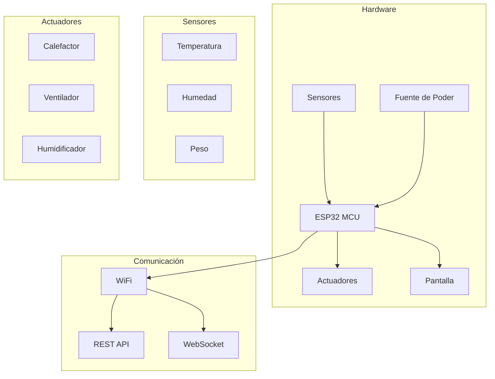

# Introduction to IncuNest

<h1 className="hero__title">🏥 IncuNest</h1>

Open Source Neonatal Incubator

## What is IncuNest?

**IncuNest** is an open source hardware and software project that aims to provide a **low-cost, accessible neonatal incubator** for resource-limited settings. The project is designed to meet medical safety standards while maintaining ease of manufacturing and maintenance.

  <video
    controls
    preload="metadata"
    width="100%"
    src="/videos/en/user-interface.mp4"
  >
    Your browser does not support the video tag.
  </video>
  

    <a href="/videos/en/user-interface.mp4" target="_blank" rel="noopener noreferrer">
      Watch full screen
    </a>
  

:::tip Project Mission
Reduce neonatal mortality by providing quality medical technology to communities that need it most.
:::

## Main Features

### 🌡️ Temperature Control
- Precise temperature control via PID
- Operating range: 25°C - 37°C
- Accuracy: ±0.1°C
- Multiple redundant temperature sensors

### 💧 Humidity Control
- Active humidification of the environment
- Humidity range: 40% - 80% RH
- Integrated water reservoir system

### 📊 Real Time Monitoring
- Integrated LCD/TFT screen
- Web interface accessible via WiFi
- Historical data recording
- Configurable alerts and alarms

### 🔒 Security
- Multiple alarm levels
- Overheat protection
- Backup battery for emergencies
- Failsafe design

## System Architecture

## Technical Specifications

| Parameter | Specification |
|-----------|----------------|
| **Microcontroller** | ESP32-WROOM-32 |
| **Temperature Range** | 25°C - 37°C |
| **Temperature Accuracy** | ±0.1°C |
| **Humidity Range** | 40% - 80% RH |
| **Feeding** | 12V DC / 110-220V AC |
| **Maximum Consumption** | 150W |
| **Connectivity** | WiFi 802.11 b/g/n |
| **Display** | 20x4 LCD / 3.5" TFT |

## License

IncuNest is licensed under **MIT**, which means that:

- ✅ You can use, modify, and distribute the project, including commercially
- ✅ You must include the MIT license and copyright notice in copies or derivative works
- ⚠️ No warranty is provided; use at your own risk

:::warning Security Notice
This project is for educational and research purposes. Any clinical use must comply with local medical regulations and require appropriate certification.
:::

## Next Steps

<h3>🚀 Quick Start Guide</h3>

Learn how to set up your first IncuNest

<a className="button button--primary button--block" href="./getting-started">Get Started</a>

<h3>🔧 Hardware</h3>

Explore components and assembly

<a className="button button--secondary button--block" href="./hardware/overview">View Hardware</a>

## Contribute

IncuNest is a community project and we welcome all contributions. See our [contribution guide](./contributing) for more information.

---

<strong>Medical Open World</strong> - Medical technology accessible to all

