# ⚠️ Security Notice

:::danger Important Warning
Please read this notice completely before building, assembling or using IncuNest.
:::

## Disclaimer

IncuNest is an open source project for educational and research purposes. The development team and contributors:

1. **DO NOT guarantee** the suitability of the device for clinical use
2. **NOT responsible** for damages or injuries resulting from use
3. **DO NOT certify** compliance with specific medical regulations

## Requirements for Clinical Use

If you plan to use IncuNest in a clinical setting, **MUST**:

### Required Certifications

| Region | Certification Required |
|--------|---------|
| European Union | CE marking (MDR 2017/745) |
| United States | FDA 510(k) Clearance |
| Latin America | ANVISA, COFEPRIS, INVIMA, etc. |
| International | ISO 13485, IEC 60601-1 |

### Required Steps

1. **Risk Assessment**: Perform complete analysis according to ISO 14971
2. **Clinical Validation**: Tests in a controlled environment with medical supervision
3. **Certification**: Obtain approval from local regulatory authority
4. **Traceability**: Implement device tracking system
5. **Training**: Train medical personnel in correct use

## Known Risks

### Thermal Risks

| Risk | Mitigation |
|--------|------------|
| Overheating | Multiple sensors + alarm at 38°C |
| Heater failure | Redundant control + thermal cut-out |
| Insufficient temperature | Low temperature alarm |

### Electrical Hazards

| Risk | Mitigation |
|--------|------------|
| Electric shock | Galvanic isolation + fuses |
| Short circuit | Circuit protection |
| Power failure | Recommended UPS system |

### Moisture Risks

| Risk | Mitigation |
|--------|------------|
| Excessive humidity | Automatic control + drainage |
| Condensation | Adequate ventilation |
| Bacterial growth | Periodic cleaning |

## Alarm System

IncuNest implements a multi-level alarm system:

```mermaid
graph TD
    A([🔍 Continuous Monitoring]) --> B{Parameter out of range?}
    B -->|✅ No| A
    B -->|⚠️ Yes| C{Severity Level}
    
    C -->|🟡 Low| D[Visual Alarm - Yellow]
    C -->|🟠 Medium| E[Visual + Audible Alarm]
    C -->|🔴 High| F[Alarm + Corrective Action]
    C -->|⛔ Critical| G[Alarm + Emergency Shutdown]
    
    D --> A
    E --> A
    F --> A
    G --> H((🔧 Requires Manual Reset))
    
    classDef monitor fill:#e2e3e5,stroke:#6c757d,stroke-width:2px
    classDef decision fill:#cce5ff,stroke:#007bff,stroke-width:2px
    classDef low fill:#fff3cd,stroke:#ffc107,stroke-width:2px
    classDef medium fill:#ffe5b4,stroke:#fd7e14,stroke-width:2px
    classDef high fill:#f8d7da,stroke:#dc3545,stroke-width:2px
    classDef critical fill:#dc3545,stroke:#721c24,stroke-width:2px,color:#fff
    
    class A monitor
    class B,C decision
    class D low
    class E medium
    class F high
    class G,H critical
```

### Alarm Levels

| Level | Condition | Action |
|-------|-----------|--------|
| **INFO** | Minor deviation | Blue LED indicator |
| **WARNING** | Moderate deviation | Yellow LED + beep |
| **ALARM** | Parameter out of limits | Red LED + audible alarm |
| **CRITICAL** | Risk for the patient | Safe shutdown + continuous alarm |

## Safe Operating Limits

### Temperature

```mermaid
graph LR
    subgraph danger1 [⚠️ DANGER ZONE - COLD]
        A["< 25°C<br/>ALARM"]
    end
    
    subgraph safe [✅ SAFE ZONE]
        B["25°C - 37°C<br/>NORMAL OPERATION"]
    end
    
    subgraph danger2 [🛑 DANGER ZONE - HOT]
        C["> 38°C<br/>CRITICAL"]
    end
    
    A --> B --> C
    
    classDef danger fill:#f8d7da,stroke:#dc3545,stroke-width:2px
    classDef safe fill:#d4edda,stroke:#28a745,stroke-width:2px
    classDef critical fill:#dc3545,stroke:#721c24,stroke-width:2px,color:#fff
    
    class A danger
    class B safe
    class C critical
```

### Relative Humidity

```mermaid
graph LR
    subgraph low [⚠️ LOW]
        A["< 40%<br/>Warning"]
    end
    
    subgraph optimal [✅ SAFE ZONE]
        B["40% - 80%<br/>OPTIMAL"]
    end
    
    subgraph high [⚠️ HIGH]
        C["> 85%<br/>Warning"]
    end
    
    A --> B --> C
    
    classDef warning fill:#fff3cd,stroke:#ffc107,stroke-width:2px
    classDef safe fill:#d4edda,stroke:#28a745,stroke-width:2px
    
    class A,C warning
    class B safe
```

## Security Maintenance

### Daily Inspections

- [ ] Check temperature and humidity readings
- [ ] Check alarm operation
- [ ] Inspect cables and connections
- [ ] Check humidifier water level

### Weekly Inspections

- [ ] Clean temperature sensors
- [ ] Verify sensor calibration
- [ ] Check electrical connections
- [ ] Review alarm logs

### Monthly Inspections

- [ ] Complete sensor calibration
- [ ] Deep cleaning of the camera
- [ ] Check insulation integrity
- [ ] Update firmware if versions are available

## Emergency Contact

In case of malfunction during use:

1. **Immediately remove patient** to an alternative safe environment
2. **Disconnect the device** from the power source
3. **Document the incident** with all details
4. **Report the issue** on [GitHub Issues](https://github.com/medicalopenworld/IncuNest/issues)

## Declaration of Conformity

This project **DOES NOT** include a declaration of conformity with medical regulations. Each implementer is responsible for:

- Obtain necessary certifications
- Perform clinical validation
- Comply with local regulations
- Maintain quality documentation

---

:::info Legal Note
By using this project, you agree that you do so at your own risk and that you have read and fully understood this safety notice.
:::
