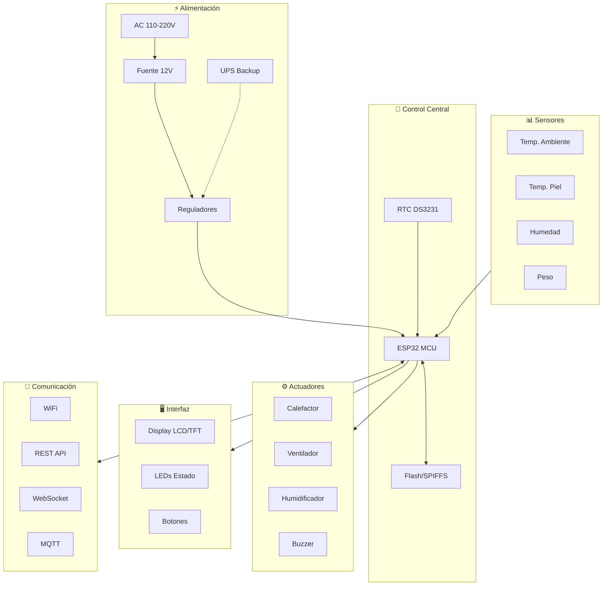
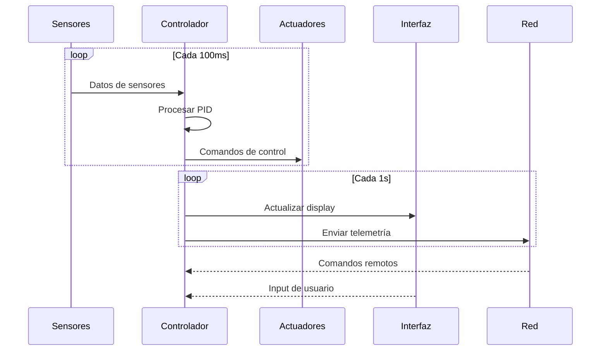
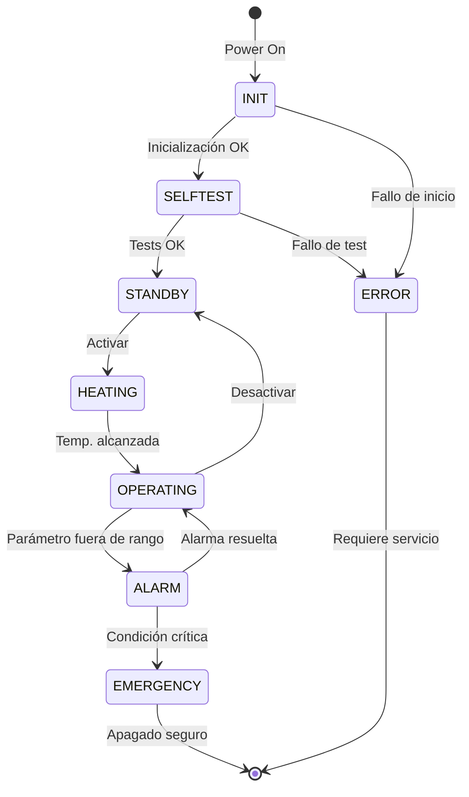

# Architecture générale du système

Présentation

IncuNest est conçu selon les principes de * * modularité * *, * * sécurité * * et * * maintenance * *. Cette section décrit l'architecture globale du système, y compris le matériel et les logiciels.

Schéma du bloc système



♪ ♪ Caps système ♪

# # 1. Couche matérielle

La couche physique comprend:

- 124; élément - 124; fonction - 124; critique - 124;
- 124; - 124; - 124;
- 124; ESP32 - 124;
- 124; Capteurs - 124; Acquisition de données - 124; Haute - 124;
124; Activateurs 124; Contrôle environnemental 124; Haute 124;
124; Alimentation 124; Énergie du système 124; Critique 124;
124; Affichage 124; Interface locale 124; Moyenne 124;

♪ 2. Layer Firmware

Le firmware est organisé en modules:

```
firmware/
├── src/
│   ├── main.cpp              # Punto de entrada
│   ├── config.h              # Configuración
│   ├── sensors/              # Módulo de sensores
│   │   ├── temperature.cpp
│   │   └── humidity.cpp
│   ├── control/              # Sistema de control
│   │   ├── pid.cpp
│   │   └── safety.cpp
│   ├── actuators/            # Control de actuadores
│   │   ├── heater.cpp
│   │   └── fan.cpp
│   ├── ui/                   # Interfaz de usuario
│   │   ├── display.cpp
│   │   └── buttons.cpp
│   ├── network/              # Comunicaciones
│   │   ├── wifi.cpp
│   │   ├── webserver.cpp
│   │   └── mqtt.cpp
│   └── storage/              # Almacenamiento
│       └── datalogger.cpp
└── lib/                      # Librerías externas
```

♪ 3. Couche d'application

Interfaces disponibles :

- * * Interface locale * *: écran LCD / TFT + boutons physiques
- * * Interface Web * *: Tableau de bord accessible par WiFi
- * * API REST * *: Pour l'intégration avec les systèmes externes
- * * MQTT * *: pour IoT et surveillance centralisée

Flux de données



# # Principes de conception

Sécurité de conception

1. * * Redondance du capteur * * : Capteurs de température multiples
2. * * Limites du matériel * * : Thermostats de secours physiques
3. * * Échec de sécurité * *: Le système n'est pas sécurisé
4. * * Surveillant * * : Redémarrage automatique pour bloquer

Modularité

Chaque module peut :
- Fusé indépendamment
- Oui. Être testé isolément
- Oui. À remplacer sans affecter les autres modules

Efficacité énergétique

- Mode sommeil si possible
- Contrôle efficace des MIP
- Optimisation des cycles de travail

♪ ♪ États des



Désignation des États

124; État 124; description 124; DEL 124;
- 124; - 124; - 124; - 124; - 124;
− 124; Clignement bleu - 124;
- 124; SELFTEST - 124; autodiagnostic de course - 124; bleu fixe - 124;
- 124; STANDBY - 124; Prêt, en attente d'activation - 124; Clignements verts - 124;
- 124; CHAUFFAGE-124; réchauffement à la température cible-124; jaune-124;
- 124; OPÉRATION-124; fonctionnement normal-124; vert fixe-124;
- 124; ALARM-124; état d'alarme actif-124; Clignements rouges 124;
- 124; - 124; - 124; - 124; - 124; - 124;
- 124; ERROR-124; Erreur système-124; Rouge / Bleu alternant-124;

Communications

Protocoles soutenus

124; Protocole 124; Port 124; Utilisation 124;
- 124; - 124; - 124; - 124;
- 124; HTTP - 124; 80 - 124; Interface Web - 124;
- 124; WebSocket - 124; 81 - 124; données en temps réel - 124;
124; MQTT 124; 1883 124; Télémétrie IoT 124;
124; mDNS 124; 5353 124; découverte locale 124;

# # Structure des données

Exemple de message télémétrique :

```json
{
  "device_id": "INCUNEST_001",
  "timestamp": "2026-01-15T10:30:00Z",
  "sensors": {
    "temperature_ambient": 36.5,
    "temperature_skin": 36.8,
    "humidity": 65.2
  },
  "actuators": {
    "heater_power": 45,
    "fan_speed": 30,
    "humidifier": true
  },
  "status": {
    "state": "OPERATING",
    "alarms": [],
    "uptime": 3600
  }
}
```

Documents suivants

- [Conception du système] (@ @ URL0 @) - Détails techniques de conception
- [Communications] (@ @ URL1 @) - Protocoles et API en détail