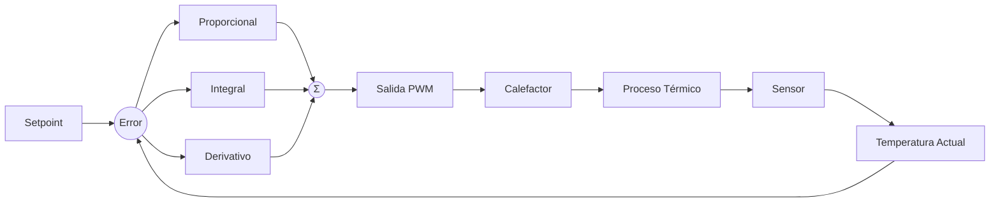
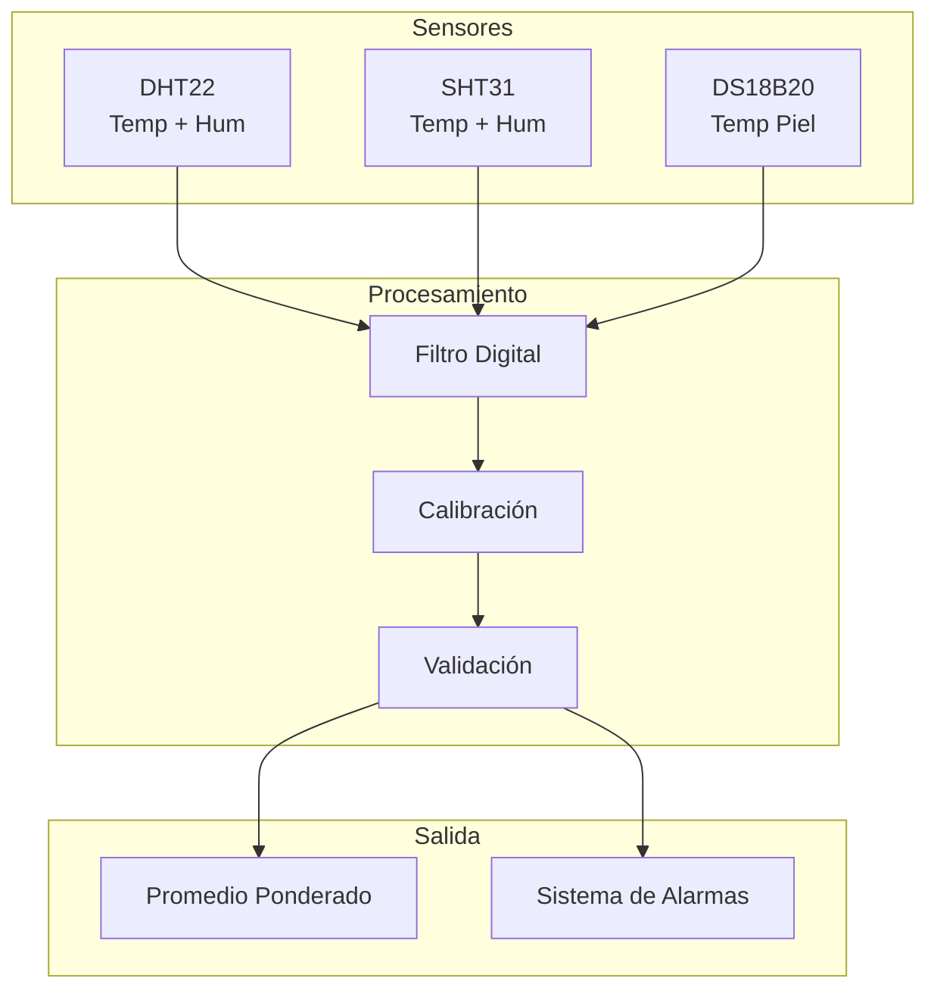
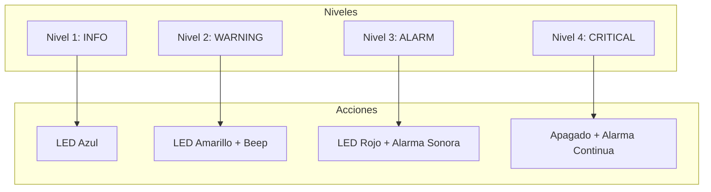
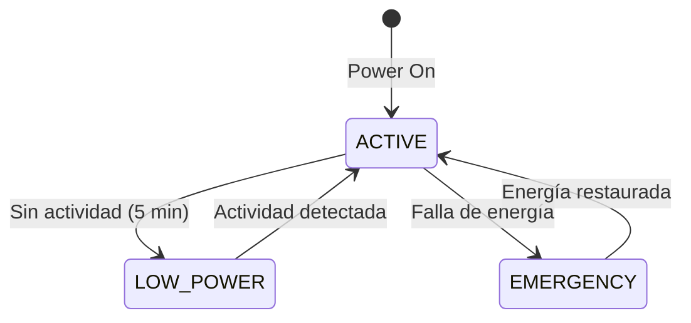

♪ Conception du système

Système de contrôle de température

Contrôle PID

IncuNest utilise un contrôleur PID * * (Proporal-Integrate-Derivative) pour maintenir la température stable.



équation de contrôle

```
u(t) = Kp × e(t) + Ki × ∫e(τ)dτ + Kd × de(t)/dt
```

où:
- u (t) = Cycle d ' essai (PWM)
- e (t) = Erreur (point de consigne - température courante)
- Kp = gain proportionnel
- Ki = Gain intégral
Kd = gain dérivé

Mise en œuvre du code

```cpp
class PIDController {
private:
    float kp, ki, kd;
    float integral = 0;
    float previousError = 0;
    unsigned long lastTime = 0;
    
public:
    PIDController(float p, float i, float d) 
        : kp(p), ki(i), kd(d) {}
    
    float compute(float setpoint, float measured) {
        unsigned long now = millis();
        float dt = (now - lastTime) / 1000.0f;
        
        if (dt <= 0) return 0;
        
        float error = setpoint - measured;
        
        // Término proporcional
        float pTerm = kp * error;
        
        // Término integral con anti-windup
        integral += error * dt;
        integral = constrain(integral, -100, 100);
        float iTerm = ki * integral;
        
        // Término derivativo
        float derivative = (error - previousError) / dt;
        float dTerm = kd * derivative;
        
        previousError = error;
        lastTime = now;
        
        // Salida limitada a 0-100%
        return constrain(pTerm + iTerm + dTerm, 0, 100);
    }
    
    void reset() {
        integral = 0;
        previousError = 0;
    }
};
```

Syntonisation du PID

Paramètres recommandés selon la méthode Ziegler-Nichols:

- 124; Paramètre - 124; Valeur des effets - 124; Gamme - 124;
- 124; - 124;
- 124 $; - K $ _ p $- 124 $;
- 124 dollars;
- Oui.

Système d'acquisition de données

Architecture des capteurs



Filtre de signalisation

Nous implémentons un filtre mobile exponentiel * * (EMA) :

```cpp
class ExponentialFilter {
private:
    float alpha;
    float filteredValue;
    bool initialized = false;
    
public:
    ExponentialFilter(float smoothingFactor = 0.1f) 
        : alpha(smoothingFactor) {}
    
    float filter(float newValue) {
        if (!initialized) {
            filteredValue = newValue;
            initialized = true;
        } else {
            filteredValue = alpha * newValue + (1 - alpha) * filteredValue;
        }
        return filteredValue;
    }
};
```

Étalonnage des capteurs

Chaque capteur stocke des coefficients d'étalonnage:

```cpp
struct CalibrationData {
    float offset;      // Desplazamiento
    float gain;        // Ganancia
    uint32_t timestamp; // Fecha de calibración
    bool valid;        // Flag de validez
};

float applyCalibration(float raw, CalibrationData& cal) {
    if (!cal.valid) return raw;
    return (raw * cal.gain) + cal.offset;
}
```

Système d'alarme

Niveau d'alarme



Conditions d'alarme

- 124; état - 124; niveau - 124; ombrial - 124;
- 124; - 124; - 124;
- 124; Tem. légèrement bas - 124; INFO - 124; < 35 °C - 124;
- 124;
- 124;
- 124; tem. très élevé - 124; ALARM - 124; > 38 °C - 124;
- 124; tém. critique - 124; CRITIQUE - 124; > 39 ° C - 124;
124; Capteur déconnecté 124; ALARM 124; Timeout 124;
- 124; défaillance du facteur caléactif - 124; Aucune réponse − 124;

Mise en œuvre du système d'alarme

```cpp
enum AlarmLevel {
    ALARM_INFO,
    ALARM_WARNING,
    ALARM_ALARM,
    ALARM_CRITICAL
};

struct Alarm {
    uint8_t id;
    AlarmLevel level;
    const char* message;
    uint32_t timestamp;
    bool acknowledged;
};

class AlarmManager {
private:
    std::vector<Alarm> activeAlarms;
    
public:
    void checkConditions(float temp, float humidity) {
        // Verificar temperatura
        if (temp > 39.0f) {
            raiseAlarm(1, ALARM_CRITICAL, "Temperatura crítica");
        } else if (temp > 38.0f) {
            raiseAlarm(2, ALARM_ALARM, "Temperatura muy alta");
        } else if (temp > 37.5f) {
            raiseAlarm(3, ALARM_WARNING, "Temperatura alta");
        }
        
        if (temp < 34.0f) {
            raiseAlarm(4, ALARM_WARNING, "Temperatura baja");
        }
        
        // Verificar humedad
        if (humidity > 85.0f) {
            raiseAlarm(5, ALARM_WARNING, "Humedad alta");
        } else if (humidity < 40.0f) {
            raiseAlarm(6, ALARM_WARNING, "Humedad baja");
        }
    }
    
    void raiseAlarm(uint8_t id, AlarmLevel level, const char* msg);
    void clearAlarm(uint8_t id);
    void acknowledgeAlarm(uint8_t id);
};
```

# # Gestion de l'énergie

États de l ' énergie



Consommation par composant

- 124; composante 124; actif 124; réserve 124;
- 124; - 124; - 124; - 124; - 124;
- 124; ESP32-124; 240mA-124; 10mA-124;
- 124; Calefactor - 124; 8A (max.) - 124; 0A - 124;
- 124; affichage TFT - 124; 80mA - 124; 5mA - 124;
- 124; capteurs - 124; 20mA - 124; 5mA - 124;
- 124; ventilateur - 124; 500mA - 124; 0A - 124;

Système UPS

Conception recommandée pour le support énergétique:

```
┌─────────────────────────────────────────────┐
│                                             │
│    AC ──► Rectificador ──► Cargador         │
│                              │              │
│                              ▼              │
│                          Batería            │
│                              │              │
│                              ▼              │
│    DC 12V ◄── Convertidor ◄──┘              │
│       │                                     │
│       ▼                                     │
│    Sistema IncuNest                         │
│                                             │
└─────────────────────────────────────────────┘
```

Documents suivants

- [Communications] (@ @ URL0 @) - Protocoles de réseau détaillés