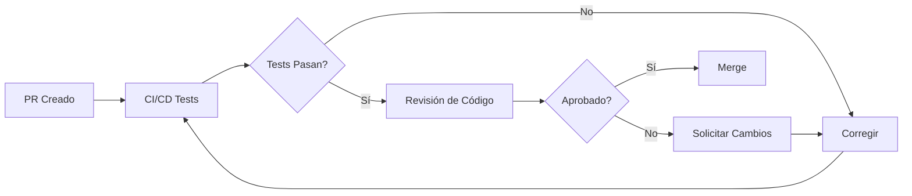

# Guide de contribution

Merci de votre intérêt à contribuer à IncuNest! Ce projet est possible grâce à des contributeurs comme vous.

Code de conduite

En participant à ce projet, vous vous engagez à maintenir un environnement respectueux et collaboratif. Nous espérons que tous les contributeurs :

- Oui. Être respectueux des différentes opinions
- Accepter les critiques constructives
- Se concentrer sur le meilleur pour la communauté
- Faire preuve d'empathie envers les autres membres

Comment contribuer

♪ ♪ ♪ Signaler des bugs ♪

Si vous trouvez un bug :

1. Vérifiez qu'il n'a pas été signalé avant à [Issues] (@ @ URL0 @ @)
2. Créer un nouveau problème en utilisant le modèle de bug
3. Comprend:
- Description claire du problème
- Étapes pour le reproduire
- Comportement attendu vs actuel
- firmware / version matérielle
- Les logos pertinents

♪ ♪ ♪ Proposer des améliorations ♪

Pour proposer de nouvelles fonctionnalités :

1. Ouvrir un problème avec le tag @ @ CODE0 @ @
2. Il décrit clairement la fonctionnalité
3. Expliquer le cas d'utilisation
4. Si possible, proposer une mise en œuvre

♪ Améliorer la documentation

La documentation peut toujours améliorer :

- Corriger les erreurs typographiques
- Clarifier les instructions déroutantes
- Ajouter des exemples
- Traduire dans d'autres langues

♪ Code de contribution

♪ # # # Configuration de l'environnement

```bash
# Clonar el repositorio
git clone https://github.com/medicalopenworld/IncuNest.git
cd IncuNest

# Crear rama para tu contribución
git checkout -b feature/mi-nueva-funcionalidad
```

Normes de code

* * Pour C + + (Firmware): * *

```cpp
// Usar nombres descriptivos en inglés
float calculateTemperature(int rawValue);

// Documentar funciones públicas
/**
 * @brief Calcula la temperatura a partir del valor raw del sensor
 * @param rawValue Valor ADC del sensor
 * @return Temperatura en grados Celsius
 */
float calculateTemperature(int rawValue) {
    // Implementación...
}

// Constantes en UPPER_CASE
const float MAX_TEMPERATURE = 38.0f;

// Variables en camelCase
float currentTemperature;
```

* * Pour la documentation: * *

- Utiliser le marquage standard
- Inclure des exemples de code le cas échéant
- Ajouter des diagrammes pour des concepts complexes
- Maintenir un ton technique mais accessible

♪ # # Demande de processus de tirage

1. * * Fourche * * le dépôt
2. * * Créer * * une branche de @ @ CODE0 @
3. ♪ Faire ♪ ♪ Vos changements
4. * * Preuve * * approfondie
5. * * commit * * avec des messages clairs
6. * * Poussez * * à votre fourchette
7. * * Ouvrir * * une demande de tirage

Format de Commits

Nous utilisons des commits sémantiques:

```
tipo(alcance): descripción breve

[cuerpo opcional]

[pie opcional]
```

Taux valides
- @ @ CODE0 @: Nouvelle fonctionnalité
- @ @ CODE1 @: correction de bug
- @ @ CODE2 @: Changements dans la documentation
- @ @ CODE3 @: Format (pas de changement de logique)
- @ @ CODE4 @ @: Refactorisation du code
- @ @ CODE5 @ @: Ajouter ou modifier des essais
- @ @ CODE6 @: Tâches de maintenance

Exemples:

```
feat(sensors): agregar soporte para sensor SHT31

fix(control): corregir oscilación en control PID

docs(readme): actualizar instrucciones de instalación
```

♪ # # - Contributions matérielles

Pour les contributions matérielles :

1. * * Schéma * * : Utiliser KiCad (préféré) ou format compatible
2. * * PCB * * : Inclure les fichiers Gerber
3. * * 3D * * : Préférez les formats STEP ou STL
4. * * BOM * *: Utiliser le format CSV avec les références du fournisseur

Processus d'examen

Toutes les contributions sont examinées comme suit :



Critères d'examen

- [] Le code suit les normes du projet
- [] La réussite des tests
- [] La documentation est mise à jour
- [] Aucun conflit de mérite
- [] Les comits sont clairs et sémantiques

Versionné

Nous suivons [Version sémantique] (@ @ URL0 @):

- * * * MAJOR * *: Modifications incompatibles
- * * * MINOR * *: Nouvelle fonctionnalité compatible
* * * PATCH * *: corrections des bugs

Reconnaissance

Tous les contributeurs sont reconnus dans :

- README du projet
- Contributeurs de fichiers.md
- Notes de sortie

Coordonnées

- * * numéros * *: Pour les bogues et les suggestions
- * * Discussions * *: Pour les questions générales
- * * Email * *: médicalopenworld @ proton. moi

---

Nous attendons votre contribution!