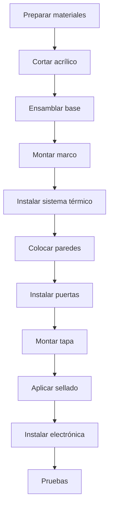

# Montage mécanique

La vision générale du processus



Étape 1: Préparation des matériaux

Liste de contrôle

- [] Tous les morceaux de coupe acrylique
- [] Pièces 3D imprimées
- [] Profilés en aluminium coupés
- [Tornillerie complète]
- [] Outils disponibles

Outils nécessaires

124; outil 124; utilisation 124;
- 124;
- 124; forage - 124; forage - 124;
- 124; 3mm, 4mm, 124; trous de montage, 124;
- 124; tournevis Phillips - 124; vis - 124;
- 124; clé hexagonale de 3 mm - 124; écrous - 124;
124; fruits calar - 124; ajustements acryliques - 124;
124; Lima - 124; achevé - 124;
124; niveau 124; niveau 124;
- 124; Flexomètre - 124; Mesures - 124;
- 124; pistolet à silicone - 124; scellement - 124;

Étape 2: Coupe d'acrylique

Couper les modèles

* * Feuille 1: Acrylique transparent 6mm (600x400mm) * *

```
┌──────────────────────────────────────────────────────┐
│                                                      │
│   ┌─────────────────────┐  ┌─────────────────────┐  │
│   │                     │  │                     │  │
│   │   PARED FRONTAL     │  │   PARED TRASERA     │  │
│   │     500 x 350       │  │     500 x 350       │  │
│   │                     │  │                     │  │
│   └─────────────────────┘  └─────────────────────┘  │
│                                                      │
└──────────────────────────────────────────────────────┘
```

* * Feuille 2: Acrylique transparent 6mm (600x400mm) * *

```
┌──────────────────────────────────────────────────────┐
│                                                      │
│  ┌───────────┐  ┌───────────┐  ┌──────────────────┐ │
│  │ PARED     │  │  PARED    │  │                  │ │
│  │ LATERAL   │  │  LATERAL  │  │   TAPA SUPERIOR  │ │
│  │ 300 x 350 │  │  300 x 350│  │     500 x 300    │ │
│  │           │  │           │  │                  │ │
│  │     ○     │  │     ○     │  │                  │ │
│  │   (puerta)│  │  (puerta) │  │                  │ │
│  │           │  │           │  │                  │ │
│  └───────────┘  └───────────┘  └──────────────────┘ │
│                                                      │
└──────────────────────────────────────────────────────┘
```

♪ Technique de coupe

1. Marquage avec marqueur fin indélébile
2. Pour les coupes droites: utiliser la règle du métal comme guide
3. Pour les coupes courbes (portes): utiliser une scie à palettes
4. Vitesse moyenne, non forcée
5. Bords de ponçage avec ponçage 400

Étape 3 : Assemblée de la base

Structure de la Base

```
          600mm
    ┌────────────────────┐
    │  ○              ○  │
    │                    │
    │    PLACA BASE      │    400mm
    │      MDF 15mm      │
    │                    │
    │  ○              ○  │
    └────────────────────┘
    
    ○ = Agujeros M4 para patas/niveladores
```

Procédure

1. Couper le MDF à 600x400m m
2. Position du trou de marquage (20 mm des bords)
3. Taille avec brosse 4mm
4. Surface de ponçage
5. Appliquer le scellant en bois (facultatif)
6. Installer les jambes de nivellement

Étape 4 : Assemblée du Cadre

Structure en aluminium

```
         VISTA FRONTAL
    ┌────────────────────┐
    │╔══════════════════╗│
    │║                  ║│
    │║   CÁMARA        ║│
    │║                  ║│
    │╚══════════════════╝│
    │    [CALEFACCIÓN]   │
    │    [ELECTRÓNICA]   │
    └────────────────────┘
    
    ═ = Perfil aluminio 20x20mm
```

Procédure

1. * * Profilés coupés * * :
- 4 x 500 mm (horizontal)
- 4 x 350 mm (vertical)
- 4 x 300 mm (profondeur)

2. * * châssis inférieur * *:
- Unifier les profils avec les équipes
- Vissez la base MDF
   
3. * * Soulevez verticalement * * :
- Mettre les pôles dans les coins
- Niveau de contrôle

4. * * Cadre supérieur complet * *:
- Connexion horizontale supérieure
- Vérifiez l'escadron à tous les coins

Étape 5 : Système de chauffage

Lieu

```
         VISTA LATERAL
    ┌───────────────────┐
    │   ╔═══════════╗   │
    │   ║  CÁMARA   ║   │
    │   ╚═════╤═════╝   │
    │    DIFUSOR│       │
    │   ┌──────┴──────┐ │
    │   │  CONDUCTO   │ │
    │   │ ┌─────────┐ │ │
    │   │ │RESISTENC│ │ │◄── 100mm desde base
    │   │ └─────────┘ │ │
    │   │ [VENTILADOR]│ │◄── 50mm desde base
    │   └─────────────┘ │
    └───────────────────┘
```

Procédure

1. * * Voie de circulation * *:
- Faire boîte en aluminium 100x100x150mm
- Imprimé sur PETG

2. * * Installation ventilateur * *:
- Position sur la base du conduit
- Orientation: l'air se lève
- Set avec vis M3

3. * * résistance au montage * *:
- Placer sur support céramique
- Connecter les câbles à haut calibre (18AWG)
- Vérifier l'isolation thermique

4. * * Installer le thermostat de sécurité * * :
- Réglé près de la résistance
- Câble série avec alimentation

5. * * Lieu diffuseur * *:
- Montage de la pièce imprimée 3D
- Aligner avec la caméra

Étape 6: Installation de Paredes

Séquence

1. ♪ ♪ Back stop d'abord ♪
2. * * Murs latéraux * *
3. * * Arrêt avant à la fin * *

Technique de fixation

```
    ACRÍLICO ─────┬───── PERFIL
                  │
              ┌───┴───┐
              │ TIRA  │
              │SELLADO│
              └───────┘
```

1. Appliquer l'adhésif moqueur au profilé
2. Position acrylique
3. Set avec clips ou vis
4. Vérifier l'alignement avant de presser

Étape 7 : Portes d'accès

♪ ♪ Préparation de la Porte ♪

```
    PARED LATERAL
    ┌─────────────┐
    │             │
    │   ┌─────┐   │
    │   │     │   │
    │   │  ○  │   │ ← Corte circular 150mm
    │   │     │   │
    │   └─────┘   │
    │             │
    └─────────────┘
```

Système Iris (facultatif)

Pour un accès plus sophistiqué, utilisez le système iris :

- Acheter appareil photo d'occasion iris
- Ou imprimer le mécanisme 3D

Système simple

- Porte circulaire acrylique
- Charnières en plastique
- Fermeture magnétique

♪ ♪ Étape 8: Couverture supérieure

# # Ensemble de charnières

```
    ┌─────────────────────────────────┐
    │ ○                           ○   │
    │ │                           │   │
    │ └────── BISAGRAS ───────────┘   │
    │                                 │
    │          TAPA                   │
    │                                 │
    └─────────────────────────────────┘
```

1. Position de marquage des charnières (100 mm des bords)
2. Broyage acrylique avec brosse 3mm
3. Charnières à vis sur le couvercle
4. Régler le cadre arrière
5. Vérifier l'ouverture complète (180 °)

Système de fermeture

- Aimants en néodyme (10 mm de diamètre)
- 4 aimants : 2 sur le dessus, 2 sur le cadre avant
- Force d'escalade: ~ 2 kg au total

♪ ♪ Étape 9: Scellement

Application de silicone

1. Nettoyer toutes les articulations avec de l'alcool
2. Appliquer le ruban de masquage sur le bord 3mm
3. Appliquer le silicone avec le pistolet
4. Scatter avec la spatule humide
5. Retirer le ruban avant de sécher
6. Laisser guérir 24 heures

Zones critiques

- [] Pared-base unit
- [] Unions entre murs
- [] Périmètre des portes
- [] Passage par câble

Étape 10 : Vérification finale

Liste de contrôle

- [] Structure stable et nivelée
- [] Le couvercle s'ouvre et se ferme correctement
- [] Les portes fonctionnent bien.
- [] Aucun espace visible
- [] Le ventilateur tourne librement
- [] Conduite par air sans obstruction

Test d'intégrité

1. Fermer toutes les ouvertures
2. Placer l'encens à l'intérieur
3. Surveillez la fuite de fumée
4. Sceller toute fuite détectée

Sections suivantes

- [Cablage] (@ @ URL0 @)
- [Évidence] (@ @ URL1 @)