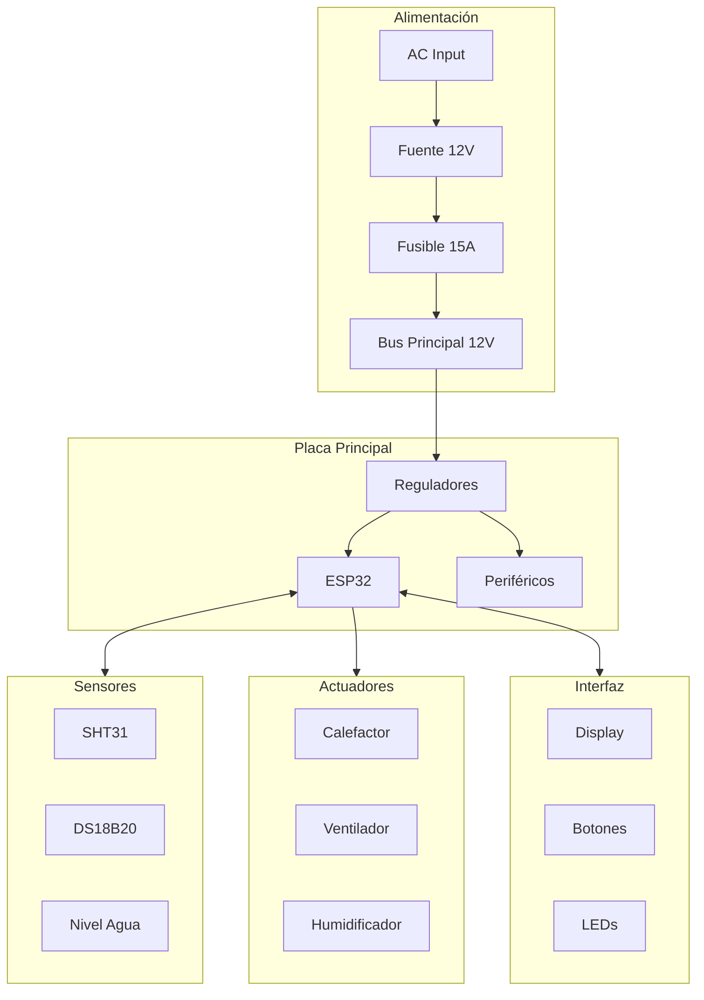

♪ Caber

Schéma général des connexions



Code couleur

# # Câbles alimentaires

- 124; couleur - 124; fonction - 124;
- 124;
- 124; - 124; + 12V - 124;
- 124;
- 124; - 124; + 5V - 124;
- 124; - jaune - 124; + 3,3V - 124;

Câbles de signal

- 124; couleur - 124; fonction - 124;
- 124;
- 124;
- 124;
- 124;
- 124;
- 124;

Liens alimentaires

# # # Entrée AC et source

```
                    ┌─────────────────────────────────────┐
                    │                                     │
 ● L (Vivo)────────┼─[INTERRUPTOR]─[FUSIBLE AC]─────► L │
                    │                                     │
 ● N (Neutro)──────┼────────────────────────────────► N │
                    │                                     │
 ● PE (Tierra)─────┼────────────────────────────────► PE│
                    │                                     │
                    │      FUENTE SWITCHING 12V/10A       │
                    │                                     │
                    │         +12V ●────────────────────►12V
                    │         GND  ●────────────────────►GND
                    │                                     │
                    └─────────────────────────────────────┘

Cable: 18AWG mínimo para AC
       16AWG para línea 12V principal
```

# # Distribution en continu

```
     +12V ────┬────────────────────────────────┬────► Calefactor (16AWG)
              │                                │
              ├────► Ventilador (20AWG)        │
              │                                │
              └────► PCB Principal (18AWG)     │
                                               │
                                    ┌──────────┴──────────┐
                                    │ FUSIBLE 15A         │
                                    └─────────────────────┘
```

Connexions de capteurs

# # # SHT31 (I2C)

```
SHT31 Module        ESP32
────────────        ─────
VCC (Rojo)    ────► 3.3V
GND (Negro)   ────► GND
SDA (Azul)    ────► GPIO21
SCL (Verde)   ────► GPIO22

Cable: 4 hilos, 22AWG
Longitud máxima: 50cm
Conector: JST-XH 4 pines
```

# # # # DS18B20 (1- Fil)

```
DS18B20 (Sonda)     ESP32
───────────────     ─────
VCC (Rojo)    ────► 3.3V
GND (Negro)   ────► GND
DATA (Amarillo)─┬─► GPIO5
                │
               [4.7K]
                │
               3.3V

Cable: Apantallado para >1m
Longitud máxima: 3m
Conector: JST-XH 3 pines
```

Capteur de niveau d'eau

```
Reed Switch         ESP32
───────────         ─────
Terminal 1 ───┬───► GPIO39
              │
             [10K]
              │
             3.3V
              
Terminal 2 ────────► GND

Cable: 2 hilos, 22AWG
```

Connexions des actionneurs

Calibre

```
                      12V_MAIN
                          │
                     [FUSIBLE 10A]
                          │
                     [TERMOSTATO 45°C]
                          │
   GPIO25 ────────────────┴───────┐
                                  │
                             ┌────┴────┐
                             │ MOSFET  │
                             │ DRIVER  │
                             └────┬────┘
                                  │
                          ┌───────┴───────┐
                          │  CALEFACTOR   │
                          │    100W       │
                          └───────┬───────┘
                                  │
                                 GND

Cable: 16AWG para calefactor
       22AWG para señal de control
```

Éventail

```
                      12V_MAIN
                          │
   GPIO26 ─────────────┐  │
                       │  │
                  ┌────┴──┴────┐
                  │   MOSFET   │
                  │   DRIVER   │
                  └──────┬─────┘
                         │
                    ┌────┴────┐
                    │VENTILADOR│
                    │   12V    │
                    └────┬────┘
                         │
                        GND

Cable: 20AWG
Conector: 2 pines
```

Humidificateur

```
                        5V
                         │
   GPIO27 ───[1K]───┐    │
                    │    │
                ┌───┴────┴───┐
                │ TRANSISTOR │
                │   2N2222   │
                └──────┬─────┘
                       │
                  ┌────┴────┐
                  │HUMIDIF. │
                  │   5V    │
                  └────┬────┘
                       │
                      GND

Cable: 22AWG
Conector: JST-XH 2 pines
```

Connexions d'interface

ACL 20x4 (I2C)

```
LCD I2C Module      ESP32
──────────────      ─────
VCC          ─────► 5V
GND          ─────► GND
SDA          ─────► GPIO21 (compartido con SHT31)
SCL          ─────► GPIO22 (compartido con SHT31)

Cable: Cinta plana 4 hilos
Longitud: Según ubicación del display
Conector: JST-XH 4 pines
```

Indiquer les LED

```
LED Rojo            ESP32
────────            ─────
Ánodo (+) ─[330Ω]─► GPIO12
Cátodo (-) ───────► GND

LED Verde           
─────────           
Ánodo (+) ─[330Ω]─► GPIO13
Cátodo (-) ───────► GND

LED Azul            
────────            
Ánodo (+) ─[330Ω]─► GPIO14
Cátodo (-) ───────► GND

Cable: 22AWG
```

Boutons

```
BTN_UP              ESP32
──────              ─────
Terminal 1 ───┬───► GPIO33
              │
             [10K]
              │
             3.3V
              
Terminal 2 ───────► GND

(Repetir para BTN_DOWN:GPIO34, BTN_SELECT:GPIO35, BTN_BACK:GPIO36)

Cable: 22AWG
Conector: JST-XH 2 pines por botón
```

Buzzer

```
                        5V
                         │
   GPIO32 ───[1K]───┐    │
                    │    │
                ┌───┴────┴───┐
                │ TRANSISTOR │
                │   2N2222   │
                └──────┬─────┘
                       │
                  ┌────┴────┐
                  │ BUZZER  │
                  │   5V    │
                  └────┬────┘
                       │
                      GND
```

♪ # Gestion des câbles

# # Techniques d'organisation

1. * * Groupe par fonction * * :
- Fourniture séparée de signaux
- Câbles d'alimentation loin des capteurs

2. * * Identifier avec les étiquettes * *:
C'est la première fois qu'il s'agit d'un problème.

3. * * Utiliser des brides à intervalles réguliers * *:
- Tous les 10-15 cm
- Oui. Au point de changement de direction

4. * * Respecter les radios de courbure * * :
- Diamètre minimum du câble 5x

# # Exemple de câbles

```
┌─────────────────────────────────────────────────┐
│                                                 │
│  ┌─────┐      ┌─────┐      ┌─────┐             │
│  │POWER│      │SENSE│      │ UI  │             │
│  │BUNDLE│     │BUNDLE│     │BUNDLE│            │
│  └──┬──┘      └──┬──┘      └──┬──┘             │
│     │            │            │                 │
│     │  ═════════════════════════════           │
│     │            │            │     (bridas)    │
│     │            │            │                 │
│     ▼            ▼            ▼                 │
│  [PCB]        [SENS]       [DISP]              │
│                                                 │
└─────────────────────────────────────────────────┘
```

# # Tableau récapitulatif des connexions

- 124; Signal - 124; GPIO - 124; Connecteur - 124; Câble - 124; Couleur - 124;
- 124;
- 124; SDA - 124; 21 - 124; J2 - 124; 22AWG - 124; Bleu - 124;
- 124; SCL - 124; 22 - 124; J2 - 124; 22AWG - 124; Vert - 124;
- 124; DHT22 _ DATA-124; 4-124; J3-124; 22AWG-124; White-124;
- 124; DS18B20 _ DATA-124; 5-124; J4-124; 22AWG-124; Yellow-124;
- 124; HEATER _ PWM-124; 25-124; J5-124; 22AWG-124; Morado-124;
- 124; FAN _ PWM-124; 26-124; J5-124; 22AWG-124; Morado-124;
- 124; HUMID _ CTRL-124; 27-124; J6-124; 22AWG-124; Brown-124;
- 124; BUZZER-124; 32-124; J7-124; 22AWG-124; Brown-124;
- 124; LED _ R - 124; 12 - 124; J8 - 124; 22AWG - 124; Rouge - 124;
- 124; LED _ G - 124; 13 - 124; J8 - 124; 22AWG - 124; Vert - 124;
- 124; LED _ B - 124; 14 - 124; J8 - 124; 22AWG - 124; Bleu - 124;
124; BTN _ UP - 124; 33 - 124; J9 - 124; 22AWG - 124; Gris - 124;
- 124; BTN _ DOWN-124; 34-124; J9-124; 22AWG-124; Gris-124;
- 124; BTN _ SELECT-124; 35-124; J9-124; 22AWG-124; Gris-124;
- 124; BTN _ BACK-124; 36-124; J9-124; 22AWG-124; Gris-124;
- 124; EAU _ NIVEAU-124; 39-124; J10-124; 22AWG-124; Blanc-124;

Sections suivantes

- [Évidence] (@ @ URL0 @)