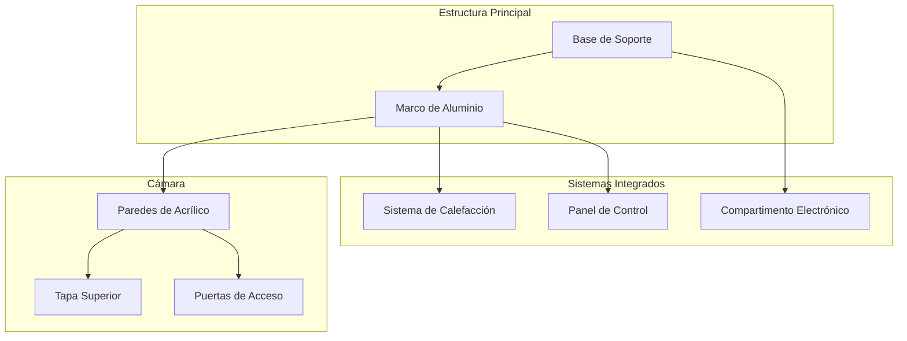

Logement et structure

Vision générale

La structure IncuNest est conçue pour:

- * * Isolation thermique * * efficace
- * * Visibilité * * du patient
* * accès facile * * pour le personnel médical
- * * Nettoyage facile * * et désinfection
- * * Fabrication locale * * avec matériaux accessibles

Dimensions générales

```
            ┌─────────────────────────────────────────┐
            │                                         │
            │              600mm                      │
            │◄───────────────────────────────────────►│
        ▲   ┌─────────────────────────────────────────┐
        │   │                                         │
        │   │                                         │
  500mm │   │          CÁMARA PRINCIPAL              │
        │   │                                         │
        │   │                                         │
        ▼   └─────────────────────────────────────────┘
            
            PROFUNDIDAD: 400mm
```

124; Paramètre 124; Externe 124; Interne 124;
- 124;
- 124; largeur 124; 600 mm 124; 500 mm 124;
- 124; haut - 124; 500 mm - 124; 350 mm - 124;
124; profondeur 124; 400 mm 124; 300 mm 124;

Matériel

Chambre principale

- 124; matériel - 124; épaisseur - 124; utilisation - 124;
- 124;
- 124; acrylique transparent - 124; 6mm - 124; Murs latéraux et plafond - 124;
- 124; acrylique opaque - 124; 6mm - 124; panneau de base et arrière - 124;
- 124; silicone médical - 124; joints et joints - 124;

Base et structure

- 124; matériel - 124; solutions de remplacement - 124; utilisation - 124;
- 124; - 124; - 124;
124; MDF 124; contreplaqué 124; base structurelle 124;
- 124; aluminium - 124; acier inoxydable - 124; cadre de soutien - 124;
- 124; PLA / PETG-124; ABS-124; pièces imprimées en 3D-124;

Conception modulaire



♪ ♪ Vues de conception ♪

Vue frontale

```
┌─────────────────────────────────────────────────────────┐
│  ┌─────────────────────────────────────────────────┐    │
│  │                                                 │    │
│  │                                                 │    │
│  │            CÁMARA PRINCIPAL                     │    │
│  │              (Acrílico)                         │    │
│  │                                                 │    │
│  │                                                 │    │
│  └─────────────────────────────────────────────────┘    │
│  ┌─────────────────────────────────────────────────┐    │
│  │  [DISPLAY]     [TEMP]   [HUM]    [ALARMA]       │    │
│  │                                                 │    │
│  │     ● ● ●     36.5°C   65%      [SILENCIAR]     │    │
│  │     R G B                                       │    │
│  └─────────────────────────────────────────────────┘    │
│                        BASE                             │
└─────────────────────────────────────────────────────────┘
```

Vue latérale

```
┌───────────────────────────┐
│    ╔═══════════════╗      │
│    ║               ║      │
│    ║    CÁMARA     ║◄──── Tapa abatible
│    ║               ║      │
│    ╚═══════════════╝      │
│  ┌───────────────────┐    │
│  │ SISTEMA CALEFAC.  │◄─── Compartimento calefacción
│  └───────────────────┘    │
│  ┌───────────────────┐    │
│  │   ELECTRÓNICA     │◄─── Panel de control
│  └───────────────────┘    │
│          BASE             │
└───────────────────────────┘
```

Système d'accès

Portes latérales

Les portes latérales permettent l'accès au patient sans ouvrir complètement la caméra:

```
┌───────────────────────────────────────┐
│                                       │
│   ┌───────┐           ┌───────┐      │
│   │       │           │       │      │
│   │ PUERTA│           │PUERTA │      │
│   │  IZQ  │           │  DER  │      │
│   │       │           │       │      │
│   └───────┘           └───────┘      │
│                                       │
└───────────────────────────────────────┘

Dimensiones de puerta: 150mm x 200mm
```

♪ ♪ Couverture supérieure ♪

- * * Ouverture * *: 180 ° retour
- * * charnières * *: Acier inoxydable avec amortisseur
- * * Fermer * *: Aimants en néodyme
- * * Timbre * *: Silicone périmétral

Isolation thermique

♪ ♪ Caps d'isolement ♪

```
EXTERIOR          AISLANTE          INTERIOR
    │                │                  │
    ▼                ▼                  ▼
┌───────┐        ┌───────┐        ┌───────┐
│Acrílico│        │Espuma │        │Acrílico│
│  6mm  │        │ 10mm  │        │  3mm  │
└───────┘        └───────┘        └───────┘
```

124; Capa 124; Matériel 124; Épaisseur 124; Valeur R 124;
- 124; - 124; - 124; - - - 124; - - 124; - - 124;
- 124; extérieur - 124; acrylique - 124; 6mm - 124; 0,17 - 124;
- 124; Isolant - 124; Polystyrène élargi - 124; 10 mm - 124; 2,5 - 124;
- 124; intérieur - 124; acrylique - 124; 3mm - 124; 0,08 - 124;

Liste des coupures acryliques

Caméra principale (6mm transparent)

- 124;
- 124; - 124; - 124;
- 124; mur avant - 124; 1 - 124; 500 x 350 mm - 124;
124; stop arrière 124; 1 124; 500 x 350 mm 124;
- 124; paroi latérale - 124; 2 - 124; 300 x 350 mm - 124;
- 124; couverture supérieure - 124; 1 - 124; 500 x 300 mm - 124;
124; base interne 124; 1 124; 500 x 300 mm 124;

Coupures spéciales

- 124;
- 124;
- 124; murs latéraux - 124; trou circulaire 150mm pour portes - 124;
- 124; arrêt arrière - 124; fente de câble 50x10mm - 124;
124; couvercle supérieur 124; charnières 124;

Assemblage

♪ ♪ Séquence d'assemblée

1. * * Préparer la base * * structure
2. * * Cadre de fixation * * en aluminium
3. * * Installation du système de chauffage * *
4. * * Régler les murs * * côté
5. * * Installer des portes d'accès * *
6. * * Placer la paroi * * avant et arrière
7. * * Mont haut * * haut
8. * * Appliquer des joints en silicone * *
9. * * Installer l'électronique * *
10. * * Tests d'intégrité * *

Tornillerie nécessaire

- 124; Type - 124; Taille - 124; Quantité - 124; Utilisation - 124;
- 124; - 124; - 124; - 124; - 124; - - 124;
- 124; vis à remontage automatique - 124; M4 x 20mm - 124; 40 - 124; structure - 124;
- 124; vis de la machine - 124; M3 x 10mm - 124; 20 - 124; Électronique - 124;
- 124;
- 124; Arandela - 124; M4 - 124; 80 - 124; distribution du fret - 124;

Fichiers CAO

Les fichiers de conception sont disponibles à l'adresse suivante:

```
hardware/
├── mechanical/
│   ├── cad/
│   │   ├── enclosure.step
│   │   ├── enclosure.f3d (Fusion 360)
│   │   └── drawings/
│   │       ├── assembly.pdf
│   │       └── parts_list.pdf
│   └── dxf/
│       ├── front_panel.dxf
│       ├── side_panel.dxf
│       └── base.dxf
```

Sections suivantes

- [Système de chauffage] (@ @ URL0 @)
- [Système d'humidification] (@ @ URL1 @)
- [3D imprime] (@ @ URL2 @)