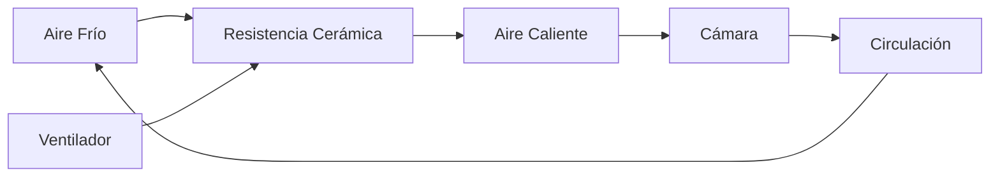
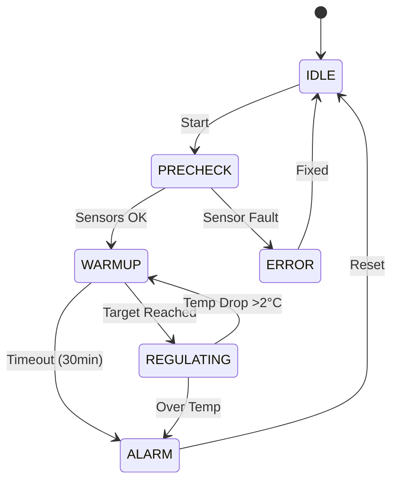

♪ Système de chauffage

Principe de fonctionnement

Le système de chauffage IncuNest utilise * * convection forcée * *:



Composantes

♪ Élément talon

124; Paramètre 124; Spécification 124;
- 124; - 124;
124; type 124; résistance céramique PTC 124;
- 124; puissance - 124; 100W - 124;
- 124; tension - 124; 12V DC - 124;
- 124; température maximale - 124; 200 °C - 124;
- 124; dimensions - 124; 50 x 30 x 10 mm - 124;

Ventilateur de circulation

124; Paramètre 124; Spécification 124;
- 124; - 124;
- 124; Type - 124; Axial brushless - 124;
- 124; calibre - 124; 80 x 80 x 25 mm - 124;
- 124; tension - 124; 12V DC - 124;
- 124; débit - 124; 40 CFM - 124;
124; bruit 124; moins de 30 dB 124;

Conception de la conduite aérienne

Vue dans la cour

```
          CÁMARA PRINCIPAL
    ┌─────────────────────────────┐
    │                             │
    │    ↑    ↑    ↑    ↑    ↑   │  Aire caliente sube
    │    │    │    │    │    │   │
    │    └────┴────┴────┴────┘   │
    │         DIFUSOR            │
    │                             │
    └─────────────────────────────┘
              │
    ┌─────────┴─────────┐
    │  CONDUCTO CALEF.  │
    │                   │
    │  ┌─────────────┐  │
    │  │  RESISTENCIA │  │
    │  │    100W      │  │
    │  └─────────────┘  │
    │         ▲         │
    │  ┌──────┴──────┐  │
    │  │ VENTILADOR  │  │
    │  │    80mm     │  │
    │  └─────────────┘  │
    │         ▲         │
    └─────────┬─────────┘
              │
        ENTRADA DE AIRE
```

Dimensions du lecteur

- 124; Section - 124; Dimensions - 124;
- 124;
- 124; entrée - 124; 80 x 80 mm - 124;
124; chambre de chauffage 124; 100 x 100 x 50 mm 124;
- 124; diffuseur - 124; 400 x 30 mm - 124;

Diffuseur d'air

Le diffuseur distribue uniformément l'air chaud:

```
┌─────────────────────────────────────────────────┐
│  ○  ○  ○  ○  ○  ○  ○  ○  ○  ○  ○  ○  ○  ○  ○  │
│     ○  ○  ○  ○  ○  ○  ○  ○  ○  ○  ○  ○  ○     │
│  ○  ○  ○  ○  ○  ○  ○  ○  ○  ○  ○  ○  ○  ○  ○  │
└─────────────────────────────────────────────────┘

○ = Agujero de 5mm de diámetro
Patrón: Rejilla alternada
Total: ~45 agujeros
```

Protection thermique

Thermostat de sécurité

Outre la commande électronique, un thermostat mécanique est inclus:

124; Paramètre 124; Valeur 124;
- 124; - 124; - 124;
124; Type 124; Bimétalique NC 124;
124; Température de coupe 124; 45 °C 124;
- 124; histérésis - 124; 5 °C - 124;
124; courant maximal 124; 10A 124;

Connexion thermostat

```
    12V ───[FUSIBLE]───[TERMOSTATO]───[MOSFET]─── RESISTENCIA
              15A          45°C
```

Balance thermique

# # # Calcul de la puissance nécessaire

```
P necesaria = Q / Δt
```

où:
- Q = Énergie thermique requise
- Oui. Δt = temps de chauffage souhaité

Pour chauffer la caméra de 25 °C à 37 °C en 10 minutes:

```
P ≈ (m × cp × ΔT) / t ≈ 80W
```

La résistance 100W offre une marge de sécurité.

Pertes thermiques

- 124; Source:
- 124; - 124; - 124;
- 124; conduite (murs) - 124; 20W - 124;
124; ouverture des portes 124; 30W (transitionnelle) 124;
- 124;
C'est pas vrai.

Code de contrôle

Contrôle PID du Calefactor

```cpp
class HeatingController {
private:
    PIDController pid;
    float targetTemp = 36.5;
    float currentTemp = 25.0;
    uint8_t heaterPower = 0;
    uint8_t fanSpeed = 0;
    
public:
    HeatingController() : pid(2.0, 0.5, 1.0) {}
    
    void update(float measuredTemp) {
        currentTemp = measuredTemp;
        
        // Calcular potencia del calefactor
        heaterPower = pid.compute(targetTemp, currentTemp);
        
        // Calcular velocidad del ventilador
        // Mínimo 30% cuando el calefactor está activo
        if (heaterPower > 0) {
            fanSpeed = max(30, heaterPower);
        } else {
            fanSpeed = 0;
        }
        
        // Aplicar salidas
        setHeaterPWM(heaterPower);
        setFanPWM(fanSpeed);
    }
    
    void setTarget(float temp) {
        targetTemp = constrain(temp, 25.0, 37.5);
    }
    
    bool isSafe() {
        // Verificar temperatura segura
        return currentTemp < 40.0;
    }
};
```

Séquence de réchauffement



Entretien

Contrôle périodique

- 124; tâche - 124; fréquence - 124;
- 124; - 124; - 124;
- 124; Vérifier le fonctionnement du ventilateur - 124;
- 124; filtre d'entrée de nettoyage - 124; mensuel - 124;
- 124; Vérifier les connexions électriques - 124; mensuel - 124;
- 124; thermostat de sécurité d'étalonnage - 124; annuel - 124;

Signes de déshabillage

- Ventilateur bruyant → Remplacer
- Résistance aux points chauds → Remplacer
- Thermostat non court → Remplacer immédiatement

Liste des matériaux

- 124; composant - 124; spécification - 124; quantité - 124;
- 124; - 124; - 124; - 124; - 124;
124; résistance PTC 124; 100W - 12V - 124; 1 - 124;
- 124; ventilateur - 124; 80mm - 12V - 124; 1 - 124;
- 124; thermostat - 124; KSD301 45 ° C NC - 124; 1 - 124;
- 124;
- 124; diffuseur - 124; PLA / PETG imprimé 3D - 124; 1 - 124;
- 124; Isolation - 124; Fibre céramique - 124; 100x100x10mm - 124mm;

Sections suivantes

- [Système d'humidification] (@ @ URL0 @)
- [3D parties] (@ @ URL1 @)