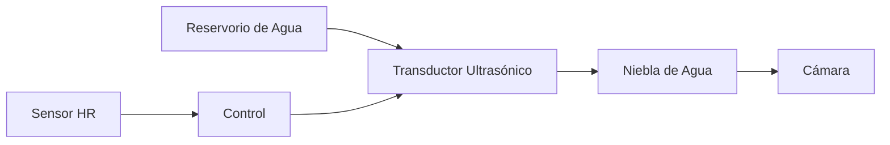

Système d'humidification

Principe de fonctionnement

IncuNest utilise un humidificateur * * ultrasonique * * pour maintenir des niveaux adéquats d'humidité relative (40-80% HR).



Composantes

Module à ultrasons

124; Paramètre 124; Spécification 124;
- 124; - 124;
- 124; type - 124; transducteur piézoélectrique - 124;
- 124; fréquence - 124; 1,7 MHz - 124;
- 124; tension - 124; 5V DC - 124;
124; Consommation
- 124; production - 124; 20-30 ml/heure - 124;

Réserve d'eau

124; Paramètre 124; Spécification 124;
- 124; - 124;
- 124; capacité - 124; 500 ml - 124;
- 124; matière - 124; polypropylène (PP) - 124;
124; Capteur de niveau 124; Flotteur magnétique 124;
- 124; Remplir - 124; Manuel, accès avant - 124;

Conception du système

Schéma des composants

```
┌───────────────────────────────────────────┐
│              CÁMARA                       │
│                                           │
│         ↑↑↑  NIEBLA  ↑↑↑                 │
│         │            │                    │
└─────────┼────────────┼────────────────────┘
          │            │
┌─────────┴────────────┴───────┐
│     CONDUCTO DE HUMEDAD      │
│                              │
│  ┌────────────────────────┐  │
│  │   TRANSDUCTOR          │  │
│  │   ULTRASÓNICO          │  │
│  │       (～～)           │  │
│  └────────────────────────┘  │
│                              │
│  ════════════════════════    │ ← Nivel de agua
│  ┌────────────────────────┐  │
│  │     RESERVORIO         │  │
│  │     500 ml             │  │
│  └────────────────────────┘  │
│                              │
│  [SENSOR DE NIVEL]          │
│                              │
└──────────────────────────────┘
```

Capteur de niveau d'eau

```
         ┌─────┐
         │     │
         │  S  │ ← Reed switch
         │     │
    ═════╪═════╪════  Nivel normal
         │  ○  │ ← Flotador con imán
         │     │
    ═════╪═════╪════  Nivel bajo → Alarma
         │     │
         └─────┘
```

Contrôle de l'humidité

# # Algorithme allumé / éteint avec l'historésie

```cpp
class HumidityController {
private:
    float targetHumidity = 60.0;
    float hysteresis = 5.0;
    bool humidifierOn = false;
    
public:
    void update(float currentHumidity) {
        if (currentHumidity < targetHumidity - hysteresis) {
            humidifierOn = true;
        } else if (currentHumidity > targetHumidity + hysteresis) {
            humidifierOn = false;
        }
        // Mantener estado entre los umbrales (histéresis)
        
        setHumidifier(humidifierOn);
    }
    
    void setTarget(float humidity) {
        targetHumidity = constrain(humidity, 40.0, 80.0);
    }
    
    bool isActive() {
        return humidifierOn;
    }
};
```

Graphique de l'histoire

```
Humedad (%)
    80 ┤
       │         ┌──────┐
    65 ┤─────────┤ OFF  ├─────────  Umbral superior (target + 5%)
       │         └──┬───┘
    60 ┤────────────┼────────────  Target
       │         ┌──┴───┐
    55 ┤─────────┤  ON  ├─────────  Umbral inferior (target - 5%)
       │         └──────┘
    40 ┤
       └──────────────────────────► Tiempo
```

Circuit électronique

Connexion de l'humidificateur

```
      5V
       │
       │
  ┌────┴────┐
  │ HUMIDIF │
  │  MODULE │
  └────┬────┘
       │
      [Q1]     2N2222 o MOSFET
       │
      GND

  GPIO27 ───[1K]───[Base/Gate Q1]
```

♪ # Connexion du capteur de niveau

```
      3.3V
       │
      [10K]
       │
  GPIO39 ──┬── SENSOR_NIVEL
           │
          GND (cuando el flotador está bajo)
```

Code du capteur de niveau

```cpp
#define WATER_LEVEL_PIN 39
#define LOW_WATER_THRESHOLD 1000  // Valor ADC

bool checkWaterLevel() {
    int level = analogRead(WATER_LEVEL_PIN);
    
    if (level < LOW_WATER_THRESHOLD) {
        raiseAlarm(ALARM_LOW_WATER, "Nivel de agua bajo");
        return false;
    }
    return true;
}

void controlHumidifier(bool enable) {
    // Solo activar si hay suficiente agua
    if (enable && checkWaterLevel()) {
        digitalWrite(HUMIDIFIER_PIN, HIGH);
    } else {
        digitalWrite(HUMIDIFIER_PIN, LOW);
    }
}
```

Sécurité

Protections mises en œuvre

- 124; risque - 124; atténuation - 124;
- 124;
124; réserve vide 124; capteur de niveau + alarme 124;
124; humidité excessive 124; limite maximale 85 % HR 124;
124; croissance bactérienne 124; rappel de nettoyage 124;
- 124; dépassement - 124; plateau de drainage - 124;

Alarmes d'humidification

```cpp
void checkHumidityAlarms(float humidity) {
    if (humidity > 85.0) {
        raiseAlarm(ALARM_HIGH_HUMIDITY, "Humedad muy alta");
        setHumidifier(false);
    }
    
    if (humidity < 30.0 && humidifierActive) {
        raiseAlarm(ALARM_HUMIDIFIER_FAULT, "Humidificador no responde");
    }
    
    if (!checkWaterLevel()) {
        setHumidifier(false);
    }
}
```

Entretien

♪ ♪ Nettoyer Rutina ♪

* * Fréquence * * : Toutes les 48 heures d'utilisation ou en cas de changement d'eau

1. * * Vide * * le réservoir complètement
2. * * Nettoyer * * avec une solution de vinaigre dilué (1: 10)
3. * * Rincer * * avec de l'eau distillée
4. * * Sécher * * complètement
5. * * Remplir * * d'eau fraîche distillée

Recommandations concernant l'eau

124; type d ' eau 124; recommandation 124;
- 124; - 124; - 124;
- 124; - 124; - 124;
124; Hervida 124; - Acceptable 124;
- 124; filtre (RO) - 124; - acceptable - 124;
- 124;
- 124; Minéraux - 124; - Ne pas utiliser - 124;

Signaux d'entretien

- * * production de brouillard réduite * * → Transducteur propre
- * * Réservoirs blancs * * → Utiliser de l'eau distillée
- * * odeur dégoûtante * * → nettoyage profond nécessaire
- * * Pas de production de brouillard * * → Vérifiez le transducteur

# # Caractéristiques techniques

124; Paramètre 124; Valeur 124;
- 124; - 124; - 124;
- 124; plage de contrôle - 124; 40 % - 80 % HR - 124;
124; précision 124; ± 5% HR 124;
124; temps de réponse 124; 5-10 minutes 124;
- 124; production de brouillard - 124; 20-30 ml/heure - 124;
- 124; capacité du réservoir - 124; 500 ml - 124;
124; autonomie maximale 124; environ 20 heures 124;

Liste des matériaux

- 124; composant - 124; spécification - 124; quantité - 124;
- 124; - 124; - 124; - 124; - 124;
- 124; module à ultrasons - 124; 5V 1.7MHz - 124; 1 - 124;
- 124; réserve - 124; PP 500ml - 124; 1 - 124;
- 124; Capteur de niveau - 124; Interrupteur de roseau + flotteur - 124; 1 - 124;
- 124; Transistor - 124; 2N2222A - 124; 1 - 124;
- 124; Résistance - 124;
- 124; Tube en silicone - 124; diamètre 10 mm - 124; 0,5 m - 124;

Sections suivantes

- [3D Imprimantes] (@ @ URL0 @)