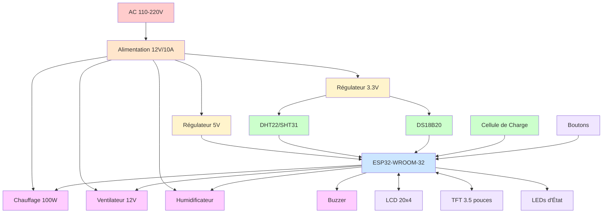

# Matériel - Vision générale

Présentation

Le matériel IncuNest est conçu selon les principes suivants :

- * * Accessibilité * *: Composantes disponibles au niveau mondial
- * * Simplicité * *: Facile à assembler et à réparer
- * * Sécurité * *: Plusieurs couches de protection
- * * Modularité * *: Composants interchangeables

Schéma système



# # Principaux composants

# # 1. Unité de contrôle

- 124; composant-124; spécification-124; fonction-124;
- 124; - 124; - 124; - 124; - 124;
- 124; ESP32-WROOM-32-124; 240MHz, 520Ko RAM-124; MCU main-124;
- 124; Flash 4MB - 124; W25Q32 - 124; Stockage - 124;
124; CCF DS3231 - 124; Précision ± 2ppm - 124; Horloge en temps réel - 124;
- 124; EEPROM 24C32 - 124; 32Kbit - 124; Configuration - 124;

♪ 2. Capteur

124; Capteur 124; Interface 124; Précision 124; Utilisation 124;
- 124; - 124; - 124; - 124; - 124; - - 124;
124; SHT31 - 124;
- 124; DS18B20 - 124;
124; HX711 + Celda - 124; Série - 124; 0,1g - 124; Poids (facultatif) - 124;

♪ 3. Actionneurs

124; actionneur 124; spécification 124; contrôle 124;
- 124; - 124; - 124;
- 124; Résistance en céramique - 124; 100W, 12V - 124; PWM via MOSFET - 124;
- 124; ventilateur - 124; 12V, 0,5A - 124; PWM - 124;
- 124; Humidificateur - 124; ultrasonique 5V - 124; marche/arrêt - 124;
- 124; Buzzer - 124; 5V, 85dB - 124; PWM / Digital - 124;

♪ 4. Interface utilisateur

- 124; Composant-124; Spécification-124; Connexion-124;
- 124; - 124; - 124; - 124; - 124;
- 124; LCD 20x4 - 124; compatible HD44780 - 124; I2C - 124;
- 124; TFT 3.5 "- 124; ILI9488, 480x320 - 124; SPI 124;
- 124; LED - 124; RGB, indicateurs - 124; GPIO - 124;
- 124; Boutons - 124; 4x tactile - 124; GPIO - 124;

Schéma du bloc électrique

```
┌─────────────────────────────────────────────────────────────────┐
│                      FUENTE DE ALIMENTACIÓN                      │
├──────────────────┬──────────────────┬──────────────────────────┤
│     12V/10A      │     5V/3A        │       3.3V/1A            │
│    (Actuadores)  │   (Lógica 5V)    │    (ESP32, Sensores)     │
└────────┬─────────┴────────┬─────────┴──────────┬───────────────┘
         │                  │                     │
         ▼                  ▼                     ▼
┌────────────────┐  ┌──────────────┐      ┌──────────────┐
│   CALEFACTOR   │  │    BUZZER    │      │    ESP32     │
│   100W PWM     │  │    ALARMA    │      │   MCU        │
└────────────────┘  └──────────────┘      └──────┬───────┘
         │                                        │
         │              ┌─────────────────────────┼─────────────┐
         │              │                         │             │
         ▼              ▼                         ▼             ▼
┌────────────────┐ ┌────────────┐         ┌────────────┐ ┌────────────┐
│  VENTILADOR    │ │   DISPLAY  │         │  SENSORES  │ │   WiFi     │
│   12V PWM      │ │  LCD/TFT   │         │  I2C/1Wire │ │  Integrado │
└────────────────┘ └────────────┘         └────────────┘ └────────────┘
```

Caractéristiques électriques

Consommation électrique

124; État 124; courant 12V 124; puissance 124;
- 124; - 124; - 124; - 124; - 124;
- 124;
- 124; chauffage (100%) - 124; 10A - 124; 120W - 124;
124; fonctionnement normal 124; 3-5A - 124; 36-60W - 124;
- 124; surveillance seulement - 124; 0,3A - 124; 3,6W - 124;

Protections

15A, 12V
* * Protection des investissements dans la Polarité * * : Diode Schottky
- * * Régulateurs avec protection thermique * *
* * * TVS dans les lignes de signal * *

# # Allocation de pins ESP32

```cpp
// Sensores
#define PIN_DHT22           4    // Sensor temp/hum ambiente
#define PIN_DS18B20         5    // Sensor temp piel
#define PIN_SDA             21   // I2C Data
#define PIN_SCL             22   // I2C Clock
#define PIN_HX711_DT        16   // Celda de carga data
#define PIN_HX711_SCK       17   // Celda de carga clock

// Actuadores
#define PIN_HEATER_PWM      25   // Control calefactor
#define PIN_FAN_PWM         26   // Control ventilador
#define PIN_HUMIDIFIER      27   // Control humidificador
#define PIN_BUZZER          32   // Alarma sonora

// Display TFT (SPI)
#define PIN_TFT_CS          15   // TFT Chip Select
#define PIN_TFT_DC          2    // TFT Data/Command
#define PIN_TFT_RST         4    // TFT Reset
#define PIN_TFT_MOSI        23   // SPI MOSI
#define PIN_TFT_SCLK        18   // SPI Clock

// LEDs de estado
#define PIN_LED_RED         12   // LED Alarma
#define PIN_LED_GREEN       13   // LED OK
#define PIN_LED_BLUE        14   // LED Info

// Botones
#define PIN_BTN_UP          33   // Botón arriba
#define PIN_BTN_DOWN        34   // Botón abajo
#define PIN_BTN_SELECT      35   // Botón selección
#define PIN_BTN_BACK        36   // Botón volver
```

Structure mécanique

Dimensions générales

124; Paramètre 124; Valeur 124;
- 124; - 124; - 124;
124; dimensions extérieures 124; 60 x 40 x 50 cm 124;
124; espace intérieur 124; 50 x 30 x 30 cm 124;
124; poids (vide) 124; ~ 15 kg 124;
- 124; matériau du boîtier - 124; Acrylique 6mm + PLA - 124;

Composants mécaniques

1. * * Caméra principale * *: Acrylique clair
2. * * Base structurelle * *: MDF ou aluminium
3. * * Système de chauffage * *: Conduites aériennes
4. * * Isolation * *: Polystyrène spuma
5. * * Portes d'accès * *: Avec joints hermétiques

Sections suivantes

- [Composants électroniques] (@ @ URL0 @) - Détails des PCB
- [Structure mécanique] (@ @ URL1 @) - Conception physique
- [Assemblée] (@ @ URL2 @) - Guide de construction