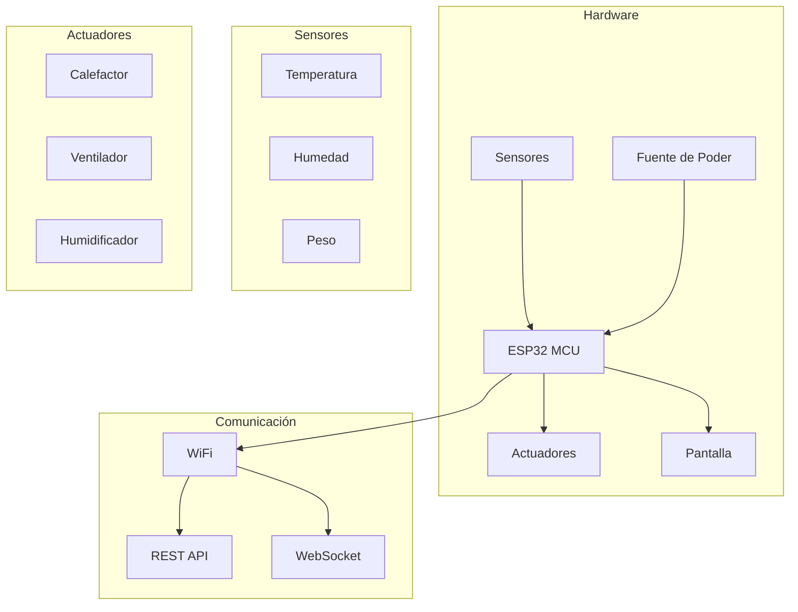

# Introduction à l'IncuNest

  

    <h1 className="hero__title">🏥 IncuNest</h1>
    
Incubateur néonatal open source

  

## Qu'est-ce qu'IncuNest?

**IncuNest** est un projet de matériel et de logiciels libres qui vise à fournir un incubateur néonatal accessible et peu coûteux pour les environnements à ressources limitées. Le projet est conçu pour répondre aux normes de sécurité médicale tout en maintenant la facilité de fabrication et d'entretien.

  <video
    controls
    preload="metadata"
    width="100%"
    src="/videos/fr/user-interface.mp4"
  >
    Votre navigateur ne prend pas en charge la balise vidéo.
  </video>
  

    <a href="/videos/fr/user-interface.mp4" target="_blank" rel="noopener noreferrer">
      Regarder en plein écran
    </a>
  

:::tip Mission du projet
Réduire la mortalité néonatale en fournissant une technologie médicale de qualité aux communautés qui en ont le plus besoin.
:::

## Caractéristiques principales

### Contrôle de la température
- Contrôle précis de la température par PID
- Plage de fonctionnement: 25 °C - 37 °C
− Précision: ± 0,1 °C
- Plusieurs capteurs de température redondants

Contrôle de l'humidité
- Humidification active de l'environnement
- plage d'humidité: 40% - 80% HR
- Système intégré de réservoir d'eau

♪ Surveillance en temps réel
- Affichage LCD / TFT intégré
- Interface Web accessible par WiFi
- Enregistrement des données historiques
- Alertes et alarmes configurables

Sécurité
- Niveaux d'alarme multiples
- Protection contre la surchauffe
- Batterie de secours
- Conception antidéfaillance

Architecture du système

# # Caractéristiques techniques

124; Paramètre 124; Spécification 124;
- 124; - 124;
- 124; * * Microcontrôleur * * - 124; ESP32-WROOM-32 - 124;
- 124; * * Plage de température * * - 124; 25 ° C - 37 ° C - 124;
- 124; * * Précision de la température * * - 124; ± 0,1 ° C - 124;
- 124; * * Plage des zones humides * * - 124; 40 % - 80 % HR - 124;
124; * * Aliments * * - 124; 12V DC / 110-220V AC - 124;
- 124; * * Consommation maximale * * - 124; 150W - 124;
- 124; * * Connectivité * * - 124; WiFi 802.11 b / g / n - 124;
- 124; * * Affichage * * - 124; LCD 20x4 / TFT 3.5 "- 124;

## Licence

IncuNest est sous licence **MIT**, ce qui signifie que :

- ✅ Vous pouvez utiliser, modifier et distribuer le projet, y compris à des fins commerciales
- ✅ Vous devez inclure l'avis de copyright et la licence MIT dans les copies ou travaux dérivés
- ⚠️ Aucune garantie n'est fournie ; utilisez-le à vos risques et périls

:: Avertissement de sécurité
Ce projet est destiné à des fins éducatives et de recherche. Toute utilisation clinique doit respecter les règlements médicaux locaux et exiger une certification appropriée.
:: Le cas échéant;

Prochaines étapes

< div classe = "row" >
< div classe = "col col-6" >
< div classe = "carte" >
< div class = "carte _ _ en-tête" >
< h3 > Â Guide de démarrage rapide < / h3 >
< / div >
< div class = "carte _ _ body" >
< p > Apprenez à configurer votre premier IncuNest < / p >
< / div >
< div class = "card _ _ footer" >
< a class = "bouton--bouton primaire--block" href =. "/ start-up" > Start < / a >
< / div >
< / div >
< / div >
< div classe = "col col-6" >
< div classe = "carte" >
< div class = "carte _ _ en-tête" >
Matériel < / h3 >
< / div >
< div class = "carte _ _ body" >
< p > Explorer les composants et le montage < / p >
< / div >
< div class = "card _ _ footer" >
< a class = "bouton--bouton secondaire--block" href =. "/ hardware / panorama" > Voir le matériel < / a >
< / div >
< / div >
< / div >
< / div >

♪ ♪ Contribuer

IncuNest est un projet communautaire et nous apprécions toutes les contributions. Consultez notre [guide de contribution] (@ @ URL0 @ @) pour plus d'informations.

---

< p align = "centre" >
< forte > Medical Open World < / fort > - Technologie médicale accessible à tous
< / p >
