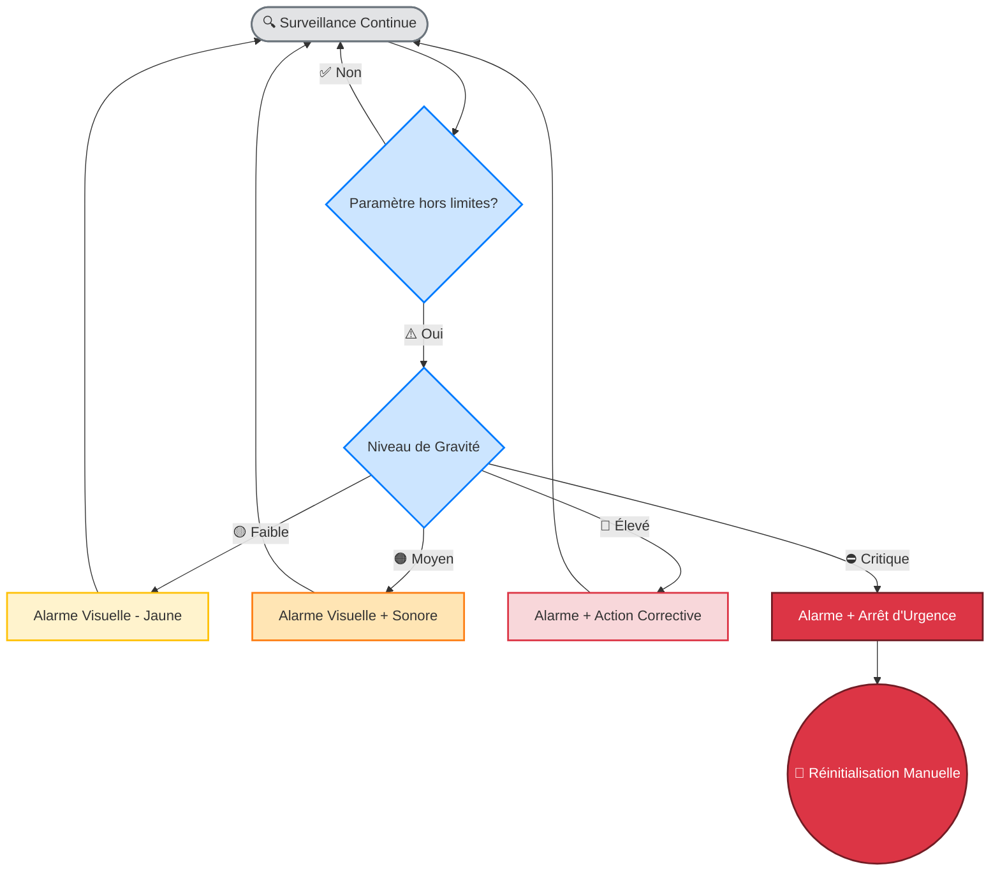
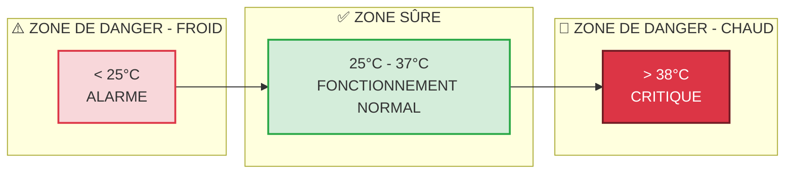
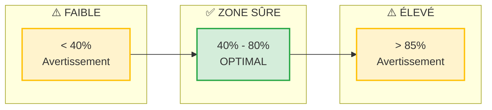

## ⚠️ Avis de sécurité

:::danger Avertissement important
Lisez cet avis dans son intégralité avant de construire, assembler ou utiliser IncuNest.
:::

## Avertissement

IncuNest est un projet open source à des fins éducatives et de recherche. Équipe de développement et contributeurs:

1. * * Ne garantit pas * * l'adéquation de l'appareil à un usage clinique
2. * * Ils ne sont pas tenus responsables * * des dommages ou blessures résultant de l'utilisation
3. * * Ils n'attestent pas * * le respect des règlements médicaux spécifiques

# # Exigences relatives à l'utilisation clinique

Si vous prévoyez d'utiliser IncuNest dans un environnement clinique, * * DEBE * *:

Certificats requis

- 124; région - 124; certification requise - 124;
- 124;
- 124; Union européenne - 124; marquage CE (MDR 2017 / 745) - 124;
- 124; États-Unis - 124; FDA 510 k) Liquidation - 124;
- 124; Amérique latine - 124; ANVISA, COFEPRIS, INVIMA, etc. - 124;
- 124; International - 124; ISO 13485, CEI 60601-1 - 124;

Étapes obligatoires

1. * * Évaluation des risques * *: analyse complète conformément à la norme ISO 14971
2. * * Validation clinique * * : Essais dans un environnement contrôlé avec supervision médicale
3. * * Certification * *: Obtenir l'approbation de l'autorité de régulation locale
4. * * Tracabilité * * : Mettre en œuvre le système de suivi des appareils
5. * * Formation * *: Formation du personnel médical à une utilisation correcte

Risques connus

Risques thermiques

- 124; risque - 124; atténuation - 124;
- 124;
- 124; surchauffe - 124; Capteurs multiples + alarme à 38 °C - 124;
- 124; panne de chauffage - 124; commande redondante + coupure thermique - 124;
- 124; température insuffisante - 124; alarme basse température - 124;

Risques électriques

- 124; risque - 124; atténuation - 124;
- 124;
- 124; décharge électrique - 124; isolation galvanique + fusibles - 124;
- 124; court-circuit - 124; protection du circuit - 124;
- 124; Défaut de puissance - 124; système UPS recommandé - 124;

Pays humides

- 124; risque - 124; atténuation - 124;
- 124;
- 124; humidité excessive - 124; commande automatique + drainage - 124;
124; condamnation 124; ventilation appropriée 124;
124; croissance bactérienne 124; nettoyage périodique 124;

Système d'alarme

IncuNest implémente un système d'alarme à plusieurs niveaux :

Niveau d'alarme

124; niveau 124; état 124; action 124;
- 124; - 124; - 124;
- 124; * * INFO * * - 124; écart mineur - 124; indicateur DEL bleu - 124;
124; * * AVERTISSEMENT * * - 124; déviation modérée - 124; LED jaune + bip - 124;
124; * * ALARM * * - 124;
- 124; * * CRITIQUE * * - 124; Risque pour le patient - 124; Sécurisation + alarme continue - 124;

L'opération limite la sécurité

Température

Humidité relative

Entretien de la sécurité

Inspections quotidiennes

- [] Vérifier les valeurs de température et d'humidité
- [] Vérifier le fonctionnement des alarmes
- [] Inspecter les câbles et les connexions
- [] Vérifiez le niveau d'eau de l'humidificateur

Inspections hebdomadaires

- [] Capteurs de température propres
- [] Vérifier l'étalonnage du capteur
- [] Vérifier les connexions électriques
- [] Examiner les dossiers des alarmes

Inspections mensuelles

- [] Étalonnage complet du capteur
- [] Nettoyage en profondeur de la caméra
- [] Vérifier l'intégrité de l'isolement
- [] Mettre à jour le firmware si les versions sont disponibles

Contact d'urgence

En cas de défaut de fonctionnement pendant l'utilisation:

1. * * Emmenez immédiatement le patient * * dans un autre environnement sûr
2. * * Débrancher l'appareil * * de l'alimentation électrique
3. * * Documenté l'incident * * avec tous les détails
4. * * Signaler le problème * * sur [GitHub Issues] (@ @ URL0 @)

Déclaration de conformité

Ce projet * * NON * comprend une déclaration de conformité avec la réglementation médicale. Chaque implémentateur est responsable:

- Obtenez les certifications nécessaires
- Effectuer une validation clinique
- Respect des réglementations locales
- Maintenir la documentation de qualité

---

:: info Note juridique
En utilisant ce projet, il accepte qu'il le fasse sous sa propre responsabilité et qu'il ait lu et bien compris cet avis de sécurité.
:: Le cas échéant;
