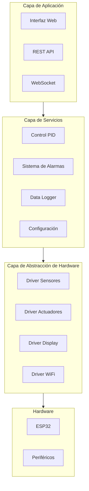
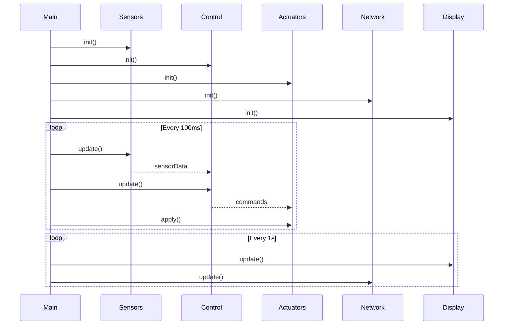

# Logiciel - Vision générale

Architecture logicielle

Le logiciel IncuNest est composé de plusieurs couches:



Technologie des piles

- 124; composante 124; technologie 124;
- 124;
- 124; microcontrôleur - 124; ESP32-WROOM-32 - 124;
- 124; cadre - 124; Arduino / ESP-IDF - 124;
- 124; construire un système - 124; PlatformIO - 124;
- 124; Langue - 124; C + + (firmware), HTML / CSS / JS (web) - 124;
- 124; Protocole Web - 124; HTTP, WebSocket - 124;
124; IoT 124; MQTT (facultatif) 124;

Structure du projet

```
firmware/
├── platformio.ini          # Configuración PlatformIO
├── src/
│   ├── main.cpp           # Punto de entrada
│   ├── config.h           # Configuración global
│   │
│   ├── sensors/           # Drivers de sensores
│   │   ├── SensorManager.h
│   │   ├── SensorManager.cpp
│   │   ├── TemperatureSensor.h
│   │   └── HumiditySensor.h
│   │
│   ├── actuators/         # Control de actuadores
│   │   ├── ActuatorManager.h
│   │   ├── HeaterController.h
│   │   ├── FanController.h
│   │   └── HumidifierController.h
│   │
│   ├── control/           # Sistema de control
│   │   ├── PIDController.h
│   │   ├── PIDController.cpp
│   │   └── SafetyMonitor.h
│   │
│   ├── ui/                # Interfaz de usuario
│   │   ├── DisplayManager.h
│   │   ├── LCDDisplay.h
│   │   ├── TFTDisplay.h
│   │   └── ButtonHandler.h
│   │
│   ├── network/           # Comunicaciones
│   │   ├── WiFiManager.h
│   │   ├── WebServer.h
│   │   ├── WebSocketServer.h
│   │   └── MQTTClient.h
│   │
│   ├── storage/           # Almacenamiento
│   │   ├── ConfigManager.h
│   │   ├── DataLogger.h
│   │   └── SPIFFSManager.h
│   │
│   └── utils/             # Utilidades
│       ├── Timer.h
│       ├── Filter.h
│       └── Debug.h
│
├── data/                  # Archivos SPIFFS (web)
│   ├── index.html
│   ├── style.css
│   ├── app.js
│   └── config.json
│
├── include/               # Headers compartidos
│   └── config_example.h
│
├── lib/                   # Librerías locales
│
└── test/                  # Unit tests
```

Principaux modules

♪ 1. Gestionnaire de capteurs

Gérer la lecture et le traitement de tous les capteurs :

```cpp
class SensorManager {
public:
    void init();
    void update();
    
    float getAmbientTemperature();
    float getSkinTemperature();
    float getHumidity();
    bool isWaterLevelOk();
    
    SensorStatus getStatus();
};
```

♪ 2. Gestionnaire d ' actionneur

Contrôler tous les actionneurs du système:

```cpp
class ActuatorManager {
public:
    void init();
    
    void setHeaterPower(uint8_t percent);
    void setFanSpeed(uint8_t percent);
    void setHumidifier(bool state);
    void setBuzzer(uint16_t frequency, uint16_t duration);
    
    void emergencyStop();
};
```

♪ 3. Système de contrôle

Mettre en oeuvre le contrôle de l'IPD et la logique réglementaire :

```cpp
class ControlSystem {
public:
    void init();
    void update();
    
    void setTemperatureSetpoint(float temp);
    void setHumiditySetpoint(float humidity);
    
    ControlState getState();
    
private:
    PIDController tempPID;
    HumidityController humidityCtrl;
    SafetyMonitor safety;
};
```

4. Gestionnaire d'alarme

Système d'alarme à plusieurs niveaux:

```cpp
class AlarmManager {
public:
    void init();
    void check();
    
    void raiseAlarm(AlarmCode code, AlarmLevel level);
    void clearAlarm(AlarmCode code);
    void acknowledgeAlarm(AlarmCode code);
    
    std::vector<Alarm> getActiveAlarms();
};
```

5. Gestionnaire de réseau

Gestion des communications :

```cpp
class NetworkManager {
public:
    void init();
    void update();
    
    bool isConnected();
    String getIPAddress();
    
    void startAP();
    void connectToWiFi(const char* ssid, const char* password);
};
```

Courant



Configuration

Fichier Config.h

```cpp
#ifndef CONFIG_H
#define CONFIG_H

// ============ WIFI ============
#define WIFI_SSID "MiRed"
#define WIFI_PASSWORD "MiPassword"
#define HOSTNAME "incunest"

// ============ PINS ============
// Sensores
#define PIN_DHT22 4
#define PIN_DS18B20 5
#define PIN_SDA 21
#define PIN_SCL 22

// Actuadores
#define PIN_HEATER 25
#define PIN_FAN 26
#define PIN_HUMIDIFIER 27
#define PIN_BUZZER 32

// UI
#define PIN_LED_R 12
#define PIN_LED_G 13
#define PIN_LED_B 14

// ============ CONTROL ============
#define DEFAULT_TEMP_SETPOINT 36.5
#define DEFAULT_HUMIDITY_SETPOINT 60.0

#define PID_KP 2.0
#define PID_KI 0.5
#define PID_KD 1.0

// ============ LIMITES ============
#define TEMP_MIN 25.0
#define TEMP_MAX 38.0
#define TEMP_CRITICAL 39.0

#define HUMIDITY_MIN 40.0
#define HUMIDITY_MAX 80.0

// ============ INTERVALOS ============
#define SENSOR_UPDATE_INTERVAL 100   // ms
#define DISPLAY_UPDATE_INTERVAL 1000 // ms
#define LOG_INTERVAL 60000           // ms (1 min)

#endif
```

Dépendances

# # # # plate-forme.ini

```ini
[env:esp32dev]
platform = espressif32
board = esp32dev
framework = arduino

monitor_speed = 115200

lib_deps =
    adafruit/Adafruit SHT31 Library@^2.2.0
    paulstoffregen/OneWire@^2.3.7
    milesburton/DallasTemperature@^3.11.0
    marcoschwartz/LiquidCrystal_I2C@^1.1.4
    bodmer/TFT_eSPI@^2.5.0
    bblanchon/ArduinoJson@^6.21.0
    knolleary/PubSubClient@^2.8
    lennarthennigs/Button2@^2.2.2

build_flags =
    -DCORE_DEBUG_LEVEL=3
    -DUSER_SETUP_LOADED
    
board_build.filesystem = spiffs
```

Sections suivantes

- [Architecture des logiciels] (@ @ URL0 @)
- [Paramètres environnementaux] (@ @ URL1 @)
- [Référence API] (@ @ URL2 @)