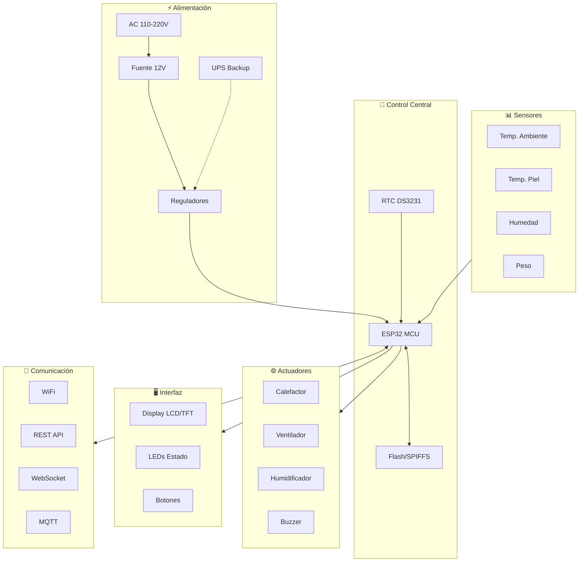
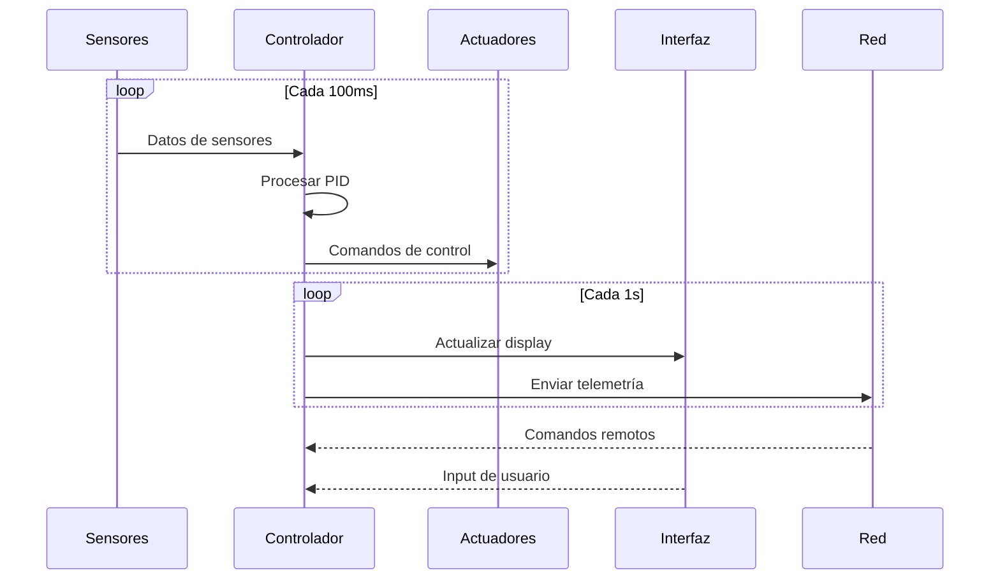
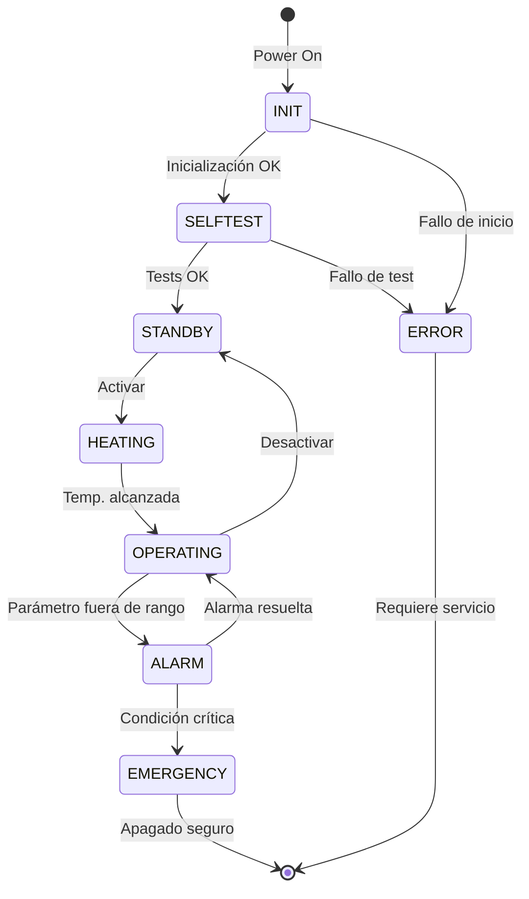

# Arquitetura Geral do Sistema

## Introdução

O IncuNest foi projetado seguindo princípios de **modularidade**, **segurança** e **manutenção**. Esta seção descreve a arquitetura geral do sistema, incluindo hardware e software.

## Diagrama de blocos do sistema



## Camadas do Sistema

### 1. Camada de Hardware

A camada física inclui:

| Componente | Função | Criticidade |
|------------|---------|------------|
| ESP32 | Processamento central | Alto |
| Sensores | Aquisição de dados | Alto |
| Atuadores | Controle ambiental | Alto |
| Alimentação | Potência do sistema | Revisão |
| Exibir | Interface local | Médio |

### 2. Camada de Firmware

O firmware está organizado em módulos:

```
firmware/
├── src/
│   ├── main.cpp              # Punto de entrada
│   ├── config.h              # Configuración
│   ├── sensors/              # Módulo de sensores
│   │   ├── temperature.cpp
│   │   └── humidity.cpp
│   ├── control/              # Sistema de control
│   │   ├── pid.cpp
│   │   └── safety.cpp
│   ├── actuators/            # Control de actuadores
│   │   ├── heater.cpp
│   │   └── fan.cpp
│   ├── ui/                   # Interfaz de usuario
│   │   ├── display.cpp
│   │   └── buttons.cpp
│   ├── network/              # Comunicaciones
│   │   ├── wifi.cpp
│   │   ├── webserver.cpp
│   │   └── mqtt.cpp
│   └── storage/              # Almacenamiento
│       └── datalogger.cpp
└── lib/                      # Librerías externas
```

### 3. Camada de Aplicação

Interfaces disponíveis:

**Interface local**: display LCD/TFT + botões físicos
- **Interface Web**: Painel acessível via WiFi
- **REST API**: Para integração com sistemas externos
- **MQTT**: para IoT e monitoramento centralizado

## Fluxo de dados



## Princípios de Design

### Segurança desde o projeto

1. **Redundância de sensor**: Vários sensores de temperatura
2. **Limites de hardware**: termostatos físicos de backup
3. **Fail-safe**: O sistema falha em um estado seguro
4. **Watchdog**: Reinicialização automática em caso de travamentos

### Modularidade

Cada módulo pode:
- Funcionar de forma independente
- Ser testado isoladamente
- Ser substituído sem afetar outros módulos

### Eficiência Energética

- Modo de suspensão quando possível
- Controle PWM eficiente
- Otimização dos ciclos de trabalho

## Estados do sistema



### Descrição dos Estados

| Estado | Descrição | LED |
|--------|-------------|-----|
| INÍCIO | Inicializando o sistema | Azul piscando |
| AUTOTESTE | Executando o autodiagnóstico | Azul sólido |
| EM ESPERA | Pronto, aguardando ativação | Verde piscando |
| AQUECIMENTO | Aquecimento até à temperatura pretendida | Amarelo |
| OPERACIONAL | Funcionamento normal | Verde sólido |
| ALARME | Condição de alarme ativo | Vermelho piscando |
| EMERGÊNCIA | Desligamento de emergência | Vermelho sólido |
| ERRO | Erro de sistema | Alternando vermelho/azul |

## Comunicações

### Protocolos Suportados

| Protocolo | Porto | Uso |
|----------|--------|-----|
| http | 80 | Interface web |
| WebSocket | 81 | Dados em tempo real |
| MQTT | 1883 | Telemetria IoT |
| mDNS | 5353 | Descoberta local |

### Estrutura de dados

Exemplo de mensagem de telemetria:

```json
{
  "device_id": "INCUNEST_001",
  "timestamp": "2026-01-15T10:30:00Z",
  "sensors": {
    "temperature_ambient": 36.5,
    "temperature_skin": 36.8,
    "humidity": 65.2
  },
  "actuators": {
    "heater_power": 45,
    "fan_speed": 30,
    "humidifier": true
  },
  "status": {
    "state": "OPERATING",
    "alarms": [],
    "uptime": 3600
  }
}
```

## Próximos documentos

- [Design do Sistema](./system-design) - Detalhes técnicos do design
- [Comunicações](./communication) - Protocolos e APIs em detalhes
