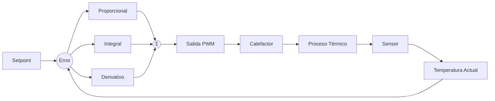
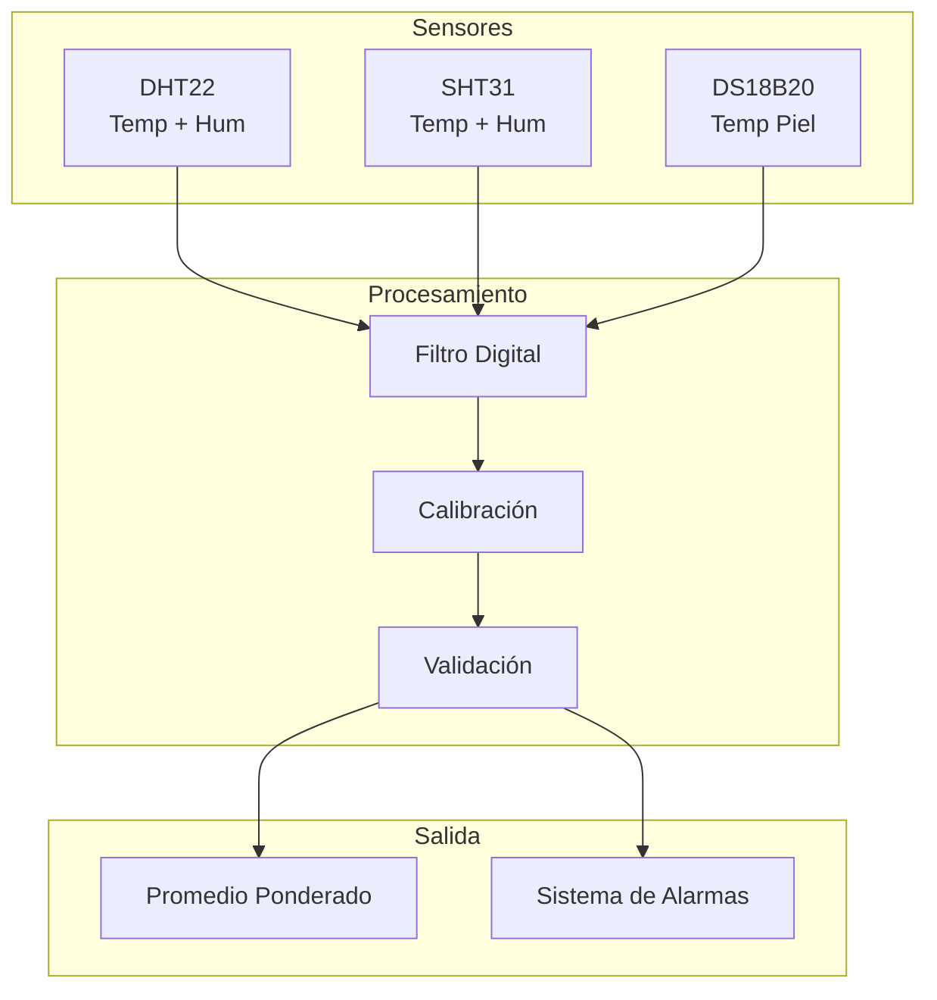
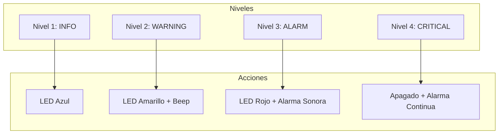
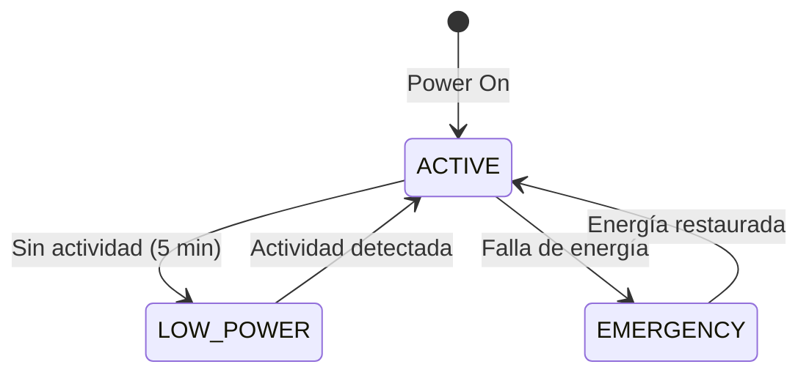

# Projeto do sistema

## Sistema de controle de temperatura

### Controle PID

O IncuNest usa um controlador **PID** (Proporcional-Integral-Derivativo) para manter a temperatura estável.



### Equação do Controlador

```
u(t) = Kp × e(t) + Ki × ∫e(τ)dτ + Kd × de(t)/dt
```

Onde:
- u(t) = Sinal de controle (ciclo de trabalho PWM)
- e(t) = Erro (setpoint - temperatura atual)
- Kp = ganho proporcional
- Ki = ganho integral
- Kd = ganho derivado

### Implementação em código

```cpp
class PIDController {
private:
    float kp, ki, kd;
    float integral = 0;
    float previousError = 0;
    unsigned long lastTime = 0;
    
public:
    PIDController(float p, float i, float d) 
        : kp(p), ki(i), kd(d) {}
    
    float compute(float setpoint, float measured) {
        unsigned long now = millis();
        float dt = (now - lastTime) / 1000.0f;
        
        if (dt <= 0) return 0;
        
        float error = setpoint - measured;
        
        // Término proporcional
        float pTerm = kp * error;
        
        // Término integral con anti-windup
        integral += error * dt;
        integral = constrain(integral, -100, 100);
        float iTerm = ki * integral;
        
        // Término derivativo
        float derivative = (error - previousError) / dt;
        float dTerm = kd * derivative;
        
        previousError = error;
        lastTime = now;
        
        // Salida limitada a 0-100%
        return constrain(pTerm + iTerm + dTerm, 0, 100);
    }
    
    void reset() {
        integral = 0;
        previousError = 0;
    }
};
```

### Ajuste PID

Parâmetros recomendados de acordo com o método Ziegler-Nichols:

| Parâmetro | Valor padrão | Alcance |
|-----------|--------|-------|
| $K_p$ | 2.0 | 1,0 - 5,0 |
| $K_i$ | 0,5 | 0,1 - 2,0 |
| $K_d$ | 1,0 | 0,5 - 3,0 |

## Sistema de aquisição de dados

### Arquitetura do Sensor



### Filtragem de sinal

Implementamos um filtro de **média móvel exponencial** (EMA):

```cpp
class ExponentialFilter {
private:
    float alpha;
    float filteredValue;
    bool initialized = false;
    
public:
    ExponentialFilter(float smoothingFactor = 0.1f) 
        : alpha(smoothingFactor) {}
    
    float filter(float newValue) {
        if (!initialized) {
            filteredValue = newValue;
            initialized = true;
        } else {
            filteredValue = alpha * newValue + (1 - alpha) * filteredValue;
        }
        return filteredValue;
    }
};
```

### Calibração do Sensor

Cada sensor armazena coeficientes de calibração:

```cpp
struct CalibrationData {
    float offset;      // Desplazamiento
    float gain;        // Ganancia
    uint32_t timestamp; // Fecha de calibración
    bool valid;        // Flag de validez
};

float applyCalibration(float raw, CalibrationData& cal) {
    if (!cal.valid) return raw;
    return (raw * cal.gain) + cal.offset;
}
```

## Sistema de alarme

### Níveis de alarme



### Condições de Alarme

| Condição | Nível | Limite |
|----|-------|----|
| Temperatura. ligeiramente baixo | INFORMAÇÕES | < 35°C |
| Temperatura. baixo | AVISO | < 34°C |
| Temperatura. alto | AVISO | > 37,5°C |
| Temperatura. muito alto | ALARME | > 38°C |
| Temperatura. crítica | CRÍTICO | > 39°C |
| Sensor desconectado | ALARME | Tempo limite |
| Falha no aquecedor | CRÍTICO | Sem resposta |

### Implementação do Sistema de Alarme

```cpp
enum AlarmLevel {
    ALARM_INFO,
    ALARM_WARNING,
    ALARM_ALARM,
    ALARM_CRITICAL
};

struct Alarm {
    uint8_t id;
    AlarmLevel level;
    const char* message;
    uint32_t timestamp;
    bool acknowledged;
};

class AlarmManager {
private:
    std::vector<Alarm> activeAlarms;
    
public:
    void checkConditions(float temp, float humidity) {
        // Verificar temperatura
        if (temp > 39.0f) {
            raiseAlarm(1, ALARM_CRITICAL, "Temperatura crítica");
        } else if (temp > 38.0f) {
            raiseAlarm(2, ALARM_ALARM, "Temperatura muy alta");
        } else if (temp > 37.5f) {
            raiseAlarm(3, ALARM_WARNING, "Temperatura alta");
        }
        
        if (temp < 34.0f) {
            raiseAlarm(4, ALARM_WARNING, "Temperatura baja");
        }
        
        // Verificar humedad
        if (humidity > 85.0f) {
            raiseAlarm(5, ALARM_WARNING, "Humedad alta");
        } else if (humidity < 40.0f) {
            raiseAlarm(6, ALARM_WARNING, "Humedad baja");
        }
    }
    
    void raiseAlarm(uint8_t id, AlarmLevel level, const char* msg);
    void clearAlarm(uint8_t id);
    void acknowledgeAlarm(uint8_t id);
};
```

## Gestão de Energia

### Estados Energéticos



### Consumo por Componente

| Componente | Ativo | Espera |
|--------|--------|---------|
| ESP32 | 240mA | 10mA |
| Aquecedor | 8A (máx.) | 0A |
| Visor TFT | 80mA | 5mA |
| Sensores | 20mA | 5mA |
| Ventilador | 500mA | 0A |

### Sistema UPS

Layout recomendado para backup de energia:

```
┌─────────────────────────────────────────────┐
│                                             │
│    AC ──► Rectificador ──► Cargador         │
│                              │              │
│                              ▼              │
│                          Batería            │
│                              │              │
│                              ▼              │
│    DC 12V ◄── Convertidor ◄──┘              │
│       │                                     │
│       ▼                                     │
│    Sistema IncuNest                         │
│                                             │
└─────────────────────────────────────────────┘
```

## Próximos documentos

- [Comunicações](./communication) - Protocolos de rede detalhados
