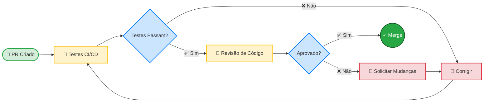

# Guia de contribuição

Obrigado pelo seu interesse em contribuir com o IncuNest! Este projeto é possível graças a colaboradores como você.

## Código de Conduta

Ao participar deste projeto, você concorda em manter um ambiente respeitoso e colaborativo. Esperamos que todos os colaboradores:

- Respeite diferentes pontos de vista
- Aceite críticas construtivas
- Concentre-se no que é melhor para a comunidade
- Mostrar empatia com outros membros

## Maneiras de contribuir

### 🐛 Relatar erros

Se você encontrar um bug:

1. Verifique se isso não foi relatado antes em [Problemas](https://github.com/medicalopenworld/IncuNest/issues)
2. Crie um novo problema usando o modelo de bug
3. Inclui:
- Descrição clara do problema
- Passos para reproduzi-lo
- Comportamento esperado vs real
- Versão de firmware/hardware
- Registros relevantes

### 💡 Sugerir melhorias

Para propor novos recursos:

1. Abra um problema com o rótulo `enhancement`
2. Descreva claramente a funcionalidade
3. Explique o caso de uso
4. Se possível, proponha uma implementação

### 📝 Melhorar a documentação

A documentação sempre pode melhorar:

- Corrigir erros de digitação
- Esclareça instruções confusas
- Adicionar exemplos
- Traduzir para outros idiomas

### 💻 Código de contribuição

#### Configurar o ambiente

```bash
# Clonar el repositorio
git clone https://github.com/medicalopenworld/IncuNest.git
cd IncuNest

# Crear rama para tu contribución
git checkout -b feature/mi-nueva-funcionalidad
```

#### Padrões de código

**Para C++ (firmware):**

```cpp
// Usar nombres descriptivos en inglés
float calculateTemperature(int rawValue);

// Documentar funciones públicas
/**
 * @brief Calcula la temperatura a partir del valor raw del sensor
 * @param rawValue Valor ADC del sensor
 * @return Temperatura en grados Celsius
 */
float calculateTemperature(int rawValue) {
    // Implementación...
}

// Constantes en UPPER_CASE
const float MAX_TEMPERATURE = 38.0f;

// Variables en camelCase
float currentTemperature;
```

**Para documentação:**

- Use Markdown padrão
- Incluir exemplos de código quando relevante
- Adicione diagramas para conceitos complexos
- Mantenha um tom técnico, mas acessível

#### Processo de solicitação pull

1. **Fork** o repositório
2. **Crie** uma ramificação de `main`
3. **Faça** suas alterações
4. **Teste** minuciosamente
5. **Comprometa-se** com mensagens claras
6. **Empurre** para o garfo
7. **Abra** uma solicitação pull

#### Formato de confirmação

Usamos commits semânticos:

```
tipo(alcance): descripción breve

[cuerpo opcional]

[pie opcional]
```

Tipos válidos:
- `feat`: Nova funcionalidade
- `fix`: Correção de bug
- `docs`: Mudanças na documentação
- `style`: Formato (sem alteração lógica)
- `refactor`: Refatoração de código
- `test`: Adicionar ou modificar testes
- `chore`: Tarefas de manutenção

Exemplos:

```
feat(sensors): agregar soporte para sensor SHT31

fix(control): corregir oscilación en control PID

docs(readme): actualizar instrucciones de instalación
```

### 🔧 Contribuições de hardware

Para contribuições de hardware:

1. **Esquemas**: Use KiCad (preferencial) ou formato compatível
2. **PCB**: Inclui arquivos Gerber
3. **3D**: Prefira os formatos STEP ou STL
4. **BOM**: Use formato CSV com referências a fornecedores

## Processo de revisão

Todas as contribuições passam por revisão:



### Critérios de revisão

- [ ] O código segue os padrões do projeto
- [] Os testes passam
- [ ] A documentação está atualizada
- [] Sem conflitos de mesclagem
- [] Os commits são claros e semânticos

## Versionado

Continuamos [Versão Semântica](https://semver.org/):

- **PRINCIPAL**: alterações incompatíveis
- **MINOR**: Nova funcionalidade suportada
- **PATCH**: Correções de bugs

## Reconhecimento

Todos os colaboradores são reconhecidos em:

- README do projeto
- Arquivo CONTRIBUIDORES.md
- Notas de lançamento

## Contato

- **Problemas**: Para bugs e sugestões
- **Discussões**: Para perguntas gerais
- **E-mail**: medicalopenworld@proton.me

---

Aguardamos sua contribuição! 🎉
