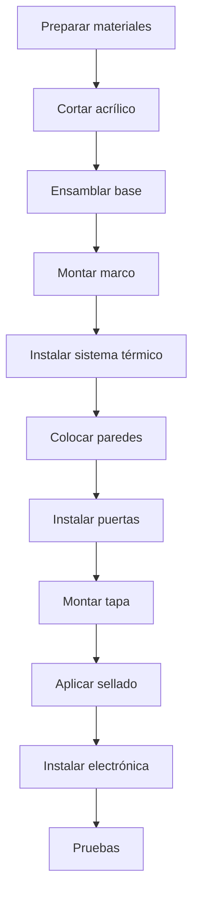

# Ensamblaje Mecánico

## Visão Geral do Processo



## Passo 1: Preparação de Materiais

## Lista de Verificação

- [ ] Todas as peças de acrílico cortadas
- [ ] Peças 3D impressas
- [ ] Perfiles de alumínio cortados
- [ ] Tornilleria completa
- [ ] Ferramentas Disponíveis

## Ferramentas Necesarias

| Ferramenta | Uso |
|------------|-----|
| Taladro | Perfurações |
| Brocas 3mm, 4mm | Agujeros de montagem |
| Destornillador Phillips | Tornillos |
| Chave hexagonal 3mm | Tuercas |
| Serra de calar | Ajustes em acrílico |
| Lima | Acabados |
| Nível | Nível | Nível |
| Flexômetro | Medições |
| Pistola de silicone | Sellado |

## Passo 2: Corte do Acrílico

## Modelos de Corte

**Hoja 1: Acrílico Transparente 6mm (600x400mm)**

```
┌──────────────────────────────────────────────────────┐
│                                                      │
│   ┌─────────────────────┐  ┌─────────────────────┐  │
│   │                     │  │                     │  │
│   │   PARED FRONTAL     │  │   PARED TRASERA     │  │
│   │     500 x 350       │  │     500 x 350       │  │
│   │                     │  │                     │  │
│   └─────────────────────┘  └─────────────────────┘  │
│                                                      │
└──────────────────────────────────────────────────────┘
```

**Hoja 2: Acrílico Transparente 6mm (600x400mm)**

```
┌──────────────────────────────────────────────────────┐
│                                                      │
│  ┌───────────┐  ┌───────────┐  ┌──────────────────┐ │
│  │ PARED     │  │  PARED    │  │                  │ │
│  │ LATERAL   │  │  LATERAL  │  │   TAPA SUPERIOR  │ │
│  │ 300 x 350 │  │  300 x 350│  │     500 x 300    │ │
│  │           │  │           │  │                  │ │
│  │     ○     │  │     ○     │  │                  │ │
│  │   (puerta)│  │  (puerta) │  │                  │ │
│  │           │  │           │  │                  │ │
│  └───────────┘  └───────────┘  └──────────────────┘ │
│                                                      │
└──────────────────────────────────────────────────────┘
```

## Técnica de Corte

1. Marcar com Marcador indelével fino
2. Para cortes retos: usar regra metálica como guia
3. Para cortes curvos (portas): usar serra de calar
4. Velocidade média, sem forçar
5. Lijar bordas com lija 400

## Passo 3: Ensamblagem da Base

## Estrutura da Base

```
          600mm
    ┌────────────────────┐
    │  ○              ○  │
    │                    │
    │    PLACA BASE      │    400mm
    │      MDF 15mm      │
    │                    │
    │  ○              ○  │
    └────────────────────┘
    
    ○ = Agujeros M4 para patas/niveladores
```

### Processo

1. Cortar o MDF para 600x400mm
2. Marcar a posição de buracos (20mm a partir de bordas)
3. Perfurar com broca 4mm
4. Lijar superfície
5. Aplicar selador para madeira (opcional)
6. Instalar pernas niveladoras

## Passo 4: Montagem do Marco

## Estrutura de Alumínio

```
         VISTA FRONTAL
    ┌────────────────────┐
    │╔══════════════════╗│
    │║                  ║│
    │║   CÁMARA        ║│
    │║                  ║│
    │╚══════════════════╝│
    │    [CALEFACCIÓN]   │
    │    [ELECTRÓNICA]   │
    └────────────────────┘
    
    ═ = Perfil aluminio 20x20mm
```

### Processo

1. **Cortar perfis**:
- 4x 500mm (horizontais)
- 4x 350mm (verticais)
- 4x 300mm (profundidad)

2. **Ensamblar quadro inferior**:
- Unir perfis com esquadras
- Atornillar à Base MDF
   
3. ** Levantar verticais**:
- Fijar postes em esquinas
- Verificar o Nível

4. **Completar quadro superior**:
- Ligar horizontais superiores
- Verificar esquadra em todos os cantos

## Passo 5: Sistema de Aquecimento

## Localização

```
         VISTA LATERAL
    ┌───────────────────┐
    │   ╔═══════════╗   │
    │   ║  CÁMARA   ║   │
    │   ╚═════╤═════╝   │
    │    DIFUSOR│       │
    │   ┌──────┴──────┐ │
    │   │  CONDUCTO   │ │
    │   │ ┌─────────┐ │ │
    │   │ │RESISTENC│ │ │◄── 100mm desde base
    │   │ └─────────┘ │ │
    │   │ [VENTILADOR]│ │◄── 50mm desde base
    │   └─────────────┘ │
    └───────────────────┘
```

### Processo

1. **Montar conduta**:
- Fabricar caixa de alumínio 100x100x150mm
- O imprimir em PETG

2. **Instalar ventilador**:
- Posicionar na base do canal
- Orientação: ar para cima
- Fixar com parafusos M3

3. **Montar resistência**:
- Colocar sobre o suporte cerâmico
- Ligar cabos de alto calibre (18AWG)
- Verificar o isolamento térmico

4. **Instalar termostato de segurança**:
- Fixar perto da resistência
- Cabor em série com alimentação

5. **Colocar difusor**:
- Montar peças impressas 3D
- Alinhar com a câmara

## Passo 6: Instalação de Paredes

### Sequência

1. **Pared traseira primeiro**
2. **Paredes laterais**
3. **Pared frontal no final**

## Técnica de Fijação

```
    ACRÍLICO ─────┬───── PERFIL
                  │
              ┌───┴───┐
              │ TIRA  │
              │SELLADO│
              └───────┘
```

1. Aplicar o burlete adesivo ao perfil
2. Posicionar acrílico
3. Desenhar com clipes ou parafusos
4. Verificar o alinhamento antes de apertar

## Passo 7: Portas de Acesso

### Preparação da Porta

```
    PARED LATERAL
    ┌─────────────┐
    │             │
    │   ┌─────┐   │
    │   │     │   │
    │   │  ○  │   │ ← Corte circular 150mm
    │   │     │   │
    │   └─────┘   │
    │             │
    └─────────────┘
```

## Sistema Iris (Opcional)

Para um acesso mais sofisticado, usar sistema de iris:

- Comprar iris de câmera usado
- Ou imprimir mecanismo em 3D

## Sistema Simples

- Porta de acrílico circular
- Bisagra plástico
- Feche magnético

## Passo 8: Tapa Superior

## Montagem de Bisagras

```
    ┌─────────────────────────────────┐
    │ ○                           ○   │
    │ │                           │   │
    │ └────── BISAGRAS ───────────┘   │
    │                                 │
    │          TAPA                   │
    │                                 │
    └─────────────────────────────────┘
```

1. Marcar a posição de bisagras (100mm a partir de bordas)
2. Perfurar acrílico com broca 3mm
3. Atornillar bisagras à tampa
4. Fixar o quadro traseiro
5. Verificar a abertura completa (180°)

## Sistema de Encerramento

- Ímanes de neodimio (10mm diâmetro)
- 4 ímanes: 2 em tampa, 2 em quadro frontal
- Força de fixação: ~2kg total

## Passo 9: Sellado

## Aplicação de Silicone

1. Limpar todas as juntas com álcool
2. Aplicar fita de mascaramento a 3mm da borda
3. Aplicar silicone com pistola
4. Alisar com espátula húmida
5. Retirar a fita antes de seque
6. Deixar curar 24 horas

## Áreas Críticas

- [ ] Uniones parede-base
- [ ] Uniones entre paredes
- [ ] Perímetro de portas
- [ ] Passo de cabos

## Passo 10: Verificação Final

## Lista de Controlo

- [ ] Estrutura estável e nivelada
- [ ] Tapa abre e fecha corretamente
- [ ] Portas funcionam bem
- [ ] Sem espaços visíveis
- [ ] Ventilador gira livremente
- [ ] Conduta de ar sem obstruções

## Teste de Hermeticidade

1. Fechar todas as aberturas
2. Colocar o incenso ligado dentro
3. Observar se há fuga de fumaça
4. Selar qualquer fuga detectada

## Próximas Secções

- [Cableado] (./wiring)
- [Pruebas] (./testing)