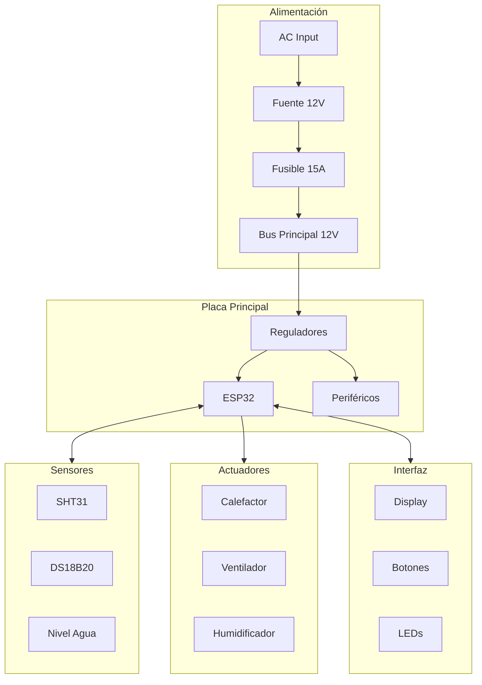

# Fiação

## Diagrama Geral de Conexão



## Código de cores

### Cabos de alimentação

| Cor | Função |
|-------|--------|
| 🔴Vermelho | +12V |
| ⚫ Preto | GND |
| 🟠 Laranja | +5V |
| 🟡 Amarelo | +3,3V |

### Cabos de sinal

| Cor | Função |
|-------|--------|
| 🔵 Azul | SDA I2C |
| 🟢 Verde | SCL I2C |
| ⚪ Branco | Dados de 1 fio |
| 🟣 Roxo | PWM |
| 🟤 Marrom | Sinais digitais |

## Conexões de energia

### Entrada e fonte CA

```
                    ┌─────────────────────────────────────┐
                    │                                     │
 ● L (Vivo)────────┼─[INTERRUPTOR]─[FUSIBLE AC]─────► L │
                    │                                     │
 ● N (Neutro)──────┼────────────────────────────────► N │
                    │                                     │
 ● PE (Tierra)─────┼────────────────────────────────► PE│
                    │                                     │
                    │      FUENTE SWITCHING 12V/10A       │
                    │                                     │
                    │         +12V ●────────────────────►12V
                    │         GND  ●────────────────────►GND
                    │                                     │
                    └─────────────────────────────────────┘

Cable: 18AWG mínimo para AC
       16AWG para línea 12V principal
```

### Distribuição DC

```
     +12V ────┬────────────────────────────────┬────► Calefactor (16AWG)
              │                                │
              ├────► Ventilador (20AWG)        │
              │                                │
              └────► PCB Principal (18AWG)     │
                                               │
                                    ┌──────────┴──────────┐
                                    │ FUSIBLE 15A         │
                                    └─────────────────────┘
```

## Conexões de sensores

### SHT31 (I2C)

```
SHT31 Module        ESP32
────────────        ─────
VCC (Rojo)    ────► 3.3V
GND (Negro)   ────► GND
SDA (Azul)    ────► GPIO21
SCL (Verde)   ────► GPIO22

Cable: 4 hilos, 22AWG
Longitud máxima: 50cm
Conector: JST-XH 4 pines
```

### DS18B20 (1 fio)

```
DS18B20 (Sonda)     ESP32
───────────────     ─────
VCC (Rojo)    ────► 3.3V
GND (Negro)   ────► GND
DATA (Amarillo)─┬─► GPIO5
                │
               [4.7K]
                │
               3.3V

Cable: Apantallado para >1m
Longitud máxima: 3m
Conector: JST-XH 3 pines
```

### Sensor de nível de água

```
Reed Switch         ESP32
───────────         ─────
Terminal 1 ───┬───► GPIO39
              │
             [10K]
              │
             3.3V
              
Terminal 2 ────────► GND

Cable: 2 hilos, 22AWG
```

## Conexões do Atuador

### Aquecedor

```
                      12V_MAIN
                          │
                     [FUSIBLE 10A]
                          │
                     [TERMOSTATO 45°C]
                          │
   GPIO25 ────────────────┴───────┐
                                  │
                             ┌────┴────┐
                             │ MOSFET  │
                             │ DRIVER  │
                             └────┬────┘
                                  │
                          ┌───────┴───────┐
                          │  CALEFACTOR   │
                          │    100W       │
                          └───────┬───────┘
                                  │
                                 GND

Cable: 16AWG para calefactor
       22AWG para señal de control
```

### Fã

```
                      12V_MAIN
                          │
   GPIO26 ─────────────┐  │
                       │  │
                  ┌────┴──┴────┐
                  │   MOSFET   │
                  │   DRIVER   │
                  └──────┬─────┘
                         │
                    ┌────┴────┐
                    │VENTILADOR│
                    │   12V    │
                    └────┬────┘
                         │
                        GND

Cable: 20AWG
Conector: 2 pines
```

### Umidificador

```
                        5V
                         │
   GPIO27 ───[1K]───┐    │
                    │    │
                ┌───┴────┴───┐
                │ TRANSISTOR │
                │   2N2222   │
                └──────┬─────┘
                       │
                  ┌────┴────┐
                  │HUMIDIF. │
                  │   5V    │
                  └────┬────┘
                       │
                      GND

Cable: 22AWG
Conector: JST-XH 2 pines
```

## Conexões de interface

###LCD 20x4 (I2C)

```
LCD I2C Module      ESP32
──────────────      ─────
VCC          ─────► 5V
GND          ─────► GND
SDA          ─────► GPIO21 (compartido con SHT31)
SCL          ─────► GPIO22 (compartido con SHT31)

Cable: Cinta plana 4 hilos
Longitud: Según ubicación del display
Conector: JST-XH 4 pines
```

### LEDs de status

```
LED Rojo            ESP32
────────            ─────
Ánodo (+) ─[330Ω]─► GPIO12
Cátodo (-) ───────► GND

LED Verde           
─────────           
Ánodo (+) ─[330Ω]─► GPIO13
Cátodo (-) ───────► GND

LED Azul            
────────            
Ánodo (+) ─[330Ω]─► GPIO14
Cátodo (-) ───────► GND

Cable: 22AWG
```

### Botões

```
BTN_UP              ESP32
──────              ─────
Terminal 1 ───┬───► GPIO33
              │
             [10K]
              │
             3.3V
              
Terminal 2 ───────► GND

(Repetir para BTN_DOWN:GPIO34, BTN_SELECT:GPIO35, BTN_BACK:GPIO36)

Cable: 22AWG
Conector: JST-XH 2 pines por botón
```

### Campainha

```
                        5V
                         │
   GPIO32 ───[1K]───┐    │
                    │    │
                ┌───┴────┴───┐
                │ TRANSISTOR │
                │   2N2222   │
                └──────┬─────┘
                       │
                  ┌────┴────┐
                  │ BUZZER  │
                  │   5V    │
                  └────┬────┘
                       │
                      GND
```

## Gerenciamento de cabos

### Técnicas de Organização

1. **Agrupar por função**:
- Fornecimento de sinal separado
- Cabos de alimentação longe dos sensores

2. **Identificar com rótulos**:

```
   [SHT31-SDA] ─────────────►
   [SHT31-SCL] ─────────────►
   [DS18B20]   ─────────────►
   ```

3. **Use abraçadeiras em intervalos regulares**:
- A cada 10-15cm
- Em pontos de mudança de direção

4. **Respeite os raios de curvatura**:
- Mínimo 5x o diâmetro do cabo

### Exemplo de chicote de cabos

```
┌─────────────────────────────────────────────────┐
│                                                 │
│  ┌─────┐      ┌─────┐      ┌─────┐             │
│  │POWER│      │SENSE│      │ UI  │             │
│  │BUNDLE│     │BUNDLE│     │BUNDLE│            │
│  └──┬──┘      └──┬──┘      └──┬──┘             │
│     │            │            │                 │
│     │  ═════════════════════════════           │
│     │            │            │     (bridas)    │
│     │            │            │                 │
│     ▼            ▼            ▼                 │
│  [PCB]        [SENS]       [DISP]              │
│                                                 │
└─────────────────────────────────────────────────┘
```

## Tabela de resumo de conexão

| Sinal | GPIO | Conector | Cabo | Cor |
|-------|------|----------|-------|-------|
| SDA | 21 | J2 | 22AWG | Azul |
| SCL | 22 | J2 | 22AWG | Verde |
| DHT22_DADOS | 4 | J3 | 22AWG | Branco |
| DS18B20_DADOS | 5 | J4 | 22AWG | Amarelo |
| AQUECEDOR_PWM | 25 | J5 | 22AWG | Roxo |
| FAN_PWM | 26 | J5 | 22AWG | Roxo |
| HUMID_CTRL | 27 | J6 | 22AWG | Marrom |
| Campainha | 32 | J7 | 22AWG | Marrom |
| LED_R | 12 | J8 | 22AWG | Vermelho |
| LED_G | 13 | J8 | 22AWG | Verde |
| LED_B | 14 | J8 | 22AWG | Azul |
| BTN_UP | 33 | J9 | 22AWG | Cinza |
| BTN_DOWN | 34 | J9 | 22AWG | Cinza |
| BTN_SELECT | 35 | J9 | 22AWG | Cinza |
| BTN_BACK | 36 | J9 | 22AWG | Cinza |
| NÍVEL_ÁGUA | 39 | J10 | 22AWG | Branco |

## Próximas seções

- [Testes](./testing)
