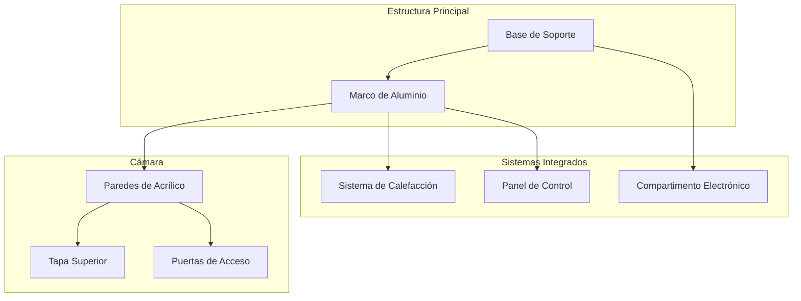

# Carcasa e Estrutura

# Visão Geral

A estrutura do IncuNest é desenhada para:

- **Aislamento térmico** eficiente
- **Visibilidade** do doente
- **Acesso** fácil para o pessoal médico
- ** Facilidade de limpeza** e desinfecção
- **Fabricação local** com materiais acessíveis

## Dimensões Gerais

```
            ┌─────────────────────────────────────────┐
            │                                         │
            │              600mm                      │
            │◄───────────────────────────────────────►│
        ▲   ┌─────────────────────────────────────────┐
        │   │                                         │
        │   │                                         │
  500mm │   │          CÁMARA PRINCIPAL              │
        │   │                                         │
        │   │                                         │
        ▼   └─────────────────────────────────────────┘
            
            PROFUNDIDAD: 400mm
```

| Parâmetro | Externo | Interno |
|-----------|---------|-------------|
| Largura | 600mm | 500mm |
| Alto | 500mm | 350mm |
| Profundidade | 400mm | 300mm |

## Materiais

## Câmara Principal

| Material | Espesor | Uso |
|----------|--------|------|
| Acrílico transparente | 6mm | Paredes laterais e teto |
| Acrílico opaco | 6mm | Base e painel posterior |
| Silicona médica | - | Selos e juntas |

## Base e Estrutura

| Material | Alternativas | Uso |
|----------|---------------|-------|------|
| MDF | Madeira contraplacada | Base estrutural |
| Alumínio | Aço inoxidável | Marco de suporte |
| PLA/PETG | ABS | Peças impressas 3D |

## Design Modular



## Vistas do Desenho

## Vista Frontal

```
┌─────────────────────────────────────────────────────────┐
│  ┌─────────────────────────────────────────────────┐    │
│  │                                                 │    │
│  │                                                 │    │
│  │            CÁMARA PRINCIPAL                     │    │
│  │              (Acrílico)                         │    │
│  │                                                 │    │
│  │                                                 │    │
│  └─────────────────────────────────────────────────┘    │
│  ┌─────────────────────────────────────────────────┐    │
│  │  [DISPLAY]     [TEMP]   [HUM]    [ALARMA]       │    │
│  │                                                 │    │
│  │     ● ● ●     36.5°C   65%      [SILENCIAR]     │    │
│  │     R G B                                       │    │
│  └─────────────────────────────────────────────────┘    │
│                        BASE                             │
└─────────────────────────────────────────────────────────┘
```

## Vista Lateral

```
┌───────────────────────────┐
│    ╔═══════════════╗      │
│    ║               ║      │
│    ║    CÁMARA     ║◄──── Tapa abatible
│    ║               ║      │
│    ╚═══════════════╝      │
│  ┌───────────────────┐    │
│  │ SISTEMA CALEFAC.  │◄─── Compartimento calefacción
│  └───────────────────┘    │
│  ┌───────────────────┐    │
│  │   ELECTRÓNICA     │◄─── Panel de control
│  └───────────────────┘    │
│          BASE             │
└───────────────────────────┘
```

## Sistema de Acesso

## Portas Laterales

As portas laterais permitem acesso ao paciente sem abrir completamente a câmera:

```
┌───────────────────────────────────────┐
│                                       │
│   ┌───────┐           ┌───────┐      │
│   │       │           │       │      │
│   │ PUERTA│           │PUERTA │      │
│   │  IZQ  │           │  DER  │      │
│   │       │           │       │      │
│   └───────┘           └───────┘      │
│                                       │
└───────────────────────────────────────┘

Dimensiones de puerta: 150mm x 200mm
```

### Tapa Superior

- **Apertura**: 180° para trás
- **Bisagras**: Aço inoxidável com amortecedor
- **Cierre**: Imanes de neodimio
- **Sello**: Silicone perimetral

## Isolamento Térmico

### Capas de Isolamento

```
EXTERIOR          AISLANTE          INTERIOR
    │                │                  │
    ▼                ▼                  ▼
┌───────┐        ┌───────┐        ┌───────┐
│Acrílico│        │Espuma │        │Acrílico│
│  6mm  │        │ 10mm  │        │  3mm  │
└───────┘        └───────┘        └───────┘
```

| Capa | Material | Espesor | R-Value |
|------|-----------|--------|-------|-----------|
| Externa | Acrílico | 6mm | 0.17 |
| Aislante | Poliestireno expandido | 10mm | 2.5 |
| Interna | Acrílico | 3mm | 0.08 |

## Lista de Corte de Acrílico

### Câmara Principal (6mm transparente)

| Pieza | Quantidade | Dimensões |
|-------|-----------|-----------------|
| Pared frontal | 1 | 500 x 350 mm |
| Pared traseira | 1 | 500 x 350 mm |
| Pared lateral | 2 | 300 x 350 mm |
| Tapa superior | 1 | 500 x 300 mm |
| Base interior | 1 | 500 x 300 mm |

### Peças com Cortes Especiais

| Pieza | Corte |
|-------|-------|
| Paredes laterais | Agujero circular 150mm para portas |
| Pared traseira | Ranura 50x10mm para cabos |
| Tapa superior | Bisagras |

# Ensamblaje

### Sequência de Ensamblaje

1. **Preparar base** estrutural
2. **Montar quadro** de alumínio
3. **Instalar sistema** de aquecimento
4. **Fijar paredes** laterais
5. **Instalar portas** de acesso
6. **Colocar parede** frontal e traseira
7. **Montar tampa** superior
8. **Aplicar selos** de silicone
9. **Instalar eletrônica**
10. **Pruebas** de hermeticidade

## Tornillería Necesaria

| Tipo | Tamanho | Quantidade | Uso |
|------|--------|-------------|------|------|
| Tornillo autorroscante | M4 x 20mm | 40 | Estrutura |
| Tornillo máquina | M3 x 10mm | 20 | Eletrônica |
| Tuerca | M4 | 40 | Fijação |
| Arandela | M4 | 80 | Distribuição carga |

# Ficheiros CAD

Os arquivos de design estão disponíveis em:

```
hardware/
├── mechanical/
│   ├── cad/
│   │   ├── enclosure.step
│   │   ├── enclosure.f3d (Fusion 360)
│   │   └── drawings/
│   │       ├── assembly.pdf
│   │       └── parts_list.pdf
│   └── dxf/
│       ├── front_panel.dxf
│       ├── side_panel.dxf
│       └── base.dxf
```

## Próximas Secções

- [Sistema de Aquecimento] (./heating-system)
- [Sistema de Humidificação] (./humidification)
- [Piezas Impresas 3D] (./3d-parts)