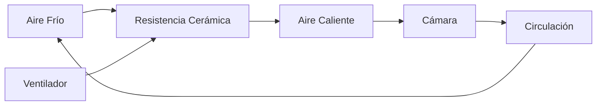
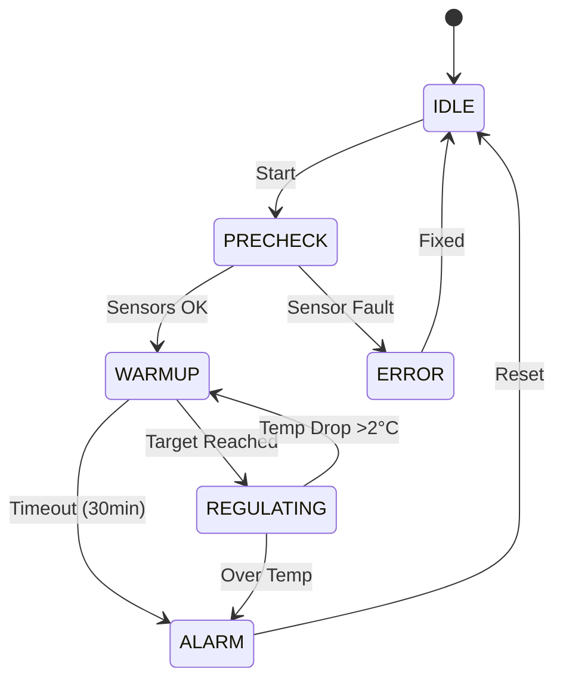

# Sistema de Aquecimento

## Princípio do Funcionamento

O sistema de aquecimento de IncuNest utiliza **convecção forçada**:



## Componentes

## Elemento Calefator

| Parâmetro | Especificação |
|-----------|----------------|
| Tipo | Resistência cerâmica PTC |
| Potência | 100W |
| Voltaje | 12V DC |
| Temperatura máx | 200°C |
| Dimensões | 50 x 30 x 10 mm |

## Ventilador Circulação

| Parâmetro | Especificação |
|-----------|----------------|
| Tipo | Axial brushless |
| Tamanho | 80 x 80 x 25 mm |
| Voltaje | 12V DC |
| Fluxo | 40 CFM |
| Ruido | menor que 30 dB |

## Design do Conduta do Ar

## Vista em Corte

```
          CÁMARA PRINCIPAL
    ┌─────────────────────────────┐
    │                             │
    │    ↑    ↑    ↑    ↑    ↑   │  Aire caliente sube
    │    │    │    │    │    │   │
    │    └────┴────┴────┴────┘   │
    │         DIFUSOR            │
    │                             │
    └─────────────────────────────┘
              │
    ┌─────────┴─────────┐
    │  CONDUCTO CALEF.  │
    │                   │
    │  ┌─────────────┐  │
    │  │  RESISTENCIA │  │
    │  │    100W      │  │
    │  └─────────────┘  │
    │         ▲         │
    │  ┌──────┴──────┐  │
    │  │ VENTILADOR  │  │
    │  │    80mm     │  │
    │  └─────────────┘  │
    │         ▲         │
    └─────────┬─────────┘
              │
        ENTRADA DE AIRE
```

### Dimensões do Conduta

| Secção | Dimensões |
|---------|-------------|
| Entrada | 80 x 80 mm |
| Câmara de aquecimento | 100 x 100 x 50 mm |
| Difusor | 400 x 30 mm |

#Difusor de Ar

O difusor distribui o ar quente uniformemente:

```
┌─────────────────────────────────────────────────┐
│  ○  ○  ○  ○  ○  ○  ○  ○  ○  ○  ○  ○  ○  ○  ○  │
│     ○  ○  ○  ○  ○  ○  ○  ○  ○  ○  ○  ○  ○     │
│  ○  ○  ○  ○  ○  ○  ○  ○  ○  ○  ○  ○  ○  ○  ○  │
└─────────────────────────────────────────────────┘

○ = Agujero de 5mm de diámetro
Patrón: Rejilla alternada
Total: ~45 agujeros
```

## Proteção Térmica

## Termostato de Segurança

Adicionado ao controle eletrônico, inclui-se um termostato mecânico:

| Parâmetro | Valor |
|-----------|-------|
| Tipo | Bimetálico NC |
| Temperatura de corte | 45°C |
| Histéresis | 5°C |
| Corrente máxima | 10A |

### Ligação do Termostato

```
    12V ───[FUSIBLE]───[TERMOSTATO]───[MOSFET]─── RESISTENCIA
              15A          45°C
```

## Balanço Térmico

### Cálculo de Potência Necesária

```
P necesaria = Q / Δt
```

Onde:
- Q = Energia térmica necessária
- Δt = Tempo de aquecimento desejado

Para aquecer a câmera de 25°C a 37°C em 10 minutos:

```
P ≈ (m × cp × ΔT) / t ≈ 80W
```

A resistência de 100W proporciona margem de segurança.

## Perdas Térmicas

| Fonte | Perda Estimada |
|--------|------------------|
| Condução (paredes) | 20W |
| Abertura de portas | 30W (transitório) |
| Radiação | 5W |
| **Total em operação** | **~25W** |

## Código de Controlo

## Controlo PID do Calefator

```cpp
class HeatingController {
private:
    PIDController pid;
    float targetTemp = 36.5;
    float currentTemp = 25.0;
    uint8_t heaterPower = 0;
    uint8_t fanSpeed = 0;
    
public:
    HeatingController() : pid(2.0, 0.5, 1.0) {}
    
    void update(float measuredTemp) {
        currentTemp = measuredTemp;
        
        // Calcular potencia del calefactor
        heaterPower = pid.compute(targetTemp, currentTemp);
        
        // Calcular velocidad del ventilador
        // Mínimo 30% cuando el calefactor está activo
        if (heaterPower > 0) {
            fanSpeed = max(30, heaterPower);
        } else {
            fanSpeed = 0;
        }
        
        // Aplicar salidas
        setHeaterPWM(heaterPower);
        setFanPWM(fanSpeed);
    }
    
    void setTarget(float temp) {
        targetTemp = constrain(temp, 25.0, 37.5);
    }
    
    bool isSafe() {
        // Verificar temperatura segura
        return currentTemp < 40.0;
    }
};
```

## Sequência de Calentamento



## Manutenção

## Inspecção Periódica

| Tarea | Frequência |
|-------|------------|
| Verificar funcionamento do ventilador | Semanal |
| Limpar o Filtro de Entrada | Mensual |
| Verificar conexões elétricas | Mensual |
| Calibrar termostato de segurança | Anual |

## Sinais de Desgaste

- Ventilador ruídos → Substituir
- Resistência com pontos quentes → Substituir
- Termostato não corta → Substituir imediatamente

## Lista de Materiais

| Componente | Especificação | Quantidade |
|------------|----------------|---------|
| Resistência PTC | 100W 12V | 1 |
| Ventilador | 80mm 12V | 1 |
| Termostato | KSD301 45°C NC | 1 |
| Conduta | Alumínio 1mm | 1 set |
| Difusor | PLA/PETG impresso 3D | 1 |
| Aislante | Fibra cerâmica | 100x100x10mm |

## Próximas Secções

- [Sistema de Humidificação] (./humidification)
- [Piezas 3D] (./3d-parts)