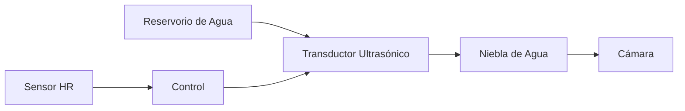

# Sistema de Humidificação

## Princípio do Funcionamento

IncuNest utiliza um **humidificador ultrassônico** para manter níveis adequados de umidade relativa (40-80% HR).



## Componentes

## Módulo Ultrasônico

| Parâmetro | Especificação |
|-----------|----------------|
| Tipo | Transdutor piezoelétrico |
| Frequência | 1.7 MHz |
| Voltaje | 5V DC |
| Consumo | 200mA típico |
| Produção | 20-30 ml/hora |

## Reservorio de Água

| Parâmetro | Especificação |
|-----------|----------------|
| Capacidade | 500 ml |
| Material | Polipropileno (PP) |
| Sensor de nível | Frotador magnético |
| Enchedo | Manual, acesso frontal |

## Design do Sistema

## Diagrama de Componentes

```
┌───────────────────────────────────────────┐
│              CÁMARA                       │
│                                           │
│         ↑↑↑  NIEBLA  ↑↑↑                 │
│         │            │                    │
└─────────┼────────────┼────────────────────┘
          │            │
┌─────────┴────────────┴───────┐
│     CONDUCTO DE HUMEDAD      │
│                              │
│  ┌────────────────────────┐  │
│  │   TRANSDUCTOR          │  │
│  │   ULTRASÓNICO          │  │
│  │       (～～)           │  │
│  └────────────────────────┘  │
│                              │
│  ════════════════════════    │ ← Nivel de agua
│  ┌────────────────────────┐  │
│  │     RESERVORIO         │  │
│  │     500 ml             │  │
│  └────────────────────────┘  │
│                              │
│  [SENSOR DE NIVEL]          │
│                              │
└──────────────────────────────┘
```

### Sensor de Nível de Água

```
         ┌─────┐
         │     │
         │  S  │ ← Reed switch
         │     │
    ═════╪═════╪════  Nivel normal
         │  ○  │ ← Flotador con imán
         │     │
    ═════╪═════╪════  Nivel bajo → Alarma
         │     │
         └─────┘
```

## Controlo de Humedad

## Algoritmo On/Off com Histéresis

```cpp
class HumidityController {
private:
    float targetHumidity = 60.0;
    float hysteresis = 5.0;
    bool humidifierOn = false;
    
public:
    void update(float currentHumidity) {
        if (currentHumidity < targetHumidity - hysteresis) {
            humidifierOn = true;
        } else if (currentHumidity > targetHumidity + hysteresis) {
            humidifierOn = false;
        }
        // Mantener estado entre los umbrales (histéresis)
        
        setHumidifier(humidifierOn);
    }
    
    void setTarget(float humidity) {
        targetHumidity = constrain(humidity, 40.0, 80.0);
    }
    
    bool isActive() {
        return humidifierOn;
    }
};
```

## Gráfico de Histéresis

```
Humedad (%)
    80 ┤
       │         ┌──────┐
    65 ┤─────────┤ OFF  ├─────────  Umbral superior (target + 5%)
       │         └──┬───┘
    60 ┤────────────┼────────────  Target
       │         ┌──┴───┐
    55 ┤─────────┤  ON  ├─────────  Umbral inferior (target - 5%)
       │         └──────┘
    40 ┤
       └──────────────────────────► Tiempo
```

## Circuito Eletrônico

### Ligação do Humidificador

```
      5V
       │
       │
  ┌────┴────┐
  │ HUMIDIF │
  │  MODULE │
  └────┬────┘
       │
      [Q1]     2N2222 o MOSFET
       │
      GND

  GPIO27 ───[1K]───[Base/Gate Q1]
```

### Ligação do Sensor de Nível

```
      3.3V
       │
      [10K]
       │
  GPIO39 ──┬── SENSOR_NIVEL
           │
          GND (cuando el flotador está bajo)
```

### Código do Sensor de Nível

```cpp
#define WATER_LEVEL_PIN 39
#define LOW_WATER_THRESHOLD 1000  // Valor ADC

bool checkWaterLevel() {
    int level = analogRead(WATER_LEVEL_PIN);
    
    if (level < LOW_WATER_THRESHOLD) {
        raiseAlarm(ALARM_LOW_WATER, "Nivel de agua bajo");
        return false;
    }
    return true;
}

void controlHumidifier(bool enable) {
    // Solo activar si hay suficiente agua
    if (enable && checkWaterLevel()) {
        digitalWrite(HUMIDIFIER_PIN, HIGH);
    } else {
        digitalWrite(HUMIDIFIER_PIN, LOW);
    }
}
```

# Segurança

## Protecções Implementadas

| Risco | Mitigação |
|--------|------------|
| Reservorio vazio | Sensor de nível + alarme |
| Humedad excessiva | Limite máximo 85% HR |
| Crescimento bacteriano | Lembratório de limpeza |
| Desbordamento | Bandeja de drenagem |

## Alarmes de Humidificação

```cpp
void checkHumidityAlarms(float humidity) {
    if (humidity > 85.0) {
        raiseAlarm(ALARM_HIGH_HUMIDITY, "Humedad muy alta");
        setHumidifier(false);
    }
    
    if (humidity < 30.0 && humidifierActive) {
        raiseAlarm(ALARM_HUMIDIFIER_FAULT, "Humidificador no responde");
    }
    
    if (!checkWaterLevel()) {
        setHumidifier(false);
    }
}
```

## Manutenção

## Rutina Limpeza

**Frequência**: Cada 48 horas de uso ou ao mudar a água

1. ** Vaciar** o reservatório completamente
2. **Limpiar** com solução de vinagre diluído (1:10)
3. **Enjuagar** com água destilada
4. **Secar** completamente
5. **Rellenar** com água destilada fresca

### Recomendações de Água

| Tipo de Água | Recomendação |
|--------------|----------------|
| Destilada | Gálatas Recomendada |
| Hervida | Gálatas Aceitable |
| Filtrada (RO) | Gálatas Aceitable |
| Grifo | Vibração️ Pode gerar depósitos |
| Mineral | ❌ Não utilizar |

## Sinais de Manutenção

- **Produção de nevoeiro reduzida** → Limpar transdutor
- **Depósitos brancos** → Usar água destilada
- **Olor desagradável** → Limpeza profunda necessária
- **Sem produção de nevoeiro** → Verificar transdutor

## Especificações Técnicas

| Parâmetro | Valor |
|-----------|-------|
| Rango de controle | 40% - 80% HR |
| Precisão | ±5% HR |
| Tempo de resposta | 5-10 minutos |
| Produção de nevoeiro | 20-30 ml/hora |
| Capacidade do reservatório | 500 ml |
| Autonomia máxima | ~20 horas |

## Lista de Materiais

| Componente | Especificação | Quantidade |
|------------|----------------|---------|
| Módulo ultrassônico | 5V 1.7MHz | 1 |
| Reservorio | PP 500ml | 1 |
| Sensor de nível | Reed switch + flutuador | 1 |
| Transistor | 2N2222A | 1 |
| Resistência | 1KΩ 1/4W | 1 |
| Tubo silicone | 10mm diâmetro | 0.5m |

## Próximas Secções

- [Piezas Impresas 3D] (./3d-parts)