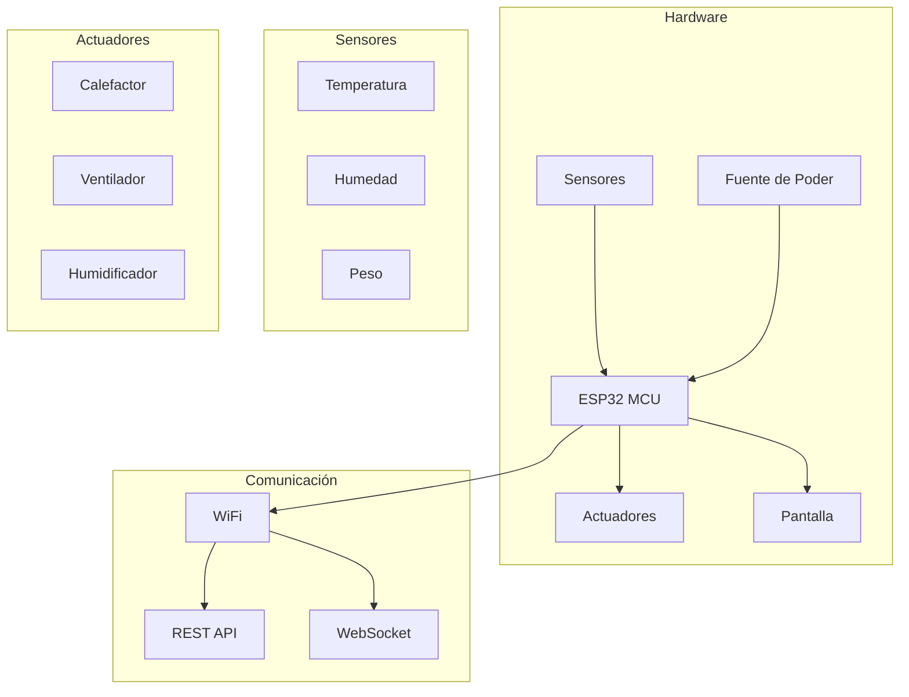

# Introdução ao IncuNest

<h1 className="hero__title">🏥 IncuNest</h1>

Incubadora Neonatal de Código Aberto

## O que é o IncuNest?

**IncuNest** é um projeto de hardware e software de código aberto que visa fornecer uma **incubadora neonatal acessível e de baixo custo** para ambientes com recursos limitados. O projeto foi projetado para atender aos padrões de segurança médica, mantendo a facilidade de fabricação e manutenção.

:::dica Missão do Projeto
Reduzir a mortalidade neonatal fornecendo tecnologia médica de qualidade às comunidades que mais dela necessitam.
:::

## Principais recursos

### 🌡️ Controle de temperatura
- Controle preciso de temperatura via PID
Faixa de operação: 25°C - 37°C
- Precisão: ±0,1°C
- Vários sensores de temperatura redundantes

### 💧 Controle de umidade
- Umidificação ativa do ambiente
Faixa de umidade: 40% 80% UR
- Sistema integrado de reservatório de água

### 📊 Monitoramento em tempo real
- Tela LCD/TFT integrada
- Interface web acessível via WiFi
- Gravação de dados históricos
- Alertas e alarmes configuráveis

### 🔒 Segurança
- Vários níveis de alarme
- Proteção contra superaquecimento
- Bateria reserva para emergências
- Projeto à prova de falhas

## Arquitetura do sistema

## Especificações Técnicas

| Parâmetro | Especificação |
|-----------|----------------|
| **Microcontrolador** | ESP32-WROOM-32 |
| **Faixa de temperatura** | 25°C - 37°C |
| **Precisão de temperatura** | ±0,1°C |
| **Faixa de umidade** | 40% - 80% UR |
| **Alimentação** | 12V CC / 110-220V CA |
| **Consumo Máximo** | 150W |
| **Conectividade** | Wi-Fi 802.11 b/g/n |
| **Exibição** | LCD 20x4 / TFT de 3,5" |

## Licença

O IncuNest é licenciado sob **GPL-3.0**, o que significa que:

- ✅ Você pode usar, modificar e distribuir o projeto
- ✅ Você deve manter o código-fonte aberto
- ✅ Você deve incluir a mesma licença em trabalhos derivados
- ✅ Você deve documentar as alterações feitas

:::aviso Aviso de segurança
Este projeto tem fins educacionais e de pesquisa. Qualquer uso clínico deve estar em conformidade com os regulamentos médicos locais e exigir certificação apropriada.
:::

## Próximas etapas

<h3>🚀 Guia de início rápido</h3>

Aprenda como configurar seu primeiro IncuNest

<a className="button button--primary button--block" href="./getting-started">Primeiros passos</a>

<h3>🔧 Hardware</h3>

Explorar componentes e montagem

<a className="button button--secondary button--block" href="./hardware/overview">Ver hardware</a>

## Contribuir

IncuNest é um projeto comunitário e todas as contribuições são bem-vindas. Consulte nosso [guia de contribuição](./contributing) para obter mais informações.

---

<strong>Medical Open World</strong> - Tecnologia médica acessível a todos

