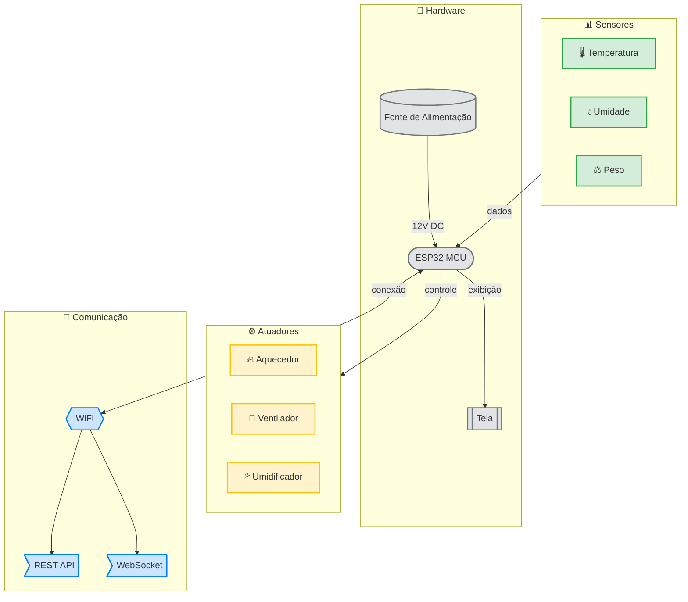

# Introdução ao IncuNest

  

    <h1 className="hero__title">🏥 IncuNest</h1>
    
Incubadora Neonatal de Código Aberto

  

## O que é o IncuNest?

**IncuNest** é um projeto de hardware e software de código aberto que visa fornecer uma **incubadora neonatal acessível e de baixo custo** para ambientes com recursos limitados. O projeto foi projetado para atender aos padrões de segurança médica, mantendo a facilidade de fabricação e manutenção.

  <video
    controls
    preload="metadata"
    width="100%"
    src="/IncuNest-Docs/videos/pt/features.mp4"
  >
    Seu navegador não oferece suporte à tag de vídeo.
  </video>
  

    <a href="/IncuNest-Docs/videos/pt/features.mp4" target="_blank" rel="noopener noreferrer">
      Assistir em tela cheia
    </a>
  

:::dica Missão do Projeto
Reduzir a mortalidade neonatal fornecendo tecnologia médica de qualidade às comunidades que mais dela necessitam.
:::

## Principais recursos

### 🌡️ Controle de temperatura
- Controle preciso de temperatura via PID
Faixa de operação: 25°C - 37°C
- Precisão: ±0,1°C
- Vários sensores de temperatura redundantes

### 💧 Controle de umidade
- Umidificação ativa do ambiente
Faixa de umidade: 40% 80% UR
- Sistema integrado de reservatório de água

### 📊 Monitoramento em tempo real
- Tela LCD/TFT integrada
- Interface web acessível via WiFi
- Gravação de dados históricos
- Alertas e alarmes configuráveis

### 🔒 Segurança
- Vários níveis de alarme
- Proteção contra superaquecimento
- Bateria reserva para emergências
- Projeto à prova de falhas

## Arquitetura do sistema

```mermaid
graph TB
    subgraph HW [🔧 Hardware]
        direction TB
        ESP32([ESP32 MCU])
        DISPLAY[[Tela]]
        POWER[(Fonte de Alimentação)]
    end
    
    subgraph SENS [📊 Sensores]
        direction LR
        TEMP[🌡️ Temperatura]
        HUM[💧 Umidade]
        WEIGHT[⚖️ Peso]
    end
    
    subgraph ACT [⚙️ Atuadores]
        direction LR
        HEATER[🔥 Aquecedor]
        FAN[💨 Ventilador]
        HUMIDIFIER[💦 Umidificador]
    end
    
    subgraph COMM [📡 Comunicação]
        direction LR
        WIFI{{WiFi}}
        API>REST API]
        WS>WebSocket]
    end
    
    POWER -->|12V DC| ESP32
    SENS -->|dados| ESP32
    ESP32 -->|controle| ACT
    ESP32 -->|exibição| DISPLAY
    ESP32 <-->|conexão| WIFI
    WIFI --> API
    WIFI --> WS
    
    classDef sensors fill:#d4edda,stroke:#28a745,stroke-width:2px
    classDef actuators fill:#fff3cd,stroke:#ffc107,stroke-width:2px
    classDef comm fill:#cce5ff,stroke:#007bff,stroke-width:2px
    classDef core fill:#e2e3e5,stroke:#6c757d,stroke-width:2px
    
    class TEMP,HUM,WEIGHT sensors
    class HEATER,FAN,HUMIDIFIER actuators
    class WIFI,API,WS comm
    class ESP32,DISPLAY,POWER core
```

## Especificações Técnicas

| Parâmetro | Especificação |
|-----------|----------------|
| **Microcontrolador** | ESP32-WROOM-32 |
| **Faixa de temperatura** | 25°C - 37°C |
| **Precisão de temperatura** | ±0,1°C |
| **Faixa de umidade** | 40% - 80% UR |
| **Alimentação** | 12V CC / 110-220V CA |
| **Consumo Máximo** | 150W |
| **Conectividade** | Wi-Fi 802.11 b/g/n |
| **Exibição** | LCD 20x4 / TFT de 3,5" |

## Licença

O IncuNest é licenciado sob **MIT**, o que significa que:

- ✅ Você pode usar, modificar e distribuir o projeto, inclusive comercialmente
- ✅ Você deve incluir o aviso de copyright e a licença MIT em cópias ou trabalhos derivados
- ⚠️ Nenhuma garantia é fornecida; use por sua conta e risco

:::aviso Aviso de segurança
Este projeto tem fins educacionais e de pesquisa. Qualquer uso clínico deve estar em conformidade com os regulamentos médicos locais e exigir certificação apropriada.
:::

## Próximas etapas

<h3>🚀 Guia de início rápido</h3>

Aprenda como configurar seu primeiro IncuNest

<a className="button button--primary button--block" href="./getting-started">Primeiros passos</a>

<h3>🔧 Hardware</h3>

Explorar componentes e montagem

<a className="button button--secondary button--block" href="./hardware/overview">Ver hardware</a>

## Contribuir

IncuNest é um projeto comunitário e todas as contribuições são bem-vindas. Consulte nosso [guia de contribuição](./contributing) para obter mais informações.

---

<strong>Medical Open World</strong> - Tecnologia médica acessível a todos

