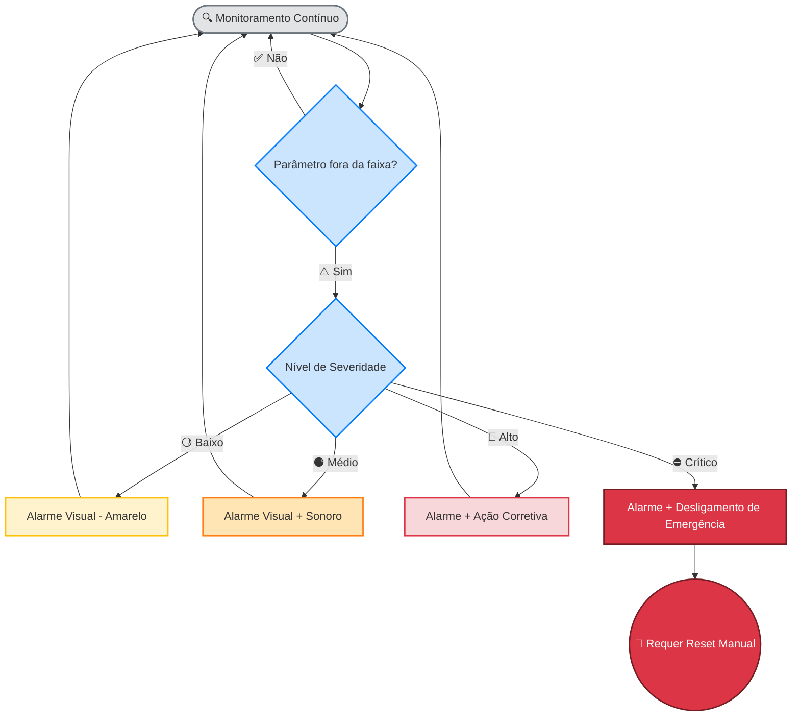
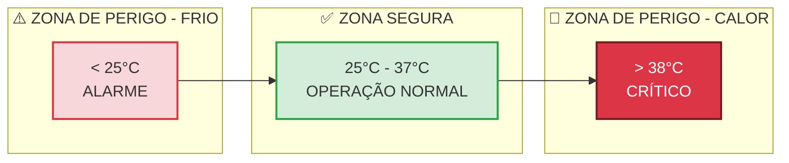
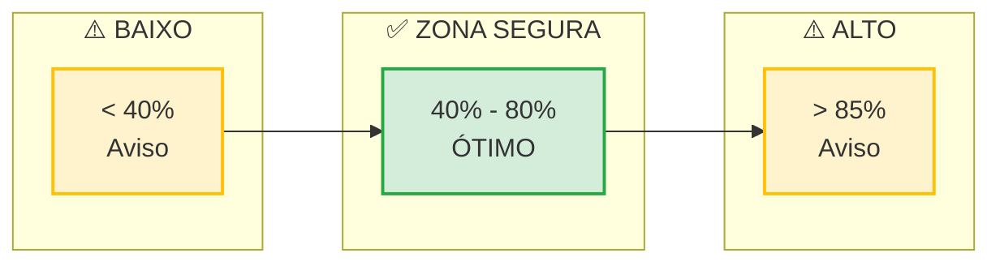

# ⚠️ Aviso de segurança

:::danger Aviso importante
Leia este aviso completamente antes de construir, montar ou usar o IncuNest.
:::

## Isenção de responsabilidade

IncuNest é um projeto de código aberto para fins educacionais e de pesquisa. A equipe de desenvolvimento e colaboradores:

1. **NÃO garantimos** a adequação do dispositivo para uso clínico
2. **NÃO nos responsabilizamos** por danos ou lesões resultantes do uso
3. **NÃO certifique** a conformidade com regulamentos médicos específicos

## Requisitos para uso clínico

Se você planeja usar o IncuNest em um ambiente clínico, **DEVE**:

### Certificações exigidas

| Região | Certificação necessária |
|--------|---------|
| União Europeia | Marcação CE (MDR 2017/745) |
| Estados Unidos | Autorização FDA 510(k) |
| América Latina | ANVISA, COFEPRIS, INVIMA, etc. |
| Internacional | ISO 13485, IEC 60601-1 |

### Etapas necessárias

1. **Avaliação de Riscos**: Realize uma análise completa de acordo com a ISO 14971
2. **Validação Clínica**: Testes em ambiente controlado com supervisão médica
3. **Certificação**: Obtenha aprovação da autoridade reguladora local
4. **Rastreabilidade**: Implementar sistema de rastreamento de dispositivos
5. **Treinamento**: Treine a equipe médica no uso correto

## Riscos Conhecidos

### Riscos Térmicos

| Risco | Mitigação |
|--------|------------|
| Superaquecimento | Múltiplos sensores + alarme a 38°C |
| Falha no aquecedor | Controle redundante + corte térmico |
| Temperatura insuficiente | Alarme de baixa temperatura |

### Riscos elétricos

| Risco | Mitigação |
|--------|------------|
| Choque elétrico | Isolamento galvânico + fusíveis |
| Curto-circuito | Proteção de circuito |
| Falha de energia | Sistema UPS recomendado |

### Riscos de umidade

| Risco | Mitigação |
|--------|------------|
| Umidade excessiva | Controle automático + drenagem |
| Condensação | Ventilação adequada |
| Crescimento bacteriano | Limpeza periódica |

## Sistema de alarme

IncuNest implementa um sistema de alarme multinível:

### Níveis de alarme

| Nível | Condição | Ação |
|-------|-----------|--------|
| **INFORMAÇÕES** | Desvio menor | Indicador LED azul |
| **AVISO** | Desvio moderado | LED amarelo + bipe |
| **ALARME** | Parâmetro fora dos limites | LED vermelho + alarme sonoro |
| **CRÍTICO** | Risco para o paciente | Desligamento seguro + alarme contínuo |

## Limites operacionais seguros

### Temperatura

### Umidade relativa

## Manutenção de segurança

### Inspeções Diárias

- [] Verifique as leituras de temperatura e umidade
- [ ] Verifique a operação do alarme
- [] Inspecione cabos e conexões
- [] Verifique o nível de água do umidificador

### Inspeções semanais

- [] Limpar sensores de temperatura
- [ ] Verifique a calibração do sensor
- [ ] Verifique as conexões elétricas
- [] Revise os registros de alarme

### Inspeções Mensais

- [] Calibração completa do sensor
- [] Limpeza profunda da câmera
- [] Verifique a integridade do isolamento
- [] Atualizar firmware se versões estiverem disponíveis

## Contato de emergência

Em caso de mau funcionamento durante o uso:

1. **Remova imediatamente o paciente** para um ambiente alternativo seguro
2. **Desconecte o dispositivo** da fonte de alimentação
3. **Documente o incidente** com todos os detalhes
4. **Relate o problema** em [Problemas do GitHub](https://github.com/medicalopenworld/IncuNest/issues)

## Declaração de Conformidade

Este projeto **NÃO** inclui uma declaração de conformidade com regulamentos médicos. Cada implementador é responsável por:

- Obtenha as certificações necessárias
- Realizar validação clínica
- Cumprir os regulamentos locais
- Manter documentação de qualidade

---

:::info Nota Legal
Ao utilizar este projeto, você concorda que o faz por sua própria conta e risco e que leu e compreendeu totalmente este aviso de segurança.
:::
