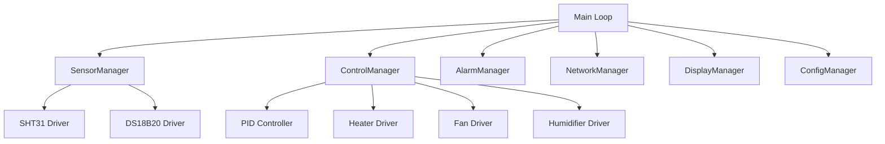

# Módulos do Firmware

# Visão Geral

O firmware de IncuNest é organizado em módulos independentes que facilitam a manutenção e testes.



## Módulo: SensorManager

**Ficheiro:** `src/sensors/SensorManager.h`

## Responsabilidades

- Inicializar e gerir todos os sensores
- Fornecer leituras filtradas
- Detectar erros de sensores
- Implementar redundância

## Interface

```cpp
class SensorManager {
public:
    // Inicialización
    bool begin();
    
    // Lecturas
    float getAmbientTemperature();
    float getSkinTemperature();
    float getHumidity();
    
    // Estado
    bool isSensorHealthy(SensorType type);
    SensorStatus getStatus(SensorType type);
    
    // Configuración
    void setCalibrationOffset(SensorType type, float offset);
    void setFilterCoefficient(float alpha);
    
private:
    SHT31Sensor sht31_;
    DS18B20Sensor ds18b20_;
    ExponentialFilter tempFilter_;
    ExponentialFilter humFilter_;
};
```

## # Filtragem de Sinais

```cpp
class ExponentialFilter {
public:
    ExponentialFilter(float alpha = 0.1) : alpha_(alpha), initialized_(false) {}
    
    float filter(float newValue) {
        if (!initialized_) {
            filteredValue_ = newValue;
            initialized_ = true;
        } else {
            filteredValue_ = alpha_ * newValue + (1 - alpha_) * filteredValue_;
        }
        return filteredValue_;
    }
    
    void reset() { initialized_ = false; }
    
private:
    float alpha_;
    float filteredValue_;
    bool initialized_;
};
```

## Módulo: ControleManager

**Ficheiro:** `src/control/ControlManager.h`

## Responsabilidades

- Coordenar controladores de temperatura e umidade
- Gerir modos de operação
- Implementar protecções de segurança

## Estados de Operação

```cpp
enum class OperationState {
    IDLE,           // Sistema apagado
    INITIALIZING,   // Inicializando
    PREHEATING,     // Calentando
    OPERATING,      // Operación normal
    COOLING,        // Enfriando
    ALARM,          // En alarma
    MAINTENANCE     // Modo mantenimiento
};
```

## Máquina de Estados

```cpp
class ControlManager {
public:
    void update() {
        switch (state_) {
            case OperationState::IDLE:
                handleIdleState();
                break;
            case OperationState::PREHEATING:
                handlePreheatingState();
                break;
            case OperationState::OPERATING:
                handleOperatingState();
                break;
            case OperationState::ALARM:
                handleAlarmState();
                break;
            // ...
        }
    }
    
private:
    void handleOperatingState() {
        // Actualizar controlador de temperatura
        float temp = sensors_->getAmbientTemperature();
        float power = tempController_->compute(temp);
        heater_->setPower(power);
        
        // Actualizar controlador de humedad
        float humidity = sensors_->getHumidity();
        humidityController_->update(humidity);
        
        // Actualizar ventilador
        fanController_->update(power);
        
        // Verificar condiciones de alarma
        checkAlarmConditions();
    }
};
```

## Módulo: AlarmManager

**Ficheiro:** `src/alarms/AlarmManager.h`

## Tipos de Alarma

```cpp
enum class AlarmCode {
    // Temperatura
    TEMP_HIGH_WARNING,      // Temperatura alta (warning)
    TEMP_HIGH_ALARM,        // Temperatura muy alta (crítico)
    TEMP_LOW_WARNING,       // Temperatura baja (warning)
    TEMP_LOW_ALARM,         // Temperatura muy baja (crítico)
    
    // Humedad
    HUMIDITY_HIGH,          // Humedad alta
    HUMIDITY_LOW,           // Humedad baja
    
    // Sensores
    SENSOR_TEMP_FAIL,       // Fallo sensor temperatura
    SENSOR_HUMIDITY_FAIL,   // Fallo sensor humedad
    
    // Sistema
    POWER_FAIL,             // Fallo de alimentación
    HEATER_FAIL,            // Fallo del calefactor
    FAN_FAIL,               // Fallo del ventilador
    WATCHDOG_RESET,         // Reinicio por watchdog
    
    // Agua
    WATER_LEVEL_LOW         // Nivel de agua bajo
};

enum class AlarmLevel {
    INFO,       // Informativo
    WARNING,    // Advertencia
    CRITICAL    // Crítico
};
```

### Suporte

```cpp
class AlarmManager {
public:
    void checkAlarms(const SensorReadings& readings) {
        // Verificar temperatura alta
        if (readings.temperature > config_.tempHighAlarm) {
            triggerAlarm(AlarmCode::TEMP_HIGH_ALARM, AlarmLevel::CRITICAL);
        } else if (readings.temperature > config_.tempHighWarning) {
            triggerAlarm(AlarmCode::TEMP_HIGH_WARNING, AlarmLevel::WARNING);
        }
        
        // Verificar temperatura baja
        if (readings.temperature < config_.tempLowAlarm) {
            triggerAlarm(AlarmCode::TEMP_LOW_ALARM, AlarmLevel::CRITICAL);
        }
        
        // Verificar sensores
        if (!sensors_->isSensorHealthy(SensorType::TEMPERATURE)) {
            triggerAlarm(AlarmCode::SENSOR_TEMP_FAIL, AlarmLevel::CRITICAL);
        }
    }
    
    void triggerAlarm(AlarmCode code, AlarmLevel level) {
        Alarm alarm;
        alarm.code = code;
        alarm.level = level;
        alarm.timestamp = millis();
        alarm.acknowledged = false;
        
        activeAlarms_.push_back(alarm);
        
        // Notificar
        notifyListeners(alarm);
        
        // Activar buzzer si es crítico
        if (level == AlarmLevel::CRITICAL) {
            buzzer_->playAlarm();
        }
    }
    
private:
    std::vector<Alarm> activeAlarms_;
    BuzzerDriver* buzzer_;
    AlarmConfig config_;
};
```

## Módulo: NetworkManager

**Ficheiro:** `src/network/NetworkManager.h`

## Responsabilidades

- Gerir acesso Wi-Fi
- Servidor HTTP e WebSocket
- Cliente MQTT
- Actualizações OTA

## Componentes

```cpp
class NetworkManager {
public:
    bool begin(const NetworkConfig& config) {
        // Conectar WiFi
        if (!connectWiFi(config.ssid, config.password)) {
            startAccessPoint();
            return false;
        }
        
        // Iniciar servicios
        startWebServer();
        startWebSocket();
        
        if (config.mqttEnabled) {
            startMQTT();
        }
        
        return true;
    }
    
    void update() {
        // Verificar conexión WiFi
        if (!WiFi.isConnected()) {
            handleDisconnection();
        }
        
        // Procesar WebSocket
        webSocket_->loop();
        
        // Procesar MQTT
        if (mqttClient_->connected()) {
            mqttClient_->loop();
        }
    }
    
private:
    AsyncWebServer* server_;
    AsyncWebSocket* webSocket_;
    PubSubClient* mqttClient_;
};
```

## Módulo: DisplayManager

**Ficheiro:** `src/display/DisplayManager.h`

### Ecrã

```cpp
enum class Screen {
    MAIN,           // Pantalla principal
    SETTINGS,       // Configuración
    ALARMS,         // Alarmas
    GRAPHS,         // Gráficos
    INFO,           // Información del sistema
    CALIBRATION     // Calibración
};
```

### Suporte

```cpp
class DisplayManager {
public:
    void update() {
        if (needsRefresh_) {
            renderScreen(currentScreen_);
            needsRefresh_ = false;
        }
    }
    
    void showMainScreen() {
        lcd_.clear();
        
        // Línea 1: Temperatura
        lcd_.setCursor(0, 0);
        lcd_.printf("Temp: %5.1f/%5.1f C", 
                    currentTemp_, setpointTemp_);
        
        // Línea 2: Humedad
        lcd_.setCursor(0, 1);
        lcd_.printf("Hum:  %5.1f/%5.1f %%", 
                    currentHum_, setpointHum_);
        
        // Línea 3: Estado
        lcd_.setCursor(0, 2);
        lcd_.print("Estado: ");
        lcd_.print(getStateName(currentState_));
        
        // Línea 4: Potencia y WiFi
        lcd_.setCursor(0, 3);
        lcd_.printf("Pwr:%3d%% ", heaterPower_);
        lcd_.print(wifiConnected_ ? "WiFi:OK" : "WiFi:--");
    }
    
private:
    LiquidCrystal_I2C lcd_;
    Screen currentScreen_;
    bool needsRefresh_;
};
```

## Módulo: ConfigManager

**Ficheiro:** `src/config/ConfigManager.h`

## Estrutura de Configuração

```cpp
struct SystemConfig {
    // Control
    float tempSetpoint;
    float humiditySetpoint;
    PIDConfig pidConfig;
    
    // Alarmas
    AlarmThresholds alarmThresholds;
    
    // Red
    char wifiSSID[32];
    char wifiPassword[64];
    MQTTConfig mqttConfig;
    
    // Calibración
    CalibrationData calibration;
    
    // Sistema
    char deviceName[32];
    char deviceId[16];
    
    // Checksum
    uint32_t crc;
};
```

## Persistência

```cpp
class ConfigManager {
public:
    bool load() {
        if (!SPIFFS.begin(true)) {
            return false;
        }
        
        File file = SPIFFS.open("/config.json", "r");
        if (!file) {
            loadDefaults();
            return save();
        }
        
        DynamicJsonDocument doc(4096);
        DeserializationError error = deserializeJson(doc, file);
        file.close();
        
        if (error) {
            loadDefaults();
            return false;
        }
        
        parseConfig(doc);
        return true;
    }
    
    bool save() {
        DynamicJsonDocument doc(4096);
        serializeConfig(doc);
        
        File file = SPIFFS.open("/config.json", "w");
        if (!file) {
            return false;
        }
        
        serializeJson(doc, file);
        file.close();
        return true;
    }
    
private:
    SystemConfig config_;
    void loadDefaults();
    void parseConfig(const JsonDocument& doc);
    void serializeConfig(JsonDocument& doc);
};
```

## Módulo: DataLogger

**Ficheiro:** `src/logging/DataLogger.h`

## Responsabilidades

- Registrar leituras periodicamente
- Guardar em memória circular
- Exportar os Dados

```cpp
class DataLogger {
public:
    void log(const SensorReadings& readings) {
        LogEntry entry;
        entry.timestamp = getEpochTime();
        entry.temperature = readings.temperature;
        entry.humidity = readings.humidity;
        entry.heaterPower = readings.heaterPower;
        
        buffer_.push(entry);
        
        // Guardar a SPIFFS periódicamente
        if (++entryCount_ >= ENTRIES_PER_FILE) {
            flushToFile();
            entryCount_ = 0;
        }
    }
    
    std::vector<LogEntry> getHistory(uint32_t startTime, uint32_t endTime) {
        std::vector<LogEntry> result;
        
        for (const auto& entry : buffer_) {
            if (entry.timestamp >= startTime && entry.timestamp <= endTime) {
                result.push_back(entry);
            }
        }
        
        return result;
    }
    
private:
    CircularBuffer<LogEntry, 1000> buffer_;
    int entryCount_;
};
```

## Próximas Secções

- [Sistema de Controlo] (./control-system)
- [Configuração do Ambiente] (./setup)