# Guía de Contribución

¡Gracias por tu interés en contribuir a IncuNest! Este proyecto es posible gracias a contribuidores como tú.

## Código de Conducta

Al participar en este proyecto, te comprometes a mantener un ambiente respetuoso y colaborativo. Esperamos que todos los contribuidores:

- Sean respetuosos con diferentes puntos de vista
- Acepten críticas constructivas
- Se enfoquen en lo mejor para la comunidad
- Muestren empatía hacia otros miembros

## Formas de Contribuir

### 🐛 Reportar Bugs

Si encuentras un bug:

1. Verifica que no haya sido reportado antes en [Issues](https://github.com/medicalopenworld/IncuNest/issues)
2. Crea un nuevo issue usando la plantilla de bug
3. Incluye:
   - Descripción clara del problema
   - Pasos para reproducirlo
   - Comportamiento esperado vs actual
   - Versión del firmware/hardware
   - Logs relevantes

### 💡 Sugerir Mejoras

Para proponer nuevas funcionalidades:

1. Abre un issue con la etiqueta `enhancement`
2. Describe claramente la funcionalidad
3. Explica el caso de uso
4. Si es posible, propón una implementación

### 📝 Mejorar Documentación

La documentación siempre puede mejorar:

- Corregir errores tipográficos
- Clarificar instrucciones confusas
- Agregar ejemplos
- Traducir a otros idiomas

### 💻 Contribuir Código

#### Configurar el Entorno

```bash
# Clonar el repositorio
git clone https://github.com/medicalopenworld/IncuNest.git
cd IncuNest

# Crear rama para tu contribución
git checkout -b feature/mi-nueva-funcionalidad
```

#### Estándares de Código

**Para C++ (Firmware):**

```cpp
// Usar nombres descriptivos en inglés
float calculateTemperature(int rawValue);

// Documentar funciones públicas
/**
 * @brief Calcula la temperatura a partir del valor raw del sensor
 * @param rawValue Valor ADC del sensor
 * @return Temperatura en grados Celsius
 */
float calculateTemperature(int rawValue) {
    // Implementación...
}

// Constantes en UPPER_CASE
const float MAX_TEMPERATURE = 38.0f;

// Variables en camelCase
float currentTemperature;
```

**Para documentación:**

- Usar Markdown estándar
- Incluir ejemplos de código cuando sea relevante
- Agregar diagramas para conceptos complejos
- Mantener un tono técnico pero accesible

#### Proceso de Pull Request

1. **Fork** el repositorio
2. **Crea** una rama desde `main`
3. **Realiza** tus cambios
4. **Prueba** exhaustivamente
5. **Commit** con mensajes claros
6. **Push** a tu fork
7. **Abre** un Pull Request

#### Formato de Commits

Usamos commits semánticos:

```
tipo(alcance): descripción breve

[cuerpo opcional]

[pie opcional]
```

Tipos válidos:
- `feat`: Nueva funcionalidad
- `fix`: Corrección de bug
- `docs`: Cambios en documentación
- `style`: Formato (sin cambio de lógica)
- `refactor`: Refactorización de código
- `test`: Agregar o modificar tests
- `chore`: Tareas de mantenimiento

Ejemplos:

```
feat(sensors): agregar soporte para sensor SHT31

fix(control): corregir oscilación en control PID

docs(readme): actualizar instrucciones de instalación
```

### 🔧 Contribuciones de Hardware

Para contribuciones de hardware:

1. **Esquemáticos**: Usar KiCad (preferido) o formato compatible
2. **PCB**: Incluir archivos Gerber
3. **3D**: Preferir formatos STEP o STL
4. **BOM**: Usar formato CSV con referencias a proveedores

## Proceso de Revisión

Todas las contribuciones pasan por revisión:

```mermaid
graph LR
    A([🚀 PR Creado]) --> B[🔄 CI/CD Tests]
    B --> C{Tests Pasan?}
    C -->|❌ No| D[🔧 Corregir]
    D --> B
    C -->|✅ Sí| E[👀 Revisión de Código]
    E --> F{Aprobado?}
    F -->|❌ No| G[📝 Solicitar Cambios]
    G --> D
    F -->|✅ Sí| H((✓ Merge))
    
    classDef start fill:#d4edda,stroke:#28a745,stroke-width:2px
    classDef process fill:#fff3cd,stroke:#ffc107,stroke-width:2px
    classDef decision fill:#cce5ff,stroke:#007bff,stroke-width:2px
    classDef action fill:#f8d7da,stroke:#dc3545,stroke-width:2px
    classDef success fill:#28a745,stroke:#155724,stroke-width:2px,color:#fff
    
    class A start
    class B,E process
    class C,F decision
    class D,G action
    class H success
```



### Criterios de Revisión

- [ ] El código sigue los estándares del proyecto
- [ ] Los tests pasan
- [ ] La documentación está actualizada
- [ ] No hay conflictos de merge
- [ ] Los commits son claros y semánticos

## Versionado

Seguimos [Semantic Versioning](https://semver.org/):

- **MAJOR**: Cambios incompatibles
- **MINOR**: Nueva funcionalidad compatible
- **PATCH**: Correcciones de bugs

## Reconocimiento

Todos los contribuidores son reconocidos en:

- README del proyecto
- Archivo CONTRIBUTORS.md
- Release notes

## Contacto

- **Issues**: Para bugs y sugerencias
- **Discussions**: Para preguntas generales
- **Email**: medicalopenworld@proton.me

---

¡Esperamos tu contribución! 🎉
