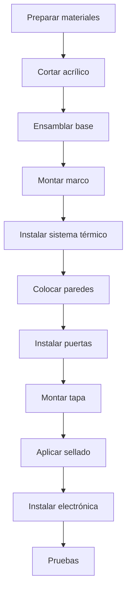

# Ensamblaje Mecánico

## Visión General del Proceso



## Paso 1: Preparación de Materiales

### Lista de Verificación

- [ ] Todas las piezas de acrílico cortadas
- [ ] Piezas 3D impresas
- [ ] Perfiles de aluminio cortados
- [ ] Tornillería completa
- [ ] Herramientas disponibles

### Herramientas Necesarias

| Herramienta | Uso |
|-------------|-----|
| Taladro | Perforaciones |
| Brocas 3mm, 4mm | Agujeros de montaje |
| Destornillador Phillips | Tornillos |
| Llave hexagonal 3mm | Tuercas |
| Sierra de calar | Ajustes en acrílico |
| Lima | Acabados |
| Nivel | Nivelación |
| Flexómetro | Mediciones |
| Pistola de silicona | Sellado |

## Paso 2: Corte del Acrílico

### Plantillas de Corte

**Hoja 1: Acrílico Transparente 6mm (600x400mm)**

```
┌──────────────────────────────────────────────────────┐
│                                                      │
│   ┌─────────────────────┐  ┌─────────────────────┐  │
│   │                     │  │                     │  │
│   │   PARED FRONTAL     │  │   PARED TRASERA     │  │
│   │     500 x 350       │  │     500 x 350       │  │
│   │                     │  │                     │  │
│   └─────────────────────┘  └─────────────────────┘  │
│                                                      │
└──────────────────────────────────────────────────────┘
```

**Hoja 2: Acrílico Transparente 6mm (600x400mm)**

```
┌──────────────────────────────────────────────────────┐
│                                                      │
│  ┌───────────┐  ┌───────────┐  ┌──────────────────┐ │
│  │ PARED     │  │  PARED    │  │                  │ │
│  │ LATERAL   │  │  LATERAL  │  │   TAPA SUPERIOR  │ │
│  │ 300 x 350 │  │  300 x 350│  │     500 x 300    │ │
│  │           │  │           │  │                  │ │
│  │     ○     │  │     ○     │  │                  │ │
│  │   (puerta)│  │  (puerta) │  │                  │ │
│  │           │  │           │  │                  │ │
│  └───────────┘  └───────────┘  └──────────────────┘ │
│                                                      │
└──────────────────────────────────────────────────────┘
```

### Técnica de Corte

1. Marcar con rotulador indeleble fino
2. Para cortes rectos: usar regla metálica como guía
3. Para cortes curvos (puertas): usar sierra de calar
4. Velocidad media, sin forzar
5. Lijar bordes con lija 400

## Paso 3: Ensamblaje de la Base

### Estructura de la Base

```
          600mm
    ┌────────────────────┐
    │  ○              ○  │
    │                    │
    │    PLACA BASE      │    400mm
    │      MDF 15mm      │
    │                    │
    │  ○              ○  │
    └────────────────────┘
    
    ○ = Agujeros M4 para patas/niveladores
```

### Procedimiento

1. Cortar MDF a 600x400mm
2. Marcar posición de agujeros (20mm desde bordes)
3. Perforar con broca 4mm
4. Lijar superficie
5. Aplicar sellador para madera (opcional)
6. Instalar patas niveladoras

## Paso 4: Montaje del Marco

### Estructura de Aluminio

```
         VISTA FRONTAL
    ┌────────────────────┐
    │╔══════════════════╗│
    │║                  ║│
    │║   CÁMARA        ║│
    │║                  ║│
    │╚══════════════════╝│
    │    [CALEFACCIÓN]   │
    │    [ELECTRÓNICA]   │
    └────────────────────┘
    
    ═ = Perfil aluminio 20x20mm
```

### Procedimiento

1. **Cortar perfiles**:
   - 4x 500mm (horizontales)
   - 4x 350mm (verticales)
   - 4x 300mm (profundidad)

2. **Ensamblar marco inferior**:
   - Unir perfiles con escuadras
   - Atornillar a la base MDF
   
3. **Levantar verticales**:
   - Fijar postes en esquinas
   - Verificar nivel

4. **Completar marco superior**:
   - Conectar horizontales superiores
   - Verificar escuadra en todas las esquinas

## Paso 5: Sistema de Calefacción

### Ubicación

```
         VISTA LATERAL
    ┌───────────────────┐
    │   ╔═══════════╗   │
    │   ║  CÁMARA   ║   │
    │   ╚═════╤═════╝   │
    │    DIFUSOR│       │
    │   ┌──────┴──────┐ │
    │   │  CONDUCTO   │ │
    │   │ ┌─────────┐ │ │
    │   │ │RESISTENC│ │ │◄── 100mm desde base
    │   │ └─────────┘ │ │
    │   │ [VENTILADOR]│ │◄── 50mm desde base
    │   └─────────────┘ │
    └───────────────────┘
```

### Procedimiento

1. **Montar conducto**:
   - Fabricar caja de aluminio 100x100x150mm
   - O imprimir en PETG

2. **Instalar ventilador**:
   - Posicionar en base del conducto
   - Orientación: aire hacia arriba
   - Fijar con tornillos M3

3. **Montar resistencia**:
   - Colocar sobre soporte cerámico
   - Conectar cables de alto calibre (18AWG)
   - Verificar aislamiento térmico

4. **Instalar termostato de seguridad**:
   - Fijar cerca de la resistencia
   - Cablear en serie con alimentación

5. **Colocar difusor**:
   - Montar pieza impresa 3D
   - Alinear con la cámara

## Paso 6: Instalación de Paredes

### Secuencia

1. **Pared trasera primero**
2. **Paredes laterales**
3. **Pared frontal al final**

### Técnica de Fijación

```
    ACRÍLICO ─────┬───── PERFIL
                  │
              ┌───┴───┐
              │ TIRA  │
              │SELLADO│
              └───────┘
```

1. Aplicar burlete adhesivo al perfil
2. Posicionar acrílico
3. Fijar con clips o tornillos
4. Verificar alineación antes de apretar

## Paso 7: Puertas de Acceso

### Preparación de la Puerta

```
    PARED LATERAL
    ┌─────────────┐
    │             │
    │   ┌─────┐   │
    │   │     │   │
    │   │  ○  │   │ ← Corte circular 150mm
    │   │     │   │
    │   └─────┘   │
    │             │
    └─────────────┘
```

### Sistema de Iris (Opcional)

Para un acceso más sofisticado, usar sistema de iris:

- Comprar iris de cámara usado
- O imprimir mecanismo en 3D

### Sistema Simple

- Puerta de acrílico circular
- Bisagra de plástico
- Cierre magnético

## Paso 8: Tapa Superior

### Montaje de Bisagras

```
    ┌─────────────────────────────────┐
    │ ○                           ○   │
    │ │                           │   │
    │ └────── BISAGRAS ───────────┘   │
    │                                 │
    │          TAPA                   │
    │                                 │
    └─────────────────────────────────┘
```

1. Marcar posición de bisagras (100mm desde bordes)
2. Perforar acrílico con broca 3mm
3. Atornillar bisagras a la tapa
4. Fijar al marco trasero
5. Verificar apertura completa (180°)

### Sistema de Cierre

- Imanes de neodimio (10mm diámetro)
- 4 imanes: 2 en tapa, 2 en marco frontal
- Fuerza de sujeción: ~2kg total

## Paso 9: Sellado

### Aplicación de Silicona

1. Limpiar todas las juntas con alcohol
2. Aplicar cinta de enmascarar a 3mm del borde
3. Aplicar silicona con pistola
4. Alisar con espátula húmeda
5. Retirar cinta antes de que seque
6. Dejar curar 24 horas

### Áreas Críticas

- [ ] Uniones pared-base
- [ ] Uniones entre paredes
- [ ] Perímetro de puertas
- [ ] Paso de cables

## Paso 10: Verificación Final

### Lista de Control

- [ ] Estructura estable y nivelada
- [ ] Tapa abre y cierra correctamente
- [ ] Puertas funcionan bien
- [ ] Sin espacios visibles
- [ ] Ventilador gira libremente
- [ ] Conducto de aire sin obstrucciones

### Prueba de Hermeticidad

1. Cerrar todas las aberturas
2. Colocar incienso encendido dentro
3. Observar si hay escape de humo
4. Sellar cualquier fuga detectada

## Próximas Secciones

- [Cableado](./wiring)
- [Pruebas](./testing)
