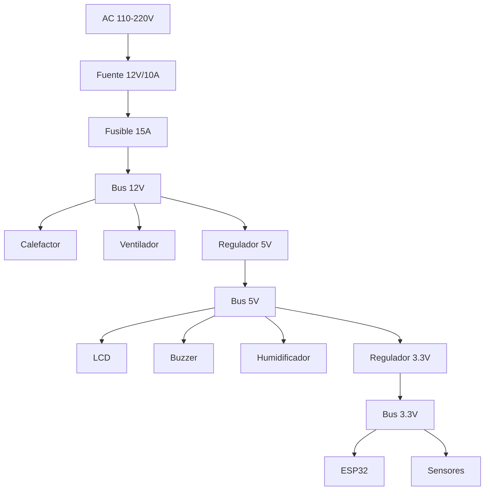
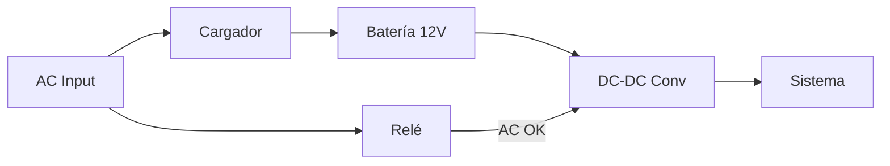

# Fuente de Alimentación

## Requisitos del Sistema

| Parámetro | Valor |
|-----------|-------|
| Entrada AC | 110-220V, 50/60Hz |
| Salida DC Principal | 12V, 10A |
| Potencia Total | 120W |
| Voltajes Lógicos | 5V, 3.3V |

## Diagrama del Sistema de Alimentación



## Fuente de Alimentación Principal

### Especificaciones Recomendadas

| Parámetro | Mínimo | Recomendado |
|-----------|--------|-------------|
| Voltaje de salida | 12V ±5% | 12V ±2% |
| Corriente | 10A | 12A |
| Regulación de carga | 5% | 2% |
| Ripple | 200mV | 100mV |
| Eficiencia | 80% | 85%+ |
| Certificaciones | - | CE, UL, FCC |

### Fuentes Recomendadas

| Modelo | Potencia | Precio Aprox. |
|--------|----------|---------------|
| Mean Well LRS-150-12 | 150W | $25 USD |
| Mean Well RS-150-12 | 150W | $30 USD |
| Fuente genérica 12V/10A | 120W | $15 USD |

### Circuito de Entrada

```
                    ┌─────────────────────────────────────┐
                    │                                     │
    AC L ───────────┤ L        FUENTE 12V/10A        +12V├───► 12V_OUT
                    │              150W                   │
    AC N ───────────┤ N                              GND ├───► GND
                    │                                     │
    AC PE ──────────┤ PE (Tierra)                        │
                    │                                     │
                    └─────────────────────────────────────┘
```

## Reguladores de Voltaje

### Regulador 5V

**Componente**: AMS1117-5.0 o LM7805

```
           12V_IN
              │
          ┌───┴───┐
    C1    │       │    C2
   100µF  │ REG5V │   100µF
    ═══   │       │    ═══
     │    │       │     │
     │    │  OUT  │     │
     │    └───┬───┘     │
     │        │         │
     └────────┼─────────┘
              │
              ▼
            5V_OUT
```

| Parámetro | Valor |
|-----------|-------|
| Entrada | 7-12V |
| Salida | 5V |
| Corriente máx | 1.5A |
| Dropout | 1.3V |

### Regulador 3.3V

**Componente**: AMS1117-3.3

```
           5V_IN
              │
          ┌───┴───┐
    C3    │       │    C4
   100µF  │REG3.3V│   100µF
    ═══   │       │    ═══
     │    │       │     │
     │    │  OUT  │     │
     │    └───┬───┘     │
     │        │         │
     └────────┼─────────┘
              │
              ▼
           3.3V_OUT
```

## Protecciones

### Fusible Principal

```
    12V_IN ───[F1 15A]─── 12V_PROTECTED
```

- **Tipo**: Fusible de vidrio 5x20mm
- **Valor**: 15A
- **Voltaje**: 250V

### Protección contra Inversión de Polaridad

```
    12V_IN ───|◄──[D1]───── 12V_PROTECTED
              SS34
```

- **Componente**: Diodo Schottky SS34
- **Corriente**: 3A
- **Caída**: 0.5V

### TVS para Protección contra Transitorios

```
    SIGNAL ─────┬───── PROTECTED_SIGNAL
                │
               ─┴─
              │TVS│
               ─┬─
                │
               GND
```

## Sistema UPS (Opcional)

Para aplicaciones críticas, se recomienda un sistema de respaldo.

### Diseño Básico con Batería



### Especificaciones del UPS

| Parámetro | Valor |
|-----------|-------|
| Batería | 12V 7Ah SLA |
| Autonomía | ~30 minutos |
| Tiempo de conmutación | menor a 10ms |
| Cargador | 13.8V, 1A |

### Circuito Simplificado

```
                    ┌──────────────┐
    AC ─────────────┤   CARGADOR   ├─────┬──────► 12V_OUT
                    │   12V/1A     │     │
                    └──────────────┘     │
                                         │
                    ┌──────────────┐     │
                    │   BATERÍA    ├─────┘
                    │  12V 7Ah     │
                    └──────────────┘
```

## Monitoreo de Alimentación

### Circuito Divisor de Voltaje

Para medir el voltaje de la batería/fuente:

```
    12V_IN ───[R1 10K]───┬───[R2 3.3K]─── GND
                         │
                         └───► ADC_PIN (ESP32)
```

Voltaje máximo en ADC: V_ADC = 12V × (3.3K / (10K + 3.3K)) = 2.98V

### Código de Monitoreo

```cpp
#define VOLTAGE_PIN 39  // ADC1_CH3
#define VOLTAGE_DIVIDER_RATIO 4.03  // (10K + 3.3K) / 3.3K

float readSupplyVoltage() {
    int rawADC = analogRead(VOLTAGE_PIN);
    float voltage = (rawADC / 4095.0) * 3.3 * VOLTAGE_DIVIDER_RATIO;
    return voltage;
}

void checkPowerStatus() {
    float voltage = readSupplyVoltage();
    
    if (voltage < 11.0) {
        raiseAlarm(ALARM_LOW_VOLTAGE, "Voltaje bajo");
    } else if (voltage > 13.0) {
        raiseAlarm(ALARM_HIGH_VOLTAGE, "Voltaje alto");
    }
}
```

## Consumo por Subsistema

| Subsistema | Voltaje | Corriente Típica | Corriente Máxima |
|------------|---------|------------------|------------------|
| ESP32 | 3.3V | 80mA | 500mA (WiFi TX) |
| Sensores | 3.3V | 10mA | 20mA |
| LCD | 5V | 50mA | 100mA |
| TFT | 3.3V | 100mA | 150mA |
| Buzzer | 5V | 30mA | 50mA |
| Calefactor | 12V | 0-8A | 8.3A |
| Ventilador | 12V | 200mA | 500mA |
| Humidificador | 5V | 150mA | 200mA |

## Consideraciones de Diseño

### Disipación de Calor

Los reguladores lineales disipan calor:

```
P_disipada = (V_in - V_out) × I_out
```

Para el regulador 5V con carga de 1A:
```
P = (12V - 5V) × 1A = 7W
```

**Solución**: Usar disipador de calor o regulador switching.

### Desacoplamiento

- Capacitor de 100µF en cada regulador
- Capacitor de 100nF cerca de cada IC
- Capacitor de 10µF cerca del ESP32

## Lista de Componentes

| Ref | Componente | Valor | Cantidad |
|-----|------------|-------|----------|
| PSU | Fuente switching | 12V 10A | 1 |
| U1 | Regulador | AMS1117-5.0 | 1 |
| U2 | Regulador | AMS1117-3.3 | 1 |
| F1 | Fusible | 15A 5x20mm | 1 |
| D1 | Diodo Schottky | SS34 | 1 |
| C1-C4 | Capacitor | 100µF 25V | 4 |
| C5-C10 | Capacitor | 100nF 50V | 6 |

## Próximas Secciones

- [Ensamblaje PCB](../assembly/pcb-assembly)
